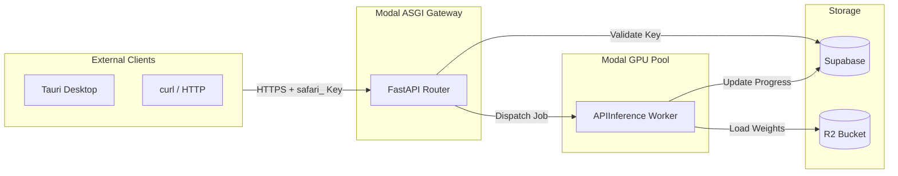
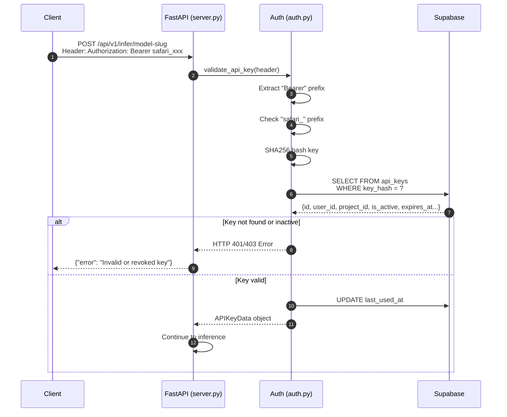
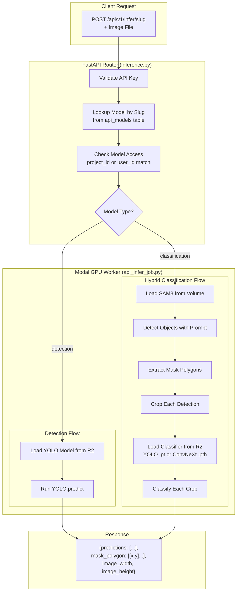
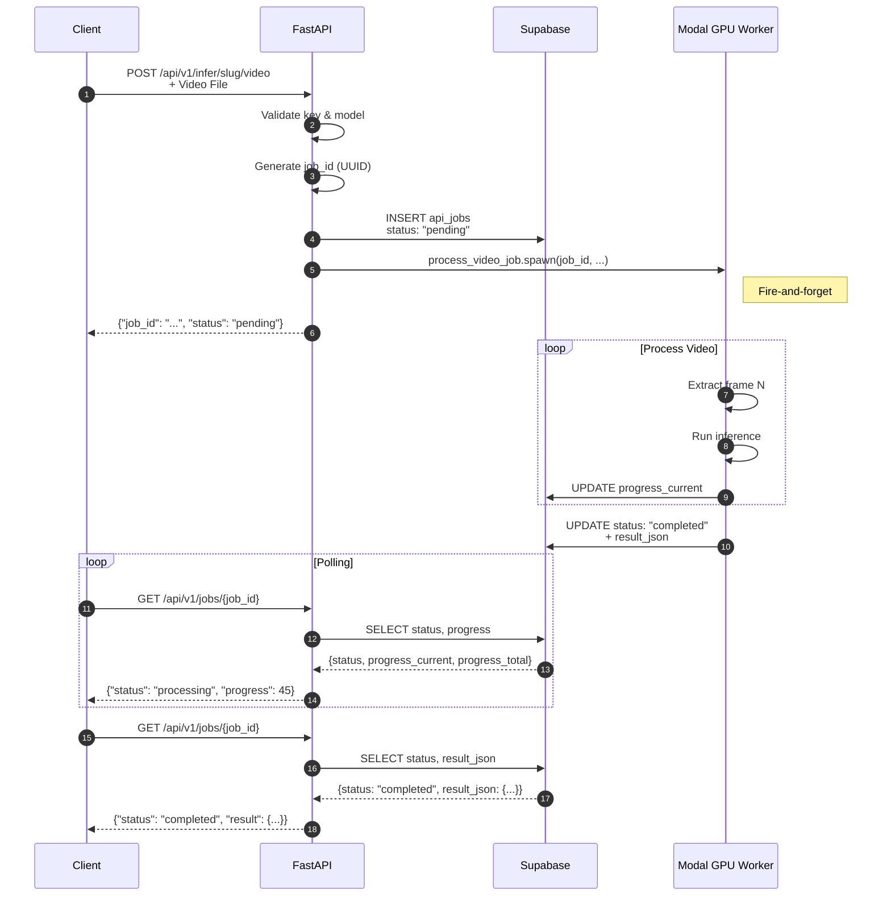
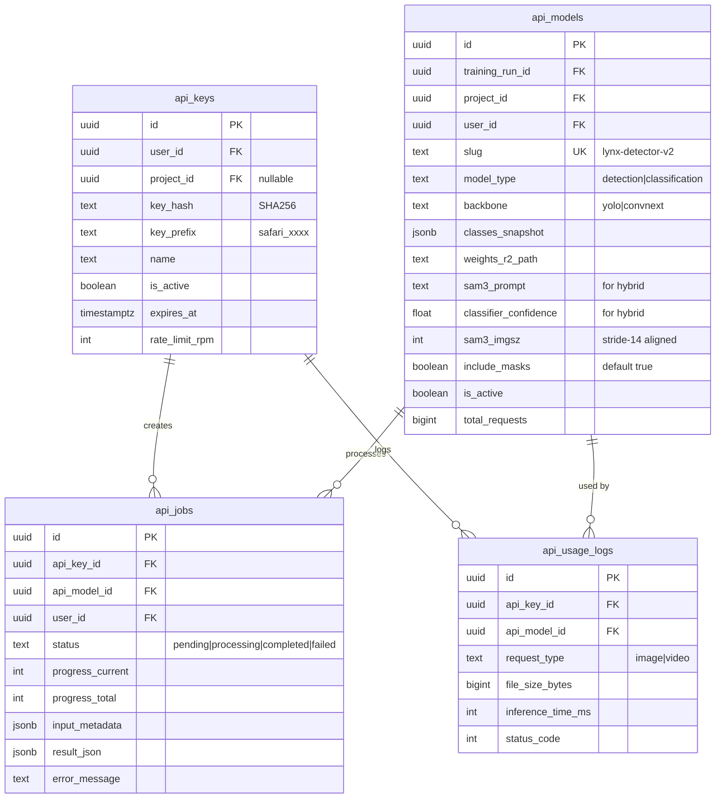

# SAFARI API Architecture

> Complete flow diagram of the API infrastructure covering authentication, inference, and async video processing.

---

## High-Level Overview



---

## Detailed Authentication Flow



---

## Image Inference Flow (Synchronous)



---

## Video Inference Flow (Asynchronous)



---

## Database Schema Overview



---

## File Structure

```
backend/api/
├── server.py           # Modal ASGI entrypoint, FastAPI setup
├── auth.py             # Bearer token validation, SHA256 hashing
└── routes/
    ├── inference.py    # /api/v1/infer/* endpoints
    └── jobs.py         # /api/v1/jobs/* endpoints

backend/modal_jobs/
└── api_infer_job.py    # GPU inference worker (detection + hybrid)
```

---

## Key Components Summary

| Component | Purpose |
|-----------|---------|
| **FastAPI Router** | Validates requests, routes by model type |
| **auth.py** | SHA256 key hashing, Bearer validation |
| **api_models** | Promoted models with frozen class snapshots |
| **api_keys** | Project-scoped or user-wide access tokens |
| **api_jobs** | Async video job tracking with progress |
| **APIInference** | Modal GPU worker supporting YOLO + SAM3 hybrid with masks |

---

## Response Schema: Predictions

Each prediction in a hybrid (classification) response includes:

| Field | Type | Description |
|-------|------|-------------|
| `class_name` | string | Species/class name from classifier |
| `class_id` | integer | Class index |
| `confidence` | float | Classifier confidence (0-1) |
| `box` | [x1,y1,x2,y2] | Normalized 0-1 bounding box |
| `mask_polygon` | [[x,y]...] | Normalized 0-1 polygon points (hybrid only) |
| `track_id` | integer | Object tracking ID (video only) |
| `top_k_crops` | [string...] | R2 URLs for classification K-crop images (video hybrid only) |
