# SAFARI Architecture Diagrams

> Visual documentation of the SAFARI platform architecture. All diagrams reflect the current implementation.

---

## Table of Contents

1. [Level 1: System Overview](#level-1-system-overview)
2. [Level 2: Core Workflow Pipelines](#level-2-core-workflow-pipelines)
3. [Level 3: Job Routing Architecture](#level-3-job-routing-architecture)
4. [Level 4: Detailed Components](#level-4-detailed-components)

---

## Level 1: System Overview

### SAFARI Ecosystem

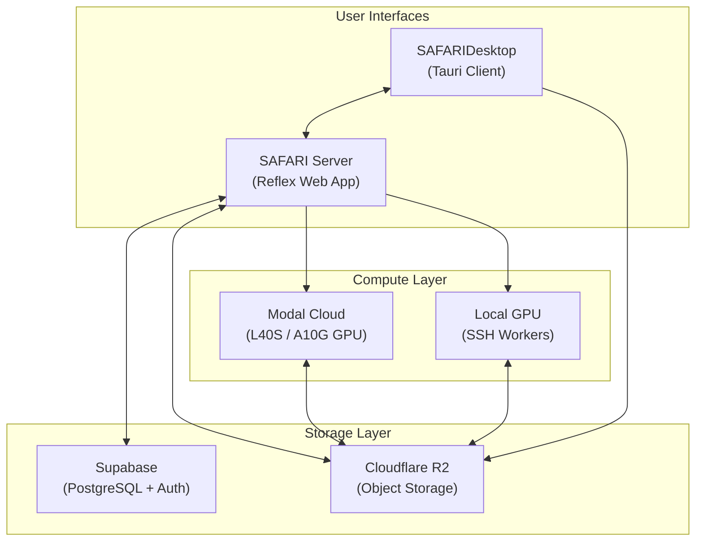

### Component Responsibilities

| Component | Technology | Responsibility |
|-----------|------------|----------------|
| **SAFARI Server** | Reflex (Python) | Web UI, state management, job orchestration |
| **SAFARIDesktop** | Tauri (Rust + TS) | Native client, video processing, scientific analytics |
| **Modal Cloud** | Modal (Python) | GPU jobs: training, inference, autolabeling |
| **Local GPU** | SSH + Python | Same jobs on user hardware (e.g., RTX 4090) |
| **Supabase** | PostgreSQL | Projects, datasets, annotations, training runs |
| **R2** | S3-compatible | Images, labels, model weights, inference results |

---

## Level 2: Core Workflow Pipelines

### 2A. Labeling Pipeline

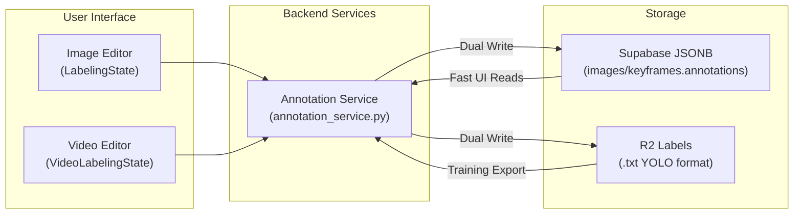

**Key patterns:**
- Annotations store `class_id` only (not `class_name`)
- Class names resolved dynamically from `projects.classes`
- Dual-write ensures YOLO training compatibility

---

### 2B. Training Pipeline

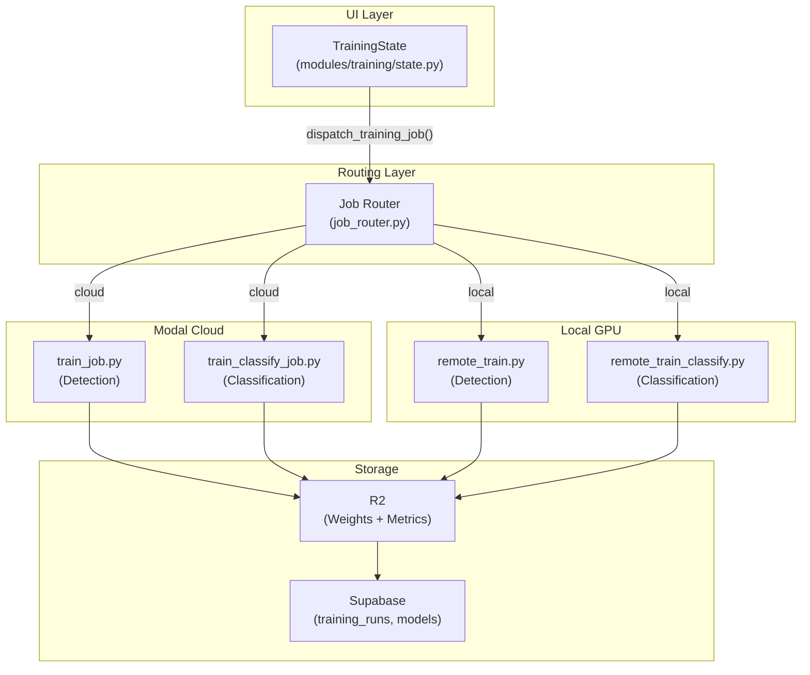

**Training types:**
| Type | Modal Job | Local Worker | Output |
|------|-----------|--------------|--------|
| Detection | `train_job.py` | `remote_train.py` | `best.pt` |
| YOLO Classify | `train_classify_job.py` | `remote_train_classify.py` | `best.pt` |
| ConvNeXt Classify | `train_classify_job.py` | `remote_train_classify.py` | `best.pth` |
| SAM3 Fine-Tune | `train_sam3_job.py` | N/A (cloud only) | Fine-tuned SAM3 weights |

---

### 2C. Inference Pipeline

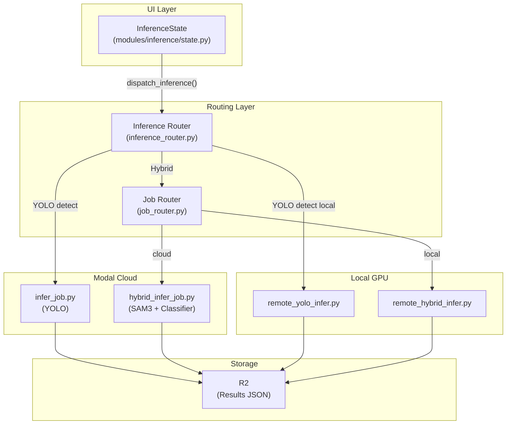

**Inference types:**
| Input | YOLO Detection | Hybrid (SAM3 + Classifier) |
|-------|----------------|---------------------------|
| Single Image | ✅ Modal + Local | ✅ Modal + Local |
| Batch Images | ✅ Modal + Local | ✅ Modal + Local |
| Video | ✅ Modal + Local | ✅ Modal + Local |

---

## Level 3: Job Routing Architecture

### 3A. Action-Level Routing

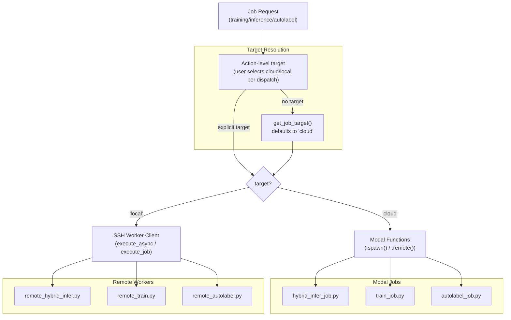

> Compute target is selected per action, not locked per project.

---

### 3B. Inference Router Flow

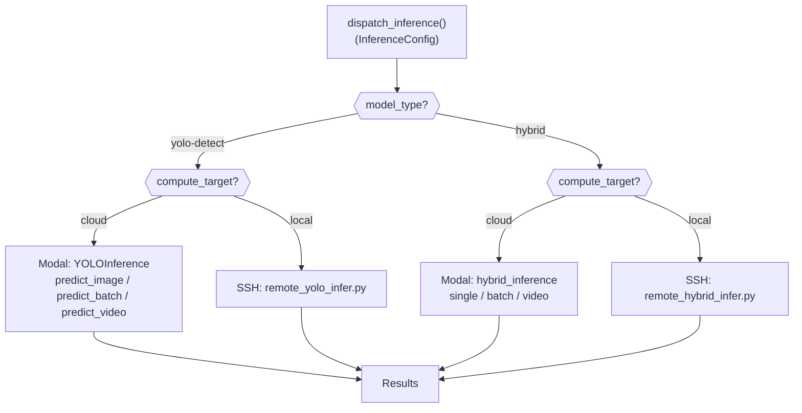

**Key decision points:**
- `model_type` → determines YOLO vs Hybrid pipeline
- `compute_target` → set per action by user (defaults to cloud)
- Input type (image/batch/video) selects method variant

---

### 3C. Shared Core Pattern

All GPU jobs use the **Shared Core Pattern** — pure logic lives in `backend/core/`, ensuring automatic parity between Modal and Local GPU.

#### Inference Cores

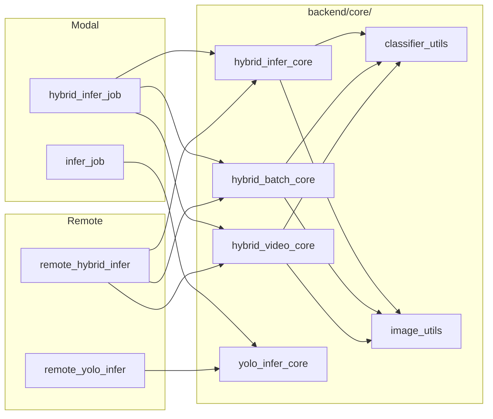

#### Training Cores

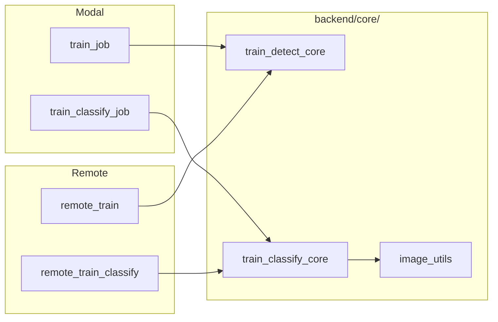

#### Autolabel Core

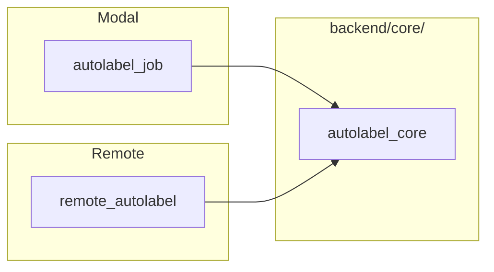

**Core module functions:**

| Module | Key Functions |
|--------|--------------|
| `hybrid_infer_core.py` | `run_hybrid_inference()`, `run_sam3_detection()`, `run_classification_loop()` |
| `hybrid_batch_core.py` | `run_hybrid_batch_inference()` |
| `hybrid_video_core.py` | `run_hybrid_video_inference()`, `classify_unique_tracks()` |
| `yolo_infer_core.py` | `run_yolo_single_inference()`, `run_yolo_batch_inference()`, `run_yolo_video_inference()` |
| `autolabel_core.py` | `run_yolo_autolabel()`, `run_sam3_autolabel()` |
| `train_detect_core.py` | `prepare_yolo_dataset()`, `run_yolo_training()` |
| `train_classify_core.py` | `create_classification_crops()`, `train_classification()` |
| `sam3_dataset_core.py` | `prepare_sam3_dataset()` |
| `classifier_utils.py` | `load_classifier()`, `classify_with_convnext()` |
| `image_utils.py` | `crop_from_box()`, `download_image()` |
| `thumbnail_generator.py` | `generate_thumbnail()` |

---

## Level 4: Detailed Components

### 4A. Hybrid Inference Pipeline

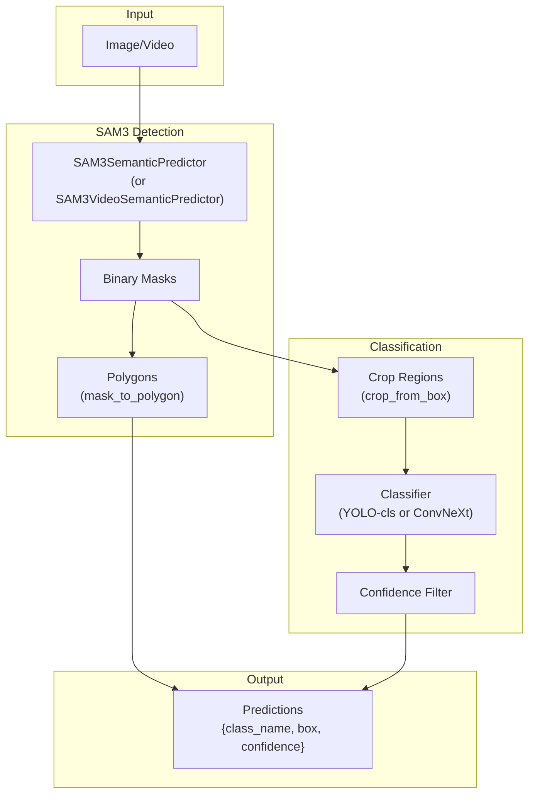

**Video classification strategy:**
**Quality-Diverse Top-K (Video):**
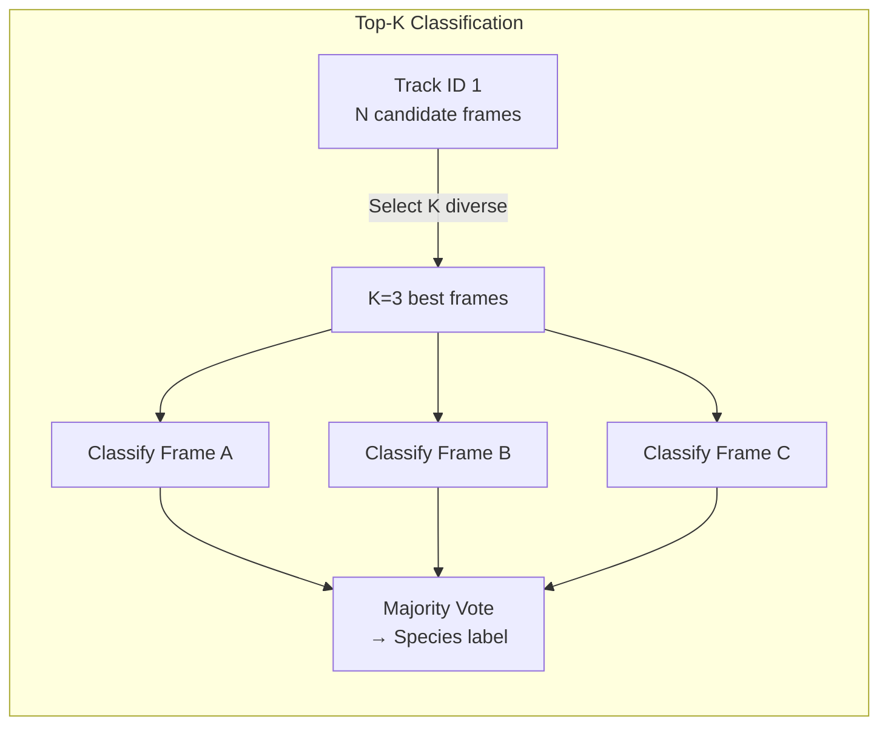

> `classify_top_k` (default: 3) selects quality-diverse frames per track for more robust species classification.

---

### 4B. Training Flow Detail

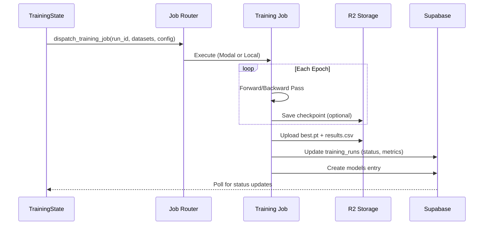

**Classification training (ConvNeXt):**
- Custom PyTorch training loop (not Ultralytics)
- Backbone auto-detected by file extension (`.pth`)
- Same metrics format for dashboard parity

---

### 4C. Storage Architecture

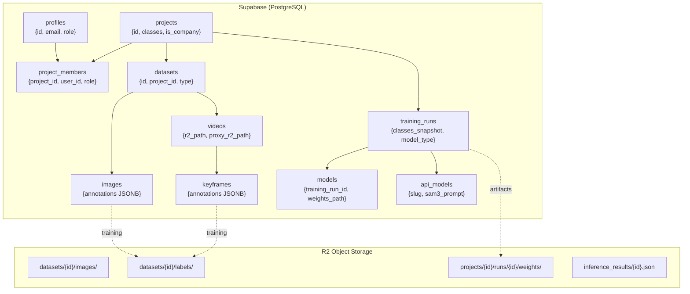

**Dual-write pattern:**
| Storage | Format | Purpose | Speed |
|---------|--------|---------|-------|
| Supabase JSONB | `{class_id, x, y, width, height}` | UI reads | ~10ms |
| R2 Labels | YOLO `.txt` | Training export | ~50ms |

---

### 4D. API Infrastructure

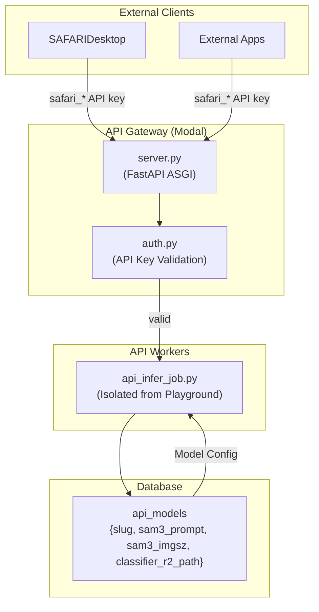

**API Endpoints:**
| Endpoint | Purpose |
|----------|---------|
| `POST /api/v1/infer/{slug}` | Single image inference |
| `POST /api/v1/infer/{slug}/batch` | Batch image inference |
| `POST /api/v1/infer/{slug}/video` | Async video inference |
| `GET /api/v1/jobs/{job_id}` | Job status polling |

---

### 4E. SAFARIDesktop Integration (High-Level)

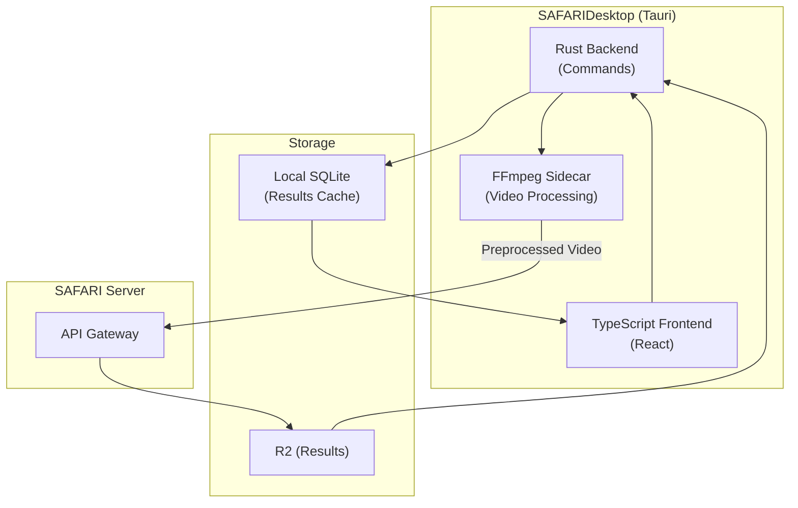

**Key flows:**
- Video preprocessing (FFmpeg resize to 640/1024/HD)
- API communication (OpenAPI contract)
- Results display (60Hz canvas overlays with RAF)
- Local persistence (SQLite results gallery)

---

## File Parity Matrix

| Modal Job | Remote Worker | Shared Core | Parity |
|-----------|---------------|-------------|--------|
| `hybrid_infer_job.py` (single) | `remote_hybrid_infer.py` | `hybrid_infer_core.py` | ✅ Automatic |
| `hybrid_infer_job.py` (batch) | `remote_hybrid_infer.py` | `hybrid_batch_core.py` | ✅ Automatic |
| `hybrid_infer_job.py` (video) | `remote_hybrid_infer.py` | `hybrid_video_core.py` | ✅ Automatic |
| `train_job.py` | `remote_train.py` | `train_detect_core.py` | ✅ Automatic |
| `train_classify_job.py` | `remote_train_classify.py` | `train_classify_core.py` | ✅ Automatic |
| `train_sam3_job.py` | N/A | `sam3_dataset_core.py` | Cloud only |
| `autolabel_job.py` | `remote_autolabel.py` | `autolabel_core.py` | ✅ Automatic |
| `infer_job.py` | `remote_yolo_infer.py` | `yolo_infer_core.py` | ✅ Automatic |
| `api_infer_job.py` | N/A | Can use `hybrid_infer_core.py` | Isolated |

---

*Last updated: 2026-02-26 — SAFARI rebrand, SAM3 training, multi-user schema*
