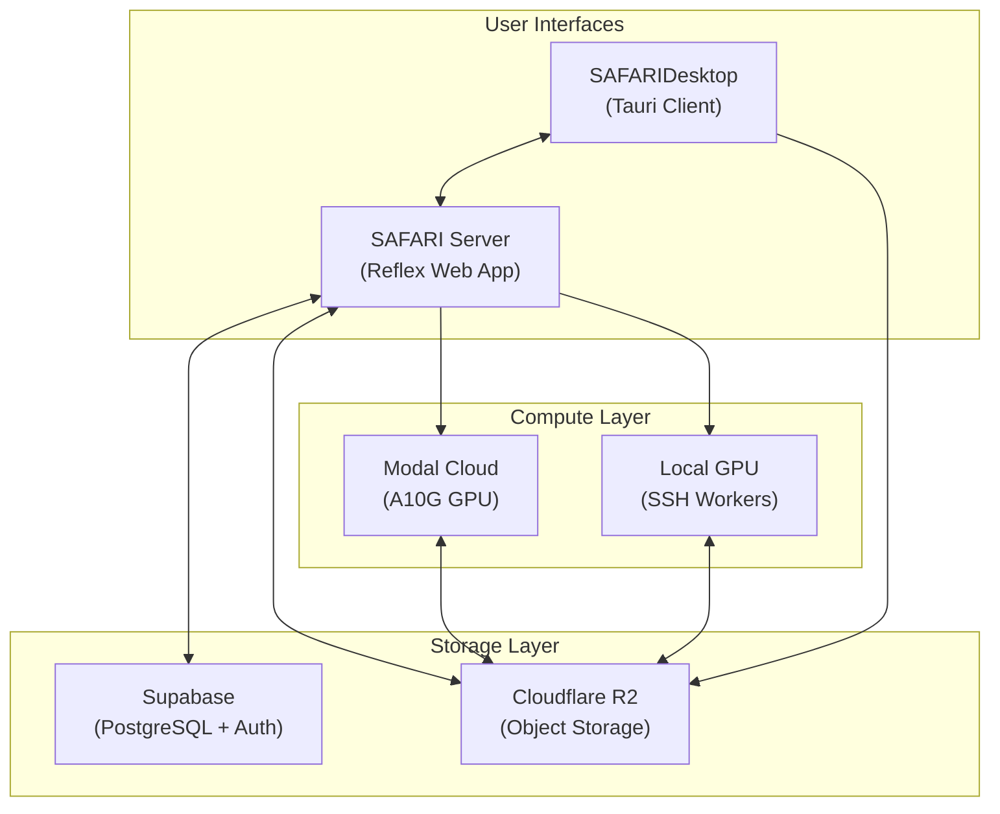

# SAFARI Platform Architecture Reference

> **Purpose**: A living reference document for AI agents (and humans) working on the SAFARI platform. Contains lookup tables, architectural patterns, and critical gotchas to prevent recurring debugging sessions.

---

## System Overview

SAFARI is a wildlife detection platform with two primary codebases:

| Component | Purpose | Deployment |
|-----------|---------|------------|
| **SAFARI Server** | Web app, API, Modal jobs, training/inference orchestration | Reflex (Python) |
| **SAFARIDesktop** | Native client, video processing, scientific analytics | Tauri (Rust + TS) |

### Architecture Diagram



> [!TIP]
> For detailed visual diagrams of all flows (training, inference, labeling), see [Architecture Diagrams](architecture_diagrams.md).

---


## Core Compute Architecture

### Job Routing Matrix

All GPU workloads are dispatched via the **Job Router** (`backend/job_router.py`). Compute target (Cloud or Local GPU) is selected **per action** by the user at dispatch time:

| Compute Target | Executor | Jobs Location | GPU Hardware |
|----------------|----------|---------------|--------------|
| **Cloud (Modal)** | Modal Functions | `backend/modal_jobs/*.py` | L40S (SAM3), A10G (training) |
| **Local GPU** | SSH Worker Client | `scripts/remote_workers/*.py` | User hardware (e.g., RTX 4090) |

> [!NOTE]
> **Action-Level Target Selection**: The compute target is chosen per dispatch call, not locked per project. `get_job_target()` defaults to `"cloud"` but each dispatch function accepts an explicit `target` parameter.

### GPU Assignment by Job Type

| Job Type | Modal GPU | Reason |
|----------|-----------|--------|
| **Hybrid Inference** (single/batch/video) | L40S | SAM3 + classifier = high VRAM |
| **Autolabeling** | L40S | SAM3-based, same VRAM needs |
| **API Inference** | L40S | Public API, same hybrid pipeline |
| **YOLO Detection Inference** | A10G | Lighter workload |
| **Detection Training** | A10G | Standard YOLO training |
| **Classification Training** | A10G | ConvNeXt or YOLO-cls |
| **SAM3 Fine-Tuning** | A10G | SAM3 dataset prep + training |

> [!TIP]
> **FP16 Half Precision**: All SAM3 operations now run with `half=True` (FP16), providing ~3.5× speedup. This is set in `backend/core/` modules (`hybrid_infer_core.py`, `hybrid_batch_core.py`, `hybrid_video_core.py`, `autolabel_core.py`).

> [!NOTE]
> **SSH Deploy**: Script sync to remote workers uses `SSHWorkerClient.sync_scripts()` and `sync_core_modules()`. Use the `/deploy` workflow after code changes.

## Inference Flows Reference

### Implementation Matrix

This matrix shows which combinations of **Input Type** × **Model Type** are implemented, and their Cloud/Local GPU support:

| Input Type | Model Type | Implemented | Modal (Cloud) | Local GPU | Notes |
|------------|------------|:-----------:|:-------------:|:---------:|-------|
| **Single Image** | YOLO Detection | ✅ | ✅ | ✅ | `dispatch_inference()` → Inference Router |
| **Single Image** | Hybrid (SAM3 + YOLO-cls) | ✅ | ✅ | ✅ | `dispatch_inference()` → Job Router |
| **Single Image** | Hybrid (SAM3 + ConvNeXt) | ✅ | ✅ | ✅ | Same as above, backbone auto-detected |
| **Batch Images** | YOLO Detection | ✅ | ✅ | ✅ | `dispatch_inference()` → Inference Router |
| **Batch Images** | Hybrid (SAM3 + YOLO-cls) | ✅ | ✅ | ✅ | `dispatch_inference()` → Job Router |
| **Batch Images** | Hybrid (SAM3 + ConvNeXt) | ✅ | ✅ | ✅ | Same as above, backbone auto-detected |
| **Video** | YOLO Detection | ✅ | ✅ | ✅ | `dispatch_inference()` → Inference Router |
| **Video** | Hybrid (SAM3 + YOLO-cls) | ✅ | ✅ | ✅ | `dispatch_inference()` → Job Router |
| **Video** | Hybrid (SAM3 + ConvNeXt) | ✅ | ✅ | ✅ | Same as above, backbone auto-detected |

> [!NOTE]
> **Model Selection Drives Flow**: The `is_hybrid_mode` flag is set when the user selects a **classification** model. The flow is routed by the model's `model_type` field from `training_runs` table.

> [!TIP]
> **All inference now routes through** `backend/inference_router.py`. Adding a new flow = implement worker + register in `dispatch_inference()`.

---

### Flow Decision Logic

The `run_inference()` method routes based on:

```python
if self.uploaded_file_type == "image":
    if self.batch_mode:
        if self.is_hybrid_mode:  # → _run_hybrid_batch_inference()
        else:                     # → _run_batch_inference()
    elif self.is_hybrid_mode:     # → _run_hybrid_image_inference()
    else:                          # → _run_image_inference()
elif self.uploaded_file_type == "video":
    if self.is_hybrid_mode:        # → start_hybrid_video_inference()
    else:                           # → start_video_inference()
```

### Video Upload Preprocessing

Videos uploaded to the playground are preprocessed before inference:

| Setting | Options | Default | Effect |
|---------|---------|---------|--------|
| **Target Resolution** | 480p / 1036p / 1280p | 1036p | FFmpeg resize before upload |
| **Target FPS** | Original / 30 / 15 / 10 | Original | FFmpeg FPS filter |

Both settings are saved as user preferences and applied via FFmpeg during upload in `InferenceState._handle_video_upload()`.

> [!NOTE]
> **Stride-14 Alignment**: SAM3 image sizes use stride-14 aligned values (480, 1036, 1280) instead of round numbers. This ensures optimal tensor alignment for SAM3.

---

### Hybrid Flow Architecture (Both Targets)

Both Modal and Local GPU use the **shared core** modules:

| Step | Core Function | Purpose |
|------|---------------|---------|
| SAM3 Detect | `run_sam3_detection()` | Generic detection using text prompts |
| Mask Extraction | `mask_to_polygon()` | Convert binary masks to polygons (inline) |
| Classification | `run_classification_loop()` | Crop → Classify → Filter by confidence |
| Top-K Selection | `select_quality_diverse_frames()` | Pick best K frames per track for classification |
| Single Orchestration | `run_hybrid_inference()` | Full pipeline entry point (single image) |
| Batch Orchestration | `run_hybrid_batch_inference()` | Full pipeline entry point (batch images) |
| Video Orchestration | `run_hybrid_video_inference()` | Full pipeline entry point (video) |

> [!TIP]
> **Coordinate System**: All predictions use **normalized 0-1 coordinates**. Box format: `[x1, y1, x2, y2]`.

### Video Inference Output Format

Video inference returns frame-indexed dictionaries stored in R2:

```json
{
  "predictions_by_frame": {
    "0": [{"class_name": "Lynx", "box": [0.1, 0.2, 0.3, 0.4], "confidence": 0.95, "track_id": 1}],
    "30": [{"class_name": "Lynx", "box": [0.15, 0.25, 0.35, 0.45], "confidence": 0.92, "track_id": 1}]
  },
  "masks_by_frame": {
    "0": [{"class_name": "Lynx", "polygon": [[0.1, 0.2], [0.3, 0.2], [0.3, 0.4], [0.1, 0.4]]}]
  }
}
```

### Quality-Diverse Top-K Classification (Video)

When a video has an animal tracked across many frames, classifying every frame is expensive, and classifying just one is unreliable (a single bad crop kills accuracy). Top-K picks the **best K frames** per track and uses majority voting for robust species identification.

#### Pipeline Overview (4 functions in `hybrid_video_core.py`)

| Function | Lines | Purpose |
|----------|-------|---------|
| `classify_unique_tracks()` | 352–488 | Orchestrator — loops tracks, extracts frames, classifies, votes |
| `select_diverse_frames()` | 248–308 | Picks K frames maximising quality + temporal diversity |
| `crop_quality_score()` | 214–245 | GPU-free heuristic scoring each detection crop [0, 1] |
| `vote_classifications()` | 311–349 | Majority vote over K classification results |

#### Step-by-Step Flow

For each unique `track_id` in the video:

1. **Collect candidates** — every frame where that animal was detected (with bounding box)
2. **Select K diverse frames** via `select_diverse_frames()`:
   - Score ALL candidates using `crop_quality_score()`
   - Pick the highest-quality frame as seed
   - Compute `min_gap = track_span / (K+1)` — ensures temporal spread
   - Greedily add frames: best quality first, but ONLY if ≥ `min_gap` apart from all selected frames
   - If still < K, relax the gap constraint and fill by quality
3. **Extract & crop** — OpenCV seeks to each selected frame, crops the detection box with 5% padding
4. **Classify each crop** — ConvNeXt or YOLO-cls (auto-detected by backbone)
5. **Majority vote** via `vote_classifications()`:
   - Filter out failed or below-confidence results
   - Winner = most common species label (`Counter.most_common(1)`)
   - Returns winner's average confidence + agreement ratio
6. **Store K crop images** — uploaded to R2 for UI preview in the result viewer

#### Quality Scoring Heuristic

`crop_quality_score()` returns [0, 1] using three GPU-free signals:

| Factor | Weight | Logic |
|--------|--------|-------|
| **Area** | 50% | Larger crop → more detail. Saturates at 10% of frame area. |
| **Edge proximity** | 30% | Penalises boxes touching frame borders (likely clipped animal). |
| **Aspect ratio** | 20% | Penalises very elongated boxes (partial animal). |

#### Parameter Flow

User sets `classify_top_k` (default 3, clamped 1–10) in the Playground UI:

```
InferenceState.classify_top_k          # modules/inference/state.py:217
  → job_router.dispatch_hybrid_inference_video()   # backend/job_router.py:512
    → hybrid_infer_job.hybrid_inference_video()     # Modal wrapper
      → hybrid_video_core.run_hybrid_video_inference()
        → classify_unique_tracks(classify_top_k=K)  # backend/core/hybrid_video_core.py:352
          → select_diverse_frames(K)                 # :248
          → vote_classifications()                   # :311
```

> [!TIP]
> The `min_gap` temporal spread is the key design choice. For a track spanning frames 0–300 with K=3, the gap is 75, so frames are picked roughly at 0, ~100, ~200 rather than three consecutive frames where the animal is in the same pose.

### SAM3 Resolution Control (`sam3_imgsz`)

SAM3 inference resolution is configurable per-session and per-API-model:

| Resolution | Stride-14 Value | Speed | Quality |
|------------|----------------|-------|--------|
| Low | 480 | Fast | Lower detail |
| Standard | 1036 | Medium | Good balance |
| High | 1280 | Slow | Maximum detail |

The `sam3_imgsz` parameter flows:
- **Playground**: `InferenceState.sam3_imgsz` → inference router → job
- **API**: `api_models.sam3_imgsz` column → inference route → GPU worker

> [!TIP]
> All SAM3 resolutions must be stride-14 aligned (divisible by 14). The UI enforcement ensures only valid values are selectable.

---

### Backbone Auto-Detection

The classifier backbone is auto-detected by `backend/core/classifier_utils.py`:

```python
from backend.core.classifier_utils import load_classifier

# Unified loader auto-detects backbone from file extension
classifier_data = load_classifier(classifier_r2_path, local_path)
# Returns: {"type": "convnext"|"yolo", "model": ..., ...}
```

| Extension | Backbone | Loader |
|-----------|----------|--------|
| `.pth` | ConvNeXt | `load_convnext_classifier()` |
| `.pt` | YOLO | `YOLO(path)` |

## Training Flows Reference

### Detection Training

| Step | Modal Job | Local GPU | Dataset Source |
|------|-----------|-----------|----------------|
| Entry | `train_job.py` | `remote_train.py` | R2 images + labels |
| Engine | YOLO (ultralytics) | YOLO (ultralytics) | Same hyperparameters |
| Output | `best.pt`, `results.csv` | `best.pt`, `results.csv` | Uploaded to R2 |

### Classification Training

| Backbone | Modal Job | Local GPU | Weights Format |
|----------|-----------|-----------|----------------|
| **YOLO-cls** | `train_classify_job.py` | `remote_train_classify.py` | `best.pt` |
| **ConvNeXt** | `train_classify_job.py` | `remote_train_classify.py` | `best.pth` |

> [!WARNING]
> **Extension Matters**: YOLO outputs `.pt`, ConvNeXt outputs `.pth`. The inference loader detects by extension. See Gotcha #19.

---

## Autolabeling Flows Reference

| Mode | Modal Job | Local GPU | Label Storage |
|------|-----------|-----------|---------------|
| **SAM3 Zero-Shot** | `autolabel_job.py` | `remote_autolabel.py` | R2 `.txt` + Supabase JSONB |
| **YOLO Custom** | `autolabel_job.py` | `remote_autolabel.py` | Same |

### SAM3 Autolabel Requirements
- Requires `prompt_class_map` to map SAM3 prompts to project classes
- Uses explicit prompts ("Lynx") vs. inference's generic prompts ("animal")

### Autolabeling Input Parameters

| Parameter | SAM3 Mode | YOLO Mode | Required |
|-----------|:---------:|:---------:|:--------:|
| `prompt_type` | `"text"` | `"yolo"` | ✅ |
| `prompt_value` | `"Lynx"` | — | SAM3 only |
| `prompt_class_map` | `{"Lynx": [0]}` | — | SAM3 only |
| `model_id` | — | Model UUID | YOLO only |
| `confidence` | 0.25 | 0.25 | Both |
| `class_id` | Target class | — | SAM3 only |

---

## Model Loading Reference

### Model Families & Loaders

| Model Family | File Extension | Loader | Package |
|--------------|----------------|--------|---------|
| YOLO Detection | `.pt` | `YOLO(path)` | `ultralytics` |
| YOLO Classify | `.pt` | `YOLO(path)` | `ultralytics` |
| ConvNeXt Classify | `.pth` | `torch.load()` + `timm.create_model()` | `torch`, `timm` |
| SAM3 (Image) | `sam3.pt` | `SAM3SemanticPredictor` | `ultralytics>=8.3.237` |
| SAM3 (Video) | `sam3.pt` | `SAM3VideoSemanticPredictor` | `ultralytics>=8.3.237` |

> [!NOTE]
> **SAM3 is Ultralytics' implementation**, not Meta's directly. Import: `from ultralytics.models.sam import SAM3SemanticPredictor`. Weights are **not** auto-downloaded — they must be pre-staged.

### SAM3 API Patterns

| Use Case | Class | Usage Pattern |
|----------|-------|---------------|
| **Image (text prompt)** | `SAM3SemanticPredictor` | `predictor.set_image(path)` → `predictor(text=["mammal"])` |
| **Video (text prompt)** | `SAM3VideoSemanticPredictor` | `predictor(source=path, text=["mammal"], stream=True)` |
| **Single object (click/box)** | `SAM` | `model.predict(source=path, points=[x,y])` — SAM2-style |

### SAM3 Model Locations

| Context | Model Source | Pattern |
|---------|--------------|---------|
| **Modal (Cloud)** | `/models/sam3.pt` (Modal Volume `sam3-volume`) | Mounted at `/models/` |
| **Local GPU** | `~/.safari/models/sam3.pt` | Downloaded by `install.sh` |
| **Important** | Never rely on auto-download | Always pass explicit path |

```python
# Correct SAM3 loading (local GPU)
sam3_path = Path.home() / ".safari" / "models" / "sam3.pt"
predictor = SAM3VideoSemanticPredictor(overrides=dict(model=str(sam3_path), ...))
```

### Model Registry (NEW)

Centralized classifier loading pattern used by Modal jobs and remote workers:

```python
# backend/model_registry.py
from backend.model_registry import load_model, detect_classifier_backbone

# Auto-detect backbone and load
backbone = detect_classifier_backbone(r2_path)  # "yolo-classify" or "convnext-classify"
classifier_data = load_model(backbone, local_path)

# Modal/Remote worker use internal load_classifier() helper for same pattern
```

> [!TIP]
> Adding a new classifier backbone = 1 registry entry + loader in `load_model()`.

### Inference Router (NEW)

Unified entry point for all inference operations, routing to Modal or Local GPU:

```python
# backend/inference_router.py
from backend.inference_router import dispatch_inference, InferenceConfig

config = InferenceConfig(
    model_type="yolo-detect",  # or "hybrid"
    input_type="image",        # or "batch", "video"
    model_name_or_id="yolo11s.pt",
    project_id=project_id,
)
result = dispatch_inference(config, image_url=url, confidence=0.25)
```

> [!TIP]
> Adding a new inference flow = 1 remote worker + routing in `dispatch_inference()`.

---

## Annotation Service Reference

Centralized annotation access layer (`backend/annotation_service.py`):

| Function | Purpose | Storage |
|----------|---------|---------|
| `get_annotations(item_id, type)` | Single image/keyframe | Supabase JSONB |
| `get_dataset_annotations(dataset_id, type)` | Batch load for dataset | Supabase JSONB |
| `get_annotations_for_training(...)` | Multi-dataset training batch | Supabase JSONB |
| `save_annotations(...)` | Dual-write save | Supabase + R2 |
| `rename_class_in_project(...)` | Project-wide class rename | Supabase + R2 |
| `delete_class_from_project(...)` | Project-wide class delete | Supabase + R2 |
| `resolve_class_names(...)` | Add `class_name` from `class_id` + project classes | In-memory |
| `strip_class_names(...)` | Remove `class_name` before storage | In-memory |

### Dual-Write Pattern

All annotation saves write to **both** storage layers:

| Storage | Format | Purpose | Speed |
|---------|--------|---------|-------|
| **Supabase JSONB** | `{id, class_id, x, y, width, height}` | UI reads, fast retrieval | ~10ms |
| **R2 Labels** | YOLO `.txt` format | Training export | ~50ms |

> [!NOTE]
> **Class Name Resolution**: Annotations store only `class_id`. The `class_name` is resolved at read time via `resolve_class_names(annotations, project_classes)` using the project's class registry. This makes simple class renames O(1).

> [!IMPORTANT]
> **Keyframes vs Images**: The `keyframes` table does NOT have a `labeled` column. The service handles this automatically.

---

## Shared Core Pattern

The `backend/core/` package contains **pure logic** shared between Modal jobs and remote workers. This eliminates code duplication and ensures parity.

### Core Module Structure

| Module | Key Functions | Used By |
|--------|--------------|---------|
| `image_utils.py` | `crop_from_box()`, `crop_image_from_annotation()`, `download_image()` | Inference, Training |
| `classifier_utils.py` | `load_classifier()`, `load_convnext_classifier()`, `classify_with_convnext()` | Inference |
| `hybrid_infer_core.py` | `run_hybrid_inference()`, `run_sam3_detection()`, `run_classification_loop()`, `mask_to_polygon()` | Hybrid Inference (single) |
| `hybrid_batch_core.py` | `run_hybrid_batch_inference()` | Hybrid Inference (batch) |
| `hybrid_video_core.py` | `run_hybrid_video_inference()`, `download_video()`, `run_sam3_video_detection()`, `classify_unique_tracks()`, `propagate_labels_and_format()` | Hybrid Inference (video) |
| `autolabel_core.py` | `run_yolo_autolabel()`, `run_sam3_autolabel()`, `xyxy_to_yolo_line()`, `yolo_lines_to_annotations()` | Autolabeling |
| `train_detect_core.py` | `prepare_yolo_dataset()`, `run_yolo_training()`, `parse_training_results()` | Detection Training |
| `train_classify_core.py` | `create_classification_crops()`, `train_classification()`, `remove_empty_class_folders()` | Classification Training |
| `sam3_dataset_core.py` | `prepare_sam3_dataset()` | SAM3 Fine-Tuning |
| `yolo_infer_core.py` | `run_yolo_single_inference()`, `run_yolo_batch_inference()`, `run_yolo_video_inference()`, `parse_yolo_results()`, `format_predictions_to_yolo()` | YOLO Detection |
| `thumbnail_generator.py` | `generate_thumbnail()` | Result thumbnail generation (masks + boxes) |

### Thin Wrapper Pattern

**All hybrid inference flows** (single, batch, and video) use thin wrappers (~30-50 lines) that call core functions. This ensures automatic parity between Modal and Local GPU.

```python
# Modal job (backend/modal_jobs/hybrid_infer_job.py)
@app.function(gpu="L40S", volumes={"/models": sam3_volume}, ...)
def hybrid_inference(...):
    from backend.core.hybrid_infer_core import run_hybrid_inference
    return run_hybrid_inference(
        ...,
        sam3_model_path="/models/sam3.pt",  # Modal volume path
        download_classifier_fn=download_classifier_model,  # R2 direct
    )

# Remote worker (scripts/remote_workers/remote_hybrid_infer.py)
def hybrid_inference(...):
    from backend.core.hybrid_infer_core import run_hybrid_inference
    return run_hybrid_inference(
        ...,
        sam3_model_path=None,  # Auto-download
        download_classifier_fn=_download_classifier_for_inference,  # Cached
    )
```


### Environment-Specific Parameters

| Parameter | Modal (Cloud) | Local GPU |
|-----------|---------------|-----------|
| `sam3_model_path` | `/models/sam3.pt` (volume) | `~/.safari/models/sam3.pt` |
| `download_classifier_fn` | Direct R2 download | Cached R2 download with hash |
| `SAFARI_ROOT` env var | N/A | Set by SSH client to `~/.safari` |

### SAFARI_ROOT Environment Variable

> [!NOTE]
> `SAFARI_ROOT` and remote `~/.safari/` directory path are the standard for all worker scripts.

Remote workers use `SAFARI_ROOT` for **portable path discovery** across any machine:

```python
# Remote worker discovers project root
safari_root = os.environ.get("SAFARI_ROOT")  # Set by SSH client
if safari_root:
    project_root = Path(safari_root)  # e.g., /home/ise/.safari
# ... fallback to directory detection for local dev
```

The SSH client automatically sets this when executing jobs:
```bash
export SAFARI_ROOT=$HOME/.safari && python scripts/remote_hybrid_infer.py
```

> [!TIP]
> **Adding new shared logic**: Add function to `backend/core/`, import in both Modal job and remote worker. Environment differences are injected via parameters.

> [!IMPORTANT]
> **Mask extraction is now shared**: The `mask_to_polygon()` function in `hybrid_infer_core.py` converts SAM3 binary masks to normalized polygon coordinates, available to both Cloud and Local GPU.

### Modal Core Module Mounting

Modal jobs require explicit configuration to access `backend/core/` modules:

```python
# In hybrid_infer_job.py image definition
image = (
    modal.Image.debian_slim(...)
    .pip_install(...)
    .env({"PYTHONPATH": "/root"})  # Enable backend.core imports
    .add_local_dir(local_path=str(_CORE_DIR), remote_path="/root/backend/core")
    .add_local_file(local_path=str(_BACKEND_INIT), remote_path="/root/backend/__init__.py")
)
```

> [!NOTE]
> `.env()` must come before `.add_local_*()` in the Modal image chain. The `PYTHONPATH=/root` allows `from backend.core import ...` to resolve correctly.

## API Infrastructure Reference

| Endpoint | Modal App | Purpose | Auth |
|----------|-----------|---------|------|
| `POST /api/v1/infer/{slug}` | `safari-api-inference` | Single image inference | `safari_*` API key |
| `POST /api/v1/infer/{slug}/batch` | `safari-api-inference` | Batch image inference | `safari_*` API key |
| `POST /api/v1/infer/{slug}/video` | `safari-api-inference` | Async video inference (Top-K) | `safari_*` API key |
| `GET /api/v1/jobs/{job_id}` | `safari-api-inference` | Job status polling | `safari_*` API key |

### API Worker Isolation

| Component | File | Purpose |
|-----------|------|---------|
| API Gateway | `backend/api/server.py` | FastAPI ASGI on Modal |
| API Inference Worker | `backend/modal_jobs/api_infer_job.py` | Isolated from Playground |
| Playground Worker | `backend/modal_jobs/hybrid_infer_job.py` | Thin wrapper → `backend/core/` |

> [!IMPORTANT]
> **Shared Core**: Hybrid inference logic is in `backend/core/hybrid_infer_core.py` (single), `hybrid_batch_core.py` (batch), and `hybrid_video_core.py` (video). Both Playground and API workers can import from core. Bug fixes automatically propagate.

### API Model Configuration

API inference configuration is database-driven via the `api_models` table:

| Column | Purpose | Example |
|--------|---------|---------|
| `sam3_prompt` | SAM3 detection prompt | `"animal"` |
| `sam3_confidence` | SAM3 detection threshold | `0.75` |
| `sam3_imgsz` | SAM3 inference resolution | `640` (stride-14 aligned) |
| `classifier_r2_path` | R2 path to classifier weights | `"projects/.../best.pt"` |
| `classes_snapshot` | Class list at promotion time | `["Lynx", "Deer"]` |
| `include_masks` | Return mask polygons (default: true) | `true` |

> [!NOTE]
> The `sam3_prompt` is read from `api_models` at inference time with fallback: `model.get("sam3_prompt") or "animal"`. The `sam3_confidence` is editable from the API Settings page. Configure per-model in the database.

---

## Supabase Schema Reference

### Core Tables

| Table | Purpose | Key Columns |
|-------|---------|-------------|
| `profiles` | User accounts & roles | `role` ('admin'/'user'), `email`, `display_name` |
| `projects` | Container for datasets/models | `classes` (JSONB), `is_company` |
| `project_members` | Multi-user project sharing | `project_id`, `user_id`, `role` |
| `datasets` | Image or video dataset | `project_id`, `type` ("image"/"video"), `usage_tag` |
| `images` | Individual images | `annotations` (JSONB), `labeled`, `annotation_count` |
| `videos` | Video files | `dataset_id`, `r2_path`, `proxy_r2_path` |
| `keyframes` | Extracted video frames | `annotations` (JSONB), `annotation_count` |
| `training_runs` | Training job records | `classes_snapshot`, `artifacts_r2_prefix`, `model_type` |
| `models` | Trained model registry | `training_run_id`, `weights_path` |
| `api_models` | Promoted API models | `classes_snapshot`, `sam3_prompt` |

### Multi-User & Project Sharing (Phase 2)

| Table/Column | Purpose | Notes |
|--------------|---------|-------|
| `profiles.role` | 'admin' or 'user' | Admins see all company projects |
| `projects.is_company` | Team project flag | Visible to all admins |
| `project_members` | Explicit membership | `user_id` + `project_id` + `role` |

> [!NOTE]
> Access control is enforced via `_get_accessible_projects(user_id)` in `supabase_client.py`. A user sees: projects they own + projects they're members of + company projects (if admin).

### Class Management

> [!IMPORTANT]
> **Classes are project-centric**. The `projects.classes` array is the single source of truth. Datasets do NOT have their own class lists.

| Concept | Storage | Notes |
|---------|---------|-------|
| Class registry | `projects.classes` | Array of class names, indexed 0-N |
| Annotation class | `annotations[].class_id` | Resolved to name via `projects.classes[class_id]` |
| Training snapshot | `training_runs.classes_snapshot` | Frozen at training time |
| API snapshot | `api_models.classes_snapshot` | Frozen at promotion time |

### Annotation JSONB Schema

Annotations are stored in `images.annotations` and `keyframes.annotations` as JSONB arrays:

```json
[
  {"class_id": 0, "x": 0.25, "y": 0.3, "width": 0.2, "height": 0.15},
  {"class_id": 1, "x": 0.5, "y": 0.4, "width": 0.3, "height": 0.25}
]
```

### Coordinate Format Reference

The platform uses **two coordinate formats**, both normalized to 0-1 range:

| Format | Fields | Used By |
|--------|--------|---------|
| **Prediction Box** | `[x1, y1, x2, y2]` | Inference outputs, video results |
| **Annotation** | `{x, y, width, height}` | Database storage, labeling UI |

Where:
- `x1, y1` = top-left corner (normalized 0-1)
- `x2, y2` = bottom-right corner (normalized 0-1)
- `x, y` = top-left corner (normalized 0-1)
- `width, height` = size (normalized 0-1)

**YOLO Label Format** (for training):
- `class_id x_center y_center width height` (all normalized 0-1)

> [!NOTE]
> **Format Conversion**: Prediction boxes (`[x1, y1, x2, y2]`) are converted to annotations (`{x, y, width, height}`) during autolabel/inference result storage. The annotation service handles YOLO label export automatically.


### Class Deletion Cascade

When a class is deleted, annotations must be updated:

1. **Filter**: Remove annotations with `class_id == deleted_index`
2. **Shift IDs**: For all `class_id > deleted_index`, decrement by 1
3. **R2 Sync**: Rewrite `.txt` label files with new class IDs
4. **Update denormalized**: Recalculate `annotation_count`

> [!NOTE]
> **Simple renames are O(1)**: Since annotations only store `class_id`, renaming a class only requires updating `projects.classes`. No annotation updates needed.

See: `rename_class_in_project()` and `delete_class_from_project()` in `backend/annotation_service.py`

> Full reference: `docs/file-map/backend-services.md` (Class Count Computation section)

---

## Desktop Client (SAFARIDesktop) Reference

### Processing Pipeline

| Stage | Location | Technology | Notes |
|-------|----------|------------|-------|
| FFmpeg Sidecar | `src-tauri/binaries/` | Bundled binary | Platform-specific naming |
| Video Preprocessing | Rust backend | libx264 resize | 640/1024/HD targets |
| API Communication | Rust backend | reqwest | OpenAPI contract |
| Results Display | TypeScript frontend | Canvas overlays | 60Hz RAF rendering |

### FFmpeg Resolution Targets

| preset | Resolution | SAM3 Native | Use Case |
|--------|------------|-------------|----------|
| `640` | 640px | ✅ Yes | Fast preview |
| `1024` | 1024px | ✅ Yes | High-quality |
| `hd` | 1080p | ❌ No | Maximum fidelity |

---

## Session & Authentication Reference

The platform uses a multi-layered session resilience strategy:

| Layer | Mechanism | Location |
|-------|-----------|----------|
| **Token Storage** | localStorage (remember me) or sessionStorage | `app_state.py` |
| **Proactive Refresh** | Refresh tokens before expiration | `AuthState.proactive_refresh()` |
| **JWT Retry** | Re-auth on PGRST303 (expired JWT) errors | `backend/supabase_auth.py` |
| **Self-Healing** | Auto-restore session from storage after failures | `AuthState.restore_session()` |
| **Controlled Reload** | Full page reload after extended inactivity (>30 min) | `session_manager.js` |

> [!TIP]
> For extended inactivity debugging, check `session_manager.js` — it detects ≥30 min gaps and triggers a controlled reload to bypass stale WebSocket state.

---

## Common Gotchas Quick Reference

> **Full List**: See the gotchas section in the Architecture KI

| # | Name | Symptom | Quick Fix |
|---|------|---------|-----------|
| 3 | Video Persistence | Large JSON, UI crashes | Store full data in R2, summary in DB |
| 4 | JSON Structure | `predictions_by_frame` key errors | Detect nested vs flat format |
| 7 | Presigned URL Expiry | 403 errors in Modal | Regenerate URLs before `.remote()` |
| 16 | Prompt-Map Silent Failure | Detections silently dropped | Inference bypasses mapping |
| 18 | UUID Empty String | `invalid syntax for type uuid` | Return early if `project_id` empty |
| 19 | Hardcoded Extensions | Wrong model downloaded | Check backbone for `.pt` vs `.pth` |
| 21 | Playground-Cloud Trap | Testing local, hitting cloud | Cloud parity not optional |
| 25 | SAM3 Video API | `AttributeError: set_video` | Use streaming iterator pattern |
| 26 | SAM3 Model Path | `NoneType` error | Always pass explicit path |
| 27 | Class ID Zero Falsy | Annotations with first class ignored | Use `class_id is not None` not `if class_id` |

---

## File Parity Matrix

Scripts that share logic via `backend/core/` (Shared Core Pattern):

| Modal Job | Remote Worker | Shared Core | Parity |
|-----------|---------------|-------------|--------|
| `hybrid_infer_job.py` (single) | `remote_hybrid_infer.py` (single) | `hybrid_infer_core.py` | ✅ Automatic |
| `hybrid_infer_job.py` (batch) | `remote_hybrid_infer.py` (batch) | `hybrid_batch_core.py` | ✅ Automatic |
| `hybrid_infer_job.py` (video) | `remote_hybrid_infer.py` (video) | `hybrid_video_core.py` | ✅ Automatic |
| `train_classify_job.py` | `remote_train_classify.py` | `train_classify_core.py` | ✅ Automatic |
| `train_job.py` | `remote_train.py` | `train_detect_core.py` | ✅ Automatic |
| `train_sam3_job.py` | N/A | `sam3_dataset_core.py` | Cloud only |
| `autolabel_job.py` | `remote_autolabel.py` | `autolabel_core.py` | ✅ Automatic |
| `infer_job.py` | `remote_yolo_infer.py` | `yolo_infer_core.py` | ✅ Automatic |
| `api_infer_job.py` | N/A | Can use `hybrid_infer_core.py` | Isolated |

> [!NOTE]
> **All inference now uses Shared Core**: Full automatic parity across Modal Cloud and Local GPU for all flows (hybrid, YOLO, training, autolabel).

---

## State Management Reference

### Key State Classes

| State Class | Location | Purpose |
|-------------|----------|---------|
| `AuthState` | `app_state.py` | Authentication & session management |
| `AdminState` | `modules/admin/admin_state.py` | Admin panel & project sharing |
| `HubState` | `modules/auth/hub_state.py` | Dashboard hub |
| `ProjectDetailState` | `modules/projects/project_detail_state.py` | Project detail |
| `DatasetDetailState` | `modules/datasets/dataset_detail_state.py` | Dataset uploads & management |
| `InferenceState` | `modules/inference/state.py` | Playground inference |
| `TrainingState` | `modules/training/state.py` | Training dashboard |
| `LabelingState` | `modules/labeling/state.py` | Image labeling editor |
| `VideoLabelingState` | `modules/labeling/video_state.py` | Video labeling editor |
| `ApiState` | `modules/api/state.py` | API key management |

### Computed Variables Pattern

```python
# Correct pattern for reactive state
@rx.var
def is_hybrid_ready(self) -> bool:
    return bool(self.selected_classifier_id) and self.is_hybrid_mode
```

### Key Data Holders

| Data | Held By | Accessed From |
|------|---------|---------------|
| `project_id` | `ProjectDetailState` | Training, Labeling |
| `selected_model_id` | `InferenceState` | Inference dispatch |
| `classifier_r2_path` | `InferenceState` | Hybrid inference |
| `is_hybrid_mode` | `InferenceState` | Flow routing |
| `datasets` | `ProjectDetailState` | Training selection |
| `user_role` | `AuthState` | Admin panel visibility |

---

## Storage Locations

| Content | Storage | Path Pattern |
|---------|---------|--------------|
| Training Weights | R2 | `projects/{project_id}/runs/{run_id}/weights/` |
| Inference Results | R2 | `inference_results/{result_id}.json` |
| Dataset Images | R2 | `datasets/{dataset_id}/images/` |
| Dataset Labels | R2 | `datasets/{dataset_id}/labels/` |
| Video Uploads | R2 | `inference_temp/{user_id}/` |
| Classification Crops | R2 | `inference_results/{result_id}/crops/` |
| Project Thumbnails | R2 | `projects/{project_id}/thumbnail.jpg` |
| Dataset Thumbnails | R2 | `datasets/{dataset_id}/thumbnail.jpg` |
| SAM3 Weights (Modal) | Modal Volume | `/models/sam3.pt` |
| SAM3 Weights (Local) | Filesystem | `~/.safari/models/sam3.pt` |

> [!TIP]
> **Ephemeral Storage Cleanup**: `inference_temp/` accumulates uploads. Consider periodic cleanup scripts for production.

---

## Debugging Checklist

When something doesn't work:

1. **Check compute target**: Is the job going to Modal or Local GPU?
2. **Check model extension**: Is it `.pt` or `.pth`? Is loader correct?
3. **Check SAM3 path**: Is `sam3.pt` explicitly passed?
4. **Check presigned URLs**: Are they fresh (< 1 hour)?
5. **Check parity**: Is the fix in both Modal job AND remote worker?
6. **Check logs**: Use `modal app logs` or check Supabase `logs` column
7. **Check JSON structure**: Flat vs nested format?

---

## Deploy Commands Quick Reference

```bash
# Deploy Modal apps
modal deploy backend/modal_jobs/hybrid_infer_job.py   # Hybrid inference
modal deploy backend/modal_jobs/train_job.py          # Detection training
modal deploy backend/api/server.py                     # API server

# Check logs
modal app logs hybrid-inference
modal app logs safari-api-inference

# Sync SAM3 weights to Modal volume
python backend/modal_jobs/model_volume.py
```

## Knowledge Items

For deeper reference, see the Knowledge Base:

| Topic | KI Name | Key Artifacts |
|-------|---------|---------------|
| Hybrid Detection | `hybrid_animal_detection` | `gotchas.md`, `video_inference_optimization.md` |
| API Infrastructure | `safari_api_infrastructure` | `troubleshooting.md`, `isolation_principles.md` |
| Training | `safari_training_infrastructure` | `dashboard_metrics.md`, `results_parsing.md` |
| Desktop Client | `tauri_client_architecture` | `scientific_analytics.md`, `debugging_and_troubleshooting.md` |
| Reflex Patterns | `reflex_ui_patterns` | `async_patterns.md`, `component_constraints.md` |

### Related Agent Files

| File | Purpose |
|------|---------|
| [`.agent/common-pitfalls.md`] | Quick reference for recurring issues |
| [`.agent/workflows/`] | Slash commands: `/start-session`, `/commit`, `/wrap-up`, `/deploy` |
| [`.agent/context.md`] | Current project context |

---

## Version Requirements

Key package versions for Modal jobs:

| Package | Version | Purpose |
|---------|---------|---------|
| `ultralytics` | `>=8.3.237` | SAM3, YOLO11 |
| `modal` | Latest | Cloud compute |
| `timm` | Latest | ConvNeXt models |
| `torch` | `>=2.0` | PyTorch backend |
| `boto3` | Latest | R2 storage |

## Revision History

| Date | Changes |
|------|---------|
| 2026-01-17 | Initial creation based on conversation history analysis |
| 2026-01-17 | Added: video output format, Classify Once optimization, coordinate system note, autolabeling params, processing target lock-in, deploy commands, version requirements, state relationships, agent file links |
| 2026-01-17 | Added: Model Registry pattern (`backend/model_registry.py`) for centralized classifier loading |
| 2026-01-17 | Added: Inference Router (`backend/inference_router.py`) for unified dispatch; `remote_yolo_infer.py` for Local GPU; updated File Parity Matrix |
| 2026-01-17 | Added: Annotation Service (`backend/annotation_service.py`) for unified annotation read/write; documented dual-write pattern and keyframe gotcha |
| 2026-01-17 | Added: Shared Core Pattern section (`backend/core/`); updated Hybrid Flow Architecture; single image uses thin wrappers, batch/video still inline |
| 2026-01-17 | Added: SAFARI_ROOT environment variable for portable Local GPU path discovery; updated SSH client |
| 2026-01-17 | Updated: Annotations now store `class_id` only; added `resolve_class_names()`/`strip_class_names()` to Annotation Service; removed redundant Tech Debt warning; class renames now O(1) |
| 2026-01-17 | **Audit**: Corrected Shared Core Pattern to clarify only single-image inference uses thin wrappers; removed non-existent `AutolabelState`; added `VideoLabelingState`; updated File Parity Matrix to show batch/video as manual parity |
| 2026-01-18 | **Phase D3 Complete**: Added `hybrid_batch_core.py` for batch hybrid inference; updated File Parity Matrix, Hybrid Flow Architecture table, API note; added Modal Core Module Mounting section; added SSH `sync_core_modules()` for remote core sync |
| 2026-01-18 | **Phase D4 Complete**: Added `hybrid_video_core.py` for video hybrid inference; updated Core Module Structure, Thin Wrapper Pattern, File Parity Matrix to show all hybrid flows as ✅ Automatic parity |
| 2026-01-18 | Added: System Overview Mermaid diagram; created `docs/architecture_diagrams.md` with 4-level diagram hierarchy (System, Workflows, Routing, Components) |
| 2026-01-18 | **Phase D5 Complete**: Added `autolabel_core.py` for autolabeling (YOLO + SAM3); updated Core Module Structure, File Parity Matrix to show autolabel as ✅ Automatic parity |
| 2026-01-18 | Added: Gotcha #27 for class_id=0 falsy bug (use `is not None` check) |
| 2026-01-18 | **Phase D6 Complete**: Added `train_detect_core.py` and `train_classify_core.py` to Core Module Structure; updated File Parity Matrix to show all training as ✅ Automatic parity; only `infer_job.py` remains manual |
| 2026-01-18 | **Phase D7 Complete**: Added `yolo_infer_core.py` to Core Module Structure; updated File Parity Matrix to show YOLO detection as ✅ Automatic parity; Architecture Roadmap v2 now complete |
| 2026-02-16 | **Bulk update** (45+ commits): GPU upgrades (A10G→L40S for SAM3 jobs), FP16 half precision, video FPS/resize controls, SAM3 `sam3_imgsz` resolution control, Quality-Diverse Top-K classification pipeline, manual SSH deploy (removed auto-sync), ConvNeXt `weight_decay` + training parity, session stability (self-healing auth, JWT retry), `thumbnail_generator.py` in core, R2 storage paths for crops/thumbnails, `api_models.sam3_imgsz` column |
| 2026-02-26 | **SAFARI rebrand + Phase 2 audit**: Renamed Tyto → SAFARI throughout. Added multi-user schema (profiles.role, project_members, is_company). Added SAM3 training to GPU matrix and parity table. Added sam3_dataset_core.py to core modules. Added AdminState, DatasetDetailState, ApiState to state reference. Fixed Modal app name to `safari-api-inference`. |

