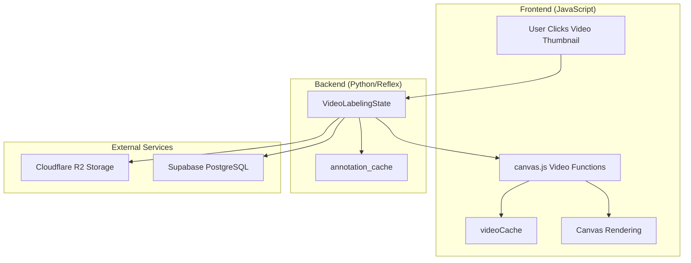
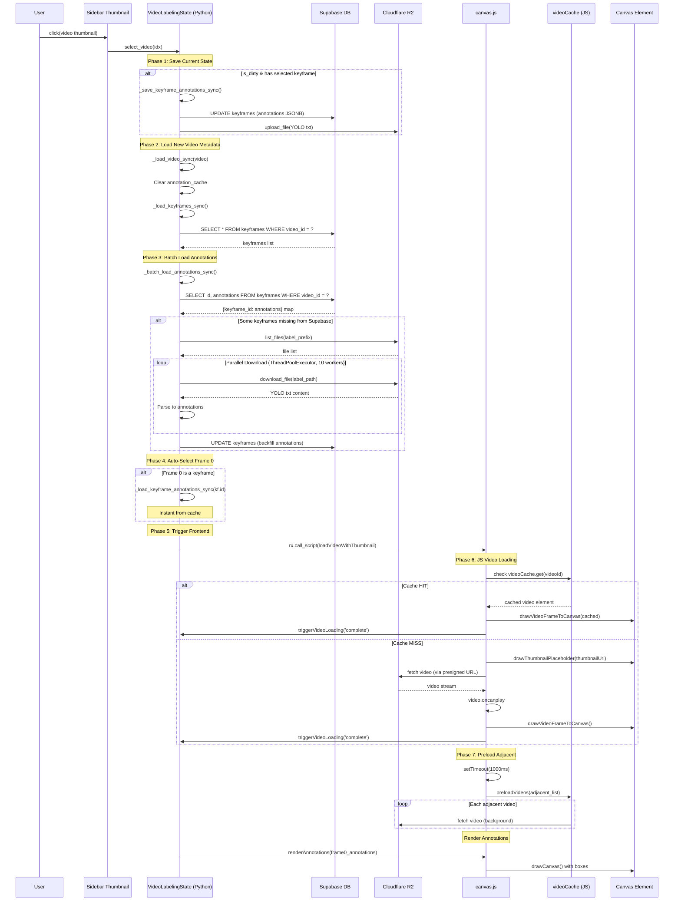
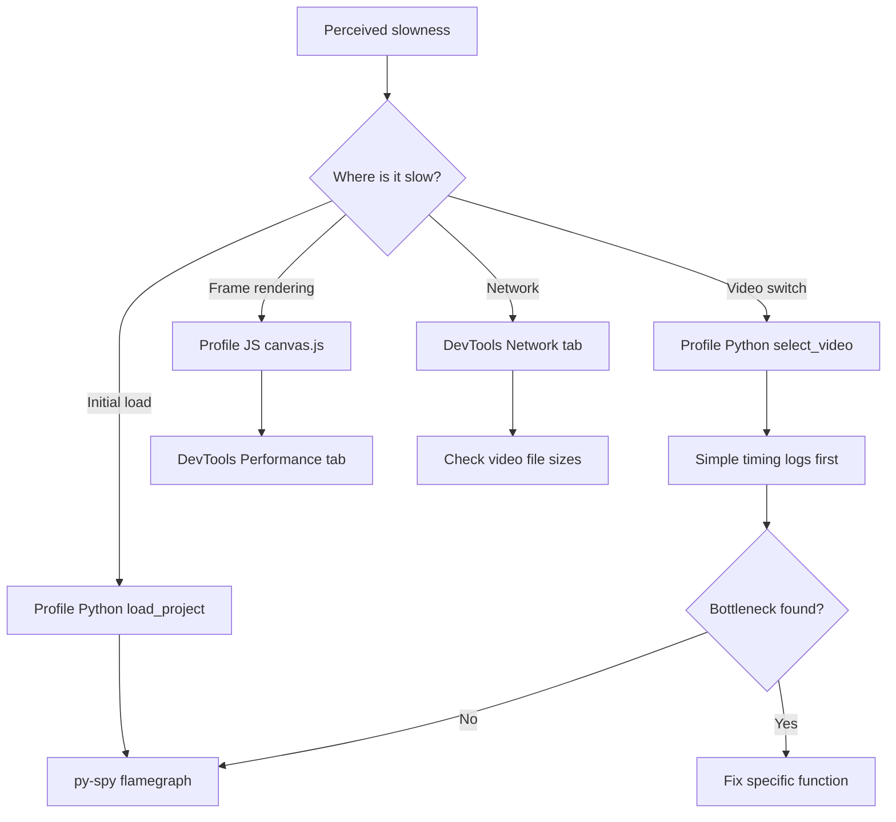

# Video Switching Flow Investigation

> **Objective**: Understand all operations involved when switching videos to identify performance bottlenecks.

---

## High-Level Architecture



---

## Complete Video Switching Sequence

When a user clicks a video thumbnail in the sidebar, the following sequence occurs:



---

## Phase-by-Phase Breakdown

### Phase 1: Save Current State (if dirty)
**Location**: [video_state.py:L810-813](file:///Users/jorge/PycharmProjects/AIO2/modules/labeling/video_state.py#L810-813)
| Operation | Target | Typical Latency |
|-----------|--------|-----------------|
| Update keyframe annotations | Supabase JSONB | 5-20ms |
| Upload YOLO label file | R2 | 50-150ms |
| Update class counts | Supabase | 10-30ms |

**Potential Bottleneck**: R2 upload is synchronous and blocking.

---

### Phase 2: Load Video Metadata
**Location**: [video_state.py:L595-632](file:///Users/jorge/PycharmProjects/AIO2/modules/labeling/video_state.py#L595-632)
| Operation | Description | Latency |
|-----------|-------------|---------|
| Set video state vars | Local state update | <1ms |
| Clear annotation_cache | `self.annotation_cache = {}` | <1ms |
| Load keyframes from DB | `get_video_keyframes()` | 5-20ms |

---

### Phase 3: Batch Load Annotations (CRITICAL FOR PERFORMANCE)
**Location**: [video_state.py:L658-725](file:///Users/jorge/PycharmProjects/AIO2/modules/labeling/video_state.py#L658-725)

```
┌─────────────────────────────────────────────────────────────────┐
│                    ANNOTATION LOADING STRATEGY                   │
├─────────────────────────────────────────────────────────────────┤
│  1. Supabase: Single batch query for ALL keyframe annotations  │
│     get_video_keyframe_annotations(video_id) → instant cache   │
│                                                                 │
│  2. R2 Fallback: Only for un-migrated data                     │
│     - list_files(prefix) to avoid N HEAD requests              │
│     - ThreadPoolExecutor(10 workers) parallel download         │
│     - Auto-backfill to Supabase for future fast loads          │
└─────────────────────────────────────────────────────────────────┘
```

| Scenario | Expected Latency |
|----------|------------------|
| All annotations in Supabase | 10-50ms (single query) |
| Some in R2 (N files) | 200-500ms+ (parallel downloads) |
| First-time video (many R2) | 1-3 seconds |

**Potential Bottleneck**: R2 fallback with many keyframes can be slow.

---

### Phase 4: Auto-Select Frame 0 Keyframe
**Location**: [video_state.py:L825-833](file:///Users/jorge/PycharmProjects/AIO2/modules/labeling/video_state.py#L825-833)

| Operation | Source | Latency |
|-----------|--------|---------|
| Load annotations | annotation_cache | <1ms (instant) |

---

### Phase 5: JavaScript Bridge
**Location**: [video_state.py:L859-872](file:///Users/jorge/PycharmProjects/AIO2/modules/labeling/video_state.py#L859-872)

The Python state returns an `rx.call_script()` that triggers JS with a 100ms `setTimeout` delay:
```javascript
setTimeout(function() {
    setVideoCacheSize(N);
    loadVideoWithThumbnail(videoUrl, thumbnailUrl, videoId);
    renderAnnotations(annotations);
    setTimeout(function() { preloadVideos(adjacent); }, 1000);
}, 100);
```

**Intentional Delay**: 100ms to ensure canvas.js is initialized.

---

### Phase 6: JS Video Loading
**Location**: [canvas.js:L1732-1752](file:///Users/jorge/PycharmProjects/AIO2/assets/canvas.js#L1732-1752)

```
┌────────────────────────────────────────────────────────────────┐
│                     VIDEO CACHE MECHANISM                       │
├────────────────────────────────────────────────────────────────┤
│  videoCache = {                                                │
│    elements: Map<videoId, {video: Element, url, ready}>        │
│    maxSize: 2-10 (based on video resolution)                   │
│    currentVideoId: string                                      │
│  }                                                             │
│                                                                │
│  Cache Size Formula (Python):                                  │
│    calculate_cache_count(videos, target_mb=400)                │
│    Based on: width * height * 3 (RGB) * 30 frames              │
└────────────────────────────────────────────────────────────────┘
```

| Scenario | Operation | Latency |
|----------|-----------|---------|
| Cache HIT | Use cached `<video>` element | <50ms |
| Cache MISS + Thumbnail | Show thumbnail → stream video | 200ms-2s |
| Cache MISS + No Thumbnail | Loading overlay → stream | 200ms-2s |

---

### Phase 7: Adjacent Video Preloading
**Location**: [canvas.js:L1758-1766](file:///Users/jorge/PycharmProjects/AIO2/assets/canvas.js#L1758-1766)

After 1 second delay, preloads adjacent videos:
- Calculates adjacent indices: `±(cache_size/2)` videos
- Each video loaded into a hidden `<video>` element
- LRU eviction when cache is full

---

## Identified Performance Bottlenecks

### 🔴 High Impact

| Issue | Location | Impact | Suggestion |
|-------|----------|--------|------------|
| Synchronous R2 save on video switch | `_save_keyframe_annotations_sync` | 50-150ms blocking | Make async, don't block switch |
| R2 annotation fallback | `_batch_load_annotations_sync` | 200ms-3s for unmigrated data | One-time bulk migration script |
| Video network streaming | `loadVideo()` | 200ms-2s network latency | Already mitigated by cache & thumbnails |

### 🟡 Medium Impact

| Issue | Location | Impact | Suggestion |
|-------|----------|--------|------------|
| 100ms intentional delay | `select_video` JS call | 100ms added latency | Reduce if canvas is reliably ready |
| Synchronous keyframe DB query | `_load_keyframes_sync` | 5-20ms | Could be batched with annotations |

### 🟢 Low Impact (Already Optimized)

| Optimization | Status |
|--------------|--------|
| Batch annotation loading from Supabase | ✅ Single query |
| Video element caching (JS) | ✅ LRU cache with preloading |
| Thumbnail placeholder | ✅ Shows immediately |
| Parallel R2 downloads | ✅ ThreadPoolExecutor(10) |
| Annotation caching (Python) | ✅ annotation_cache dict |

---

## Data Flow Summary

```
┌─────────────────────────────────────────────────────────────────┐
│                        WHAT GETS FETCHED                         │
├─────────────────────────────────────────────────────────────────┤
│  FROM SUPABASE:                                                 │
│    • Keyframe list: id, frame_number, timestamp, annotation_count│
│    • Annotations (JSONB): class_id, x, y, w, h, class_name      │
│                                                                 │
│  FROM R2 (presigned URLs, already generated):                   │
│    • Video file: streamed by browser                            │
│    • Thumbnail: quick placeholder image                         │
│    • Labels (fallback): YOLO txt files (only if not in Supabase)│
├─────────────────────────────────────────────────────────────────┤
│                       WHAT GETS CACHED                          │
├─────────────────────────────────────────────────────────────────┤
│  PYTHON (VideoLabelingState):                                   │
│    • annotation_cache: {keyframe_id: [annotations]} per video   │
│    • Cleared on video switch, repopulated via batch load        │
│                                                                 │
│  JAVASCRIPT (canvas.js):                                        │
│    • videoCache.elements: Map<videoId, HTMLVideoElement>        │
│    • LRU eviction, 2-10 videos based on resolution              │
├─────────────────────────────────────────────────────────────────┤
│                       WHAT GETS RENDERED                        │
├─────────────────────────────────────────────────────────────────┤
│  1. Thumbnail placeholder (immediate, during video load)        │
│  2. Video frame via drawVideoFrameToCanvas()                    │
│  3. Annotations via renderAnnotations() → drawBox()             │
└─────────────────────────────────────────────────────────────────┘
```

---

## Profiling Options

### Python Profiling

#### 1. cProfile (Built-in, Line-by-line)
```python
import cProfile
import pstats

# Wrap around a specific function
def profile_video_switch():
    profiler = cProfile.Profile()
    profiler.enable()
    
    # ... call select_video() or other methods
    
    profiler.disable()
    stats = pstats.Stats(profiler).sort_stats('cumtime')
    stats.print_stats(20)  # Top 20 functions
```

**Usage**: Add around `select_video()` temporarily for detailed timing.

#### 2. py-spy (External Sampling Profiler)
```bash
# Install
pip install py-spy

# Attach to running Reflex process
py-spy record --pid $(pgrep -f "reflex run") --output profile.svg

# Or run with profiling
py-spy record -o profile.svg -- python -m reflex run
```

**Best For**: Flamegraph visualization without code changes.

#### 3. line_profiler (Line-by-line Timing)
```bash
pip install line_profiler
```

```python
# Add to video_state.py
from line_profiler import profile

@profile
def select_video(self, idx: int):
    ...
```

```bash
# Run with kernprof
kernprof -l -v aio.py
```

#### 4. Simple Timing (Quick & Dirty)
```python
import time

def _load_video_sync(self, video: VideoModel):
    t0 = time.perf_counter()
    # ... existing code ...
    self._load_keyframes_sync()
    print(f"[PERF] _load_keyframes_sync: {(time.perf_counter()-t0)*1000:.1f}ms")
    
    t1 = time.perf_counter()
    self._batch_load_annotations_sync()
    print(f"[PERF] _batch_load_annotations_sync: {(time.perf_counter()-t1)*1000:.1f}ms")
```

> [!TIP]
> **Recommended for this codebase**: Add simple timing logs first to identify which phase is slow, then use py-spy for deeper investigation.

---

### Reflex-Specific Profiling

#### 1. Event Handler Timing
Reflex event handlers run on the backend. Profile them like regular Python:
```python
def select_video(self, idx: int):
    import time
    start = time.perf_counter()
    # ... handler code ...
    print(f"[Reflex] select_video total: {(time.perf_counter()-start)*1000:.1f}ms")
```

#### 2. State Serialization Overhead
Reflex serializes state to send to frontend. Large state = slow updates.
```python
# Check state size
import sys
print(f"State size: {sys.getsizeof(self.annotations)} bytes")
print(f"Cache size: {sum(len(v) for v in self.annotation_cache.values())} annotations")
```

#### 3. WebSocket Debugging
In browser DevTools → Network → WS tab:
- Watch JSON payload sizes
- Check round-trip time for state updates

---

### JavaScript Profiling

#### 1. Browser DevTools Performance Tab
1. Open DevTools (F12)
2. Go to **Performance** tab
3. Click Record ⏺️
4. Switch videos in the app
5. Stop recording
6. Analyze:
   - **Main thread** activity (blocking JS)
   - **Network** waterfall (video loading)
   - **Frames** (rendering jank)

#### 2. Console Timing
Already present in canvas.js via `console.log()`. Enable trace:
```javascript
// Add to canvas.js for detailed timing
console.time('loadVideoWithThumbnail');
// ... function body ...
console.timeEnd('loadVideoWithThumbnail');
```

#### 3. Network Tab Analysis
1. DevTools → **Network** tab
2. Filter by **Media** or **Fetch/XHR**
3. Watch for:
   - Video file size & download time
   - API calls to Supabase
   - R2 presigned URL fetches

#### 4. Lighthouse Performance Audit
```bash
# In DevTools → Lighthouse
# Or via CLI:
npx lighthouse http://localhost:3000/video-editor --only-categories=performance
```

---

### Recommended Profiling Workflow



---

## Quick Wins for Performance

1. **Async Save on Switch**: Don't block `select_video()` waiting for R2 upload
   ```python
   # Instead of synchronous save:
   # self._save_keyframe_annotations_sync(current_kf)
   # Use background thread:
   threading.Thread(target=self._save_keyframe_annotations_sync, args=(current_kf,)).start()
   ```

2. **Reduce 100ms Delay**: If canvas is reliably initialized, reduce to 50ms or 0ms

3. **Migrate R2 Labels to Supabase**: One-time script to eliminate R2 fallback path

4. **Preload More Aggressively**: Increase cache size or preload on hover instead of after click

---

## Conclusion

The video switching flow is **well-architected** with multiple layers of caching and optimizations:
- ✅ Python annotation cache
- ✅ JS video element cache
- ✅ Thumbnail placeholders
- ✅ Background preloading
- ✅ Batch Supabase queries

**Main remaining bottlenecks**:
1. Synchronous R2 save when switching (if dirty)
2. R2 fallback for unmigrated annotation data
3. Network latency for uncached videos (unavoidable)

Use the profiling tools above to measure actual timings and identify which phase is causing perceived slowness.
