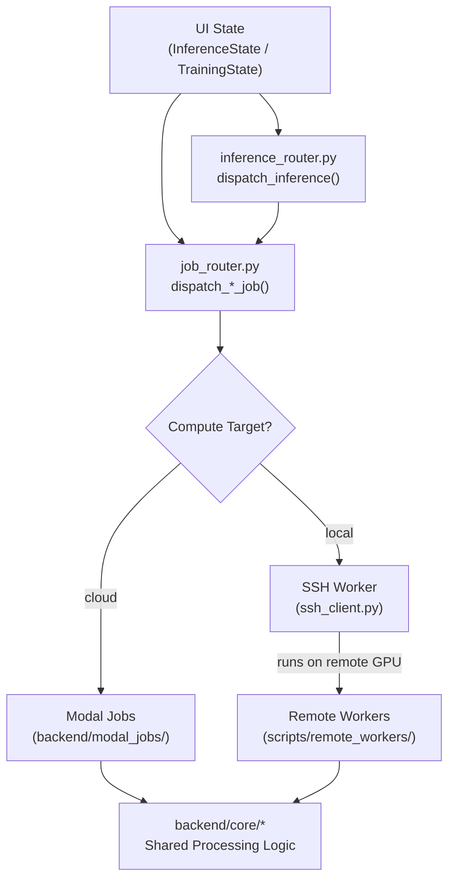

# Modal Jobs, Remote Workers & Core Processing

> The GPU computation layer — where all the heavy ML processing happens.

---

## Dispatch Flow



> **Key pattern**: Both Modal jobs and remote workers import the same `backend/core/` modules. The core modules contain the actual ML logic; Modal jobs and remote workers are just wrappers that handle I/O and environment setup.

---

## `backend/modal_jobs/` — Modal Cloud GPU Jobs

Each file is a self-contained Modal app with GPU-decorated functions.

| File | Modal App Name | Entry Function | GPU | Purpose |
|------|---------------|----------------|-----|---------|
| `infer_job.py` | `yolo-inference` | `infer_image()`, `infer_batch()`, `infer_video()` | T4 | YOLO detection inference |
| `hybrid_infer_job.py` | `hybrid-inference` | `hybrid_inference()`, `hybrid_inference_batch()`, `hybrid_inference_video()` | A10G/L40S | SAM3 + classifier hybrid inference |
| `autolabel_job.py` | `yolo-autolabel` | `autolabel_images()` | A10G | Automatic annotation with SAM3 |
| `train_job.py` | `yolo-training` | `train_yolo()` | A10G | YOLO detection training |
| `train_classify_job.py` | `yolo-classify-training` | `train_classifier()` | A10G | Classification training (YOLO + ConvNeXt) |
| `train_sam3_job.py` | `sam3-training` | `train_sam3()` | A10G | SAM3 fine-tuning with semantic classes (1,170 lines) |
| `api_infer_job.py` | `safari-api-inference` | `process_image_job_hybrid()`, `process_video_job_hybrid()` | A10G/L40S | Public REST API inference endpoints (1,472 lines) |
| `model_volume.py` | `yolo-models` | `get_model_volume()` | — | Modal volume management for model weights |

### How Modal Jobs Work

1. **Job is spawned** from `job_router.py` via `modal.Function.from_name("app-name", "function").spawn()`
2. **Modal boots a container** with the pre-built image (GPU, Python deps, code baked in)
3. **Job imports** `backend/core/*` modules for actual processing
4. **Results** are written to Supabase (DB) and R2 (files) directly from the container
5. **Progress** is reported via `update_inference_progress()` / `update_training_run()` for polling

---

## `scripts/remote_workers/` — SSH Local GPU Worker Scripts

These scripts run on remote machines (e.g., Alienware with GPU). They're synced via `SSHWorkerClient.sync_scripts()`.

| File | Purpose | Corresponding Modal Job |
|------|---------|----------------------|
| `remote_infer.py` | YOLO detection inference | `infer_job.py` |
| `remote_hybrid_infer.py` | Hybrid SAM3 + classifier inference | `hybrid_infer_job.py` |
| `remote_yolo_infer.py` | YOLO-only inference (API parity) | `infer_job.py` |
| `remote_autolabel.py` | Auto-labeling | `autolabel_job.py` |
| `remote_train.py` | Detection training | `train_job.py` |
| `remote_train_classify.py` | Classification training | `train_classify_job.py` |
| `remote_utils.py` | Shared utilities (R2, Supabase, progress) | — |

### How SSH Workers Work

1. **Job is dispatched** from `job_router.py` via `SSHWorkerClient.execute_async("remote_train.py", params)`
2. **SSH client** starts the script via nohup on the remote machine
3. **Worker reads params** from stdin JSON, imports `backend/core/*` for processing
4. **Progress** is written to a log file on the remote machine
5. **Polling** reads the log file via `SSHWorkerClient.check_async_job(job_ref)`
6. **Results** are written to Supabase/R2 directly from the remote machine

### Setup & Verification Scripts

| File | Purpose |
|------|---------|
| `install.sh` | Full remote environment setup |
| `remote_setup.sh` | Lightweight environment bootstrap |
| `remote_requirements.txt` | Python dependencies for remote |
| `verify_remote.py` | Verify remote environment is ready |
| `cleanup_cache.py` | Clean up model/data cache on remote |

---

## `backend/core/` — Shared Core Processing Modules

These are **pure logic** modules — no Modal or SSH dependencies. They're imported by both Modal jobs and remote workers.

| Module | Lines | Key Functions | Purpose |
|--------|-------|--------------|---------|
| `hybrid_infer_core.py` | 477 | `run_hybrid_inference()` | Single-image SAM3 + classifier pipeline |
| `hybrid_batch_core.py` | 321 | `run_hybrid_batch_inference()` | Multi-image hybrid inference |
| `hybrid_video_core.py` | 799 | `run_hybrid_video_inference()` | Video SAM3 tracking + classification |
| `autolabel_core.py` | 538 | `run_autolabel()` | YOLO + SAM3 auto-annotation pipeline |
| `train_detect_core.py` | 340 | `run_detection_training()` | YOLO detection training pipeline |
| `train_classify_core.py` | 647 | `run_classification_training()` | ConvNeXt/YOLO classification training |
| `sam3_dataset_core.py` | 233 | `prepare_sam3_dataset()` | SAM3 fine-tuning dataset preparation |
| `yolo_infer_core.py` | 307 | `run_yolo_inference()` | Pure YOLO detection inference |
| `image_utils.py` | 128 | `download_image()`, `crop_image()` | Image download and cropping |
| `classifier_utils.py` | 113 | `load_classifier()`, `classify_crop()` | Model loading + classification |
| `thumbnail_generator.py` | 578 | `generate_thumbnail()` | Result thumbnail generation |

### Data Flow Example: Hybrid Video Inference

```
User clicks "Run" in Playground
    ↓
InferenceState.start_hybrid_video_inference()    # modules/inference/state.py
    ↓
dispatch_inference(config, **params)              # backend/inference_router.py
    ↓
dispatch_hybrid_inference_video(...)              # backend/job_router.py
    ↓ (if cloud)
modal.Function("hybrid-inference", "hybrid_inference_video").spawn()
    ↓
hybrid_inference_video()                          # backend/modal_jobs/hybrid_infer_job.py
    ↓
run_hybrid_video_inference(...)                   # backend/core/hybrid_video_core.py
    ↓
Results → Supabase + R2
    ↓
InferenceState.polling_inference()               # Polls progress via Supabase
```

---

## `backend/api/` — Public REST API

Deployed as a Modal ASGI app (separate from the Reflex frontend).

| File | Purpose |
|------|---------|
| `server.py` | FastAPI app + Modal deployment config |
| `auth.py` | API key validation middleware |
| `routes/inference.py` | `POST /api/v1/infer/{slug}` + `POST /api/v1/infer/{slug}/video` |
| `routes/jobs.py` | `GET /api/v1/jobs/{job_id}` — poll video results |

### API Deployment

```bash
modal deploy backend/api/server.py    # Deploys to Modal as ASGI app
```
