# Architecture

> Technical reference for the SAFARI platform architecture. Covers system topology, compute routing, shared core patterns, storage, state management, and API infrastructure.

---

## System Overview

SAFARI is a wildlife detection platform with two primary codebases:

| Component | Technology | Responsibility |
|-----------|------------|----------------|
| **SAFARI Server** | Reflex (Python) | Web UI, state management, job orchestration |
| **SAFARIDesktop** | Tauri (Rust + TS) | Native desktop client, video processing, scientific analytics |
| **Modal Cloud** | Modal (Python) | GPU jobs: training, inference, autolabeling |
| **Local GPU** | SSH + Python | Same jobs on user hardware (e.g., RTX 4090) |
| **Supabase** | PostgreSQL | Projects, datasets, annotations, training runs, auth |
| **R2** | S3-compatible | Images, labels, model weights, inference results |

### SAFARI Ecosystem

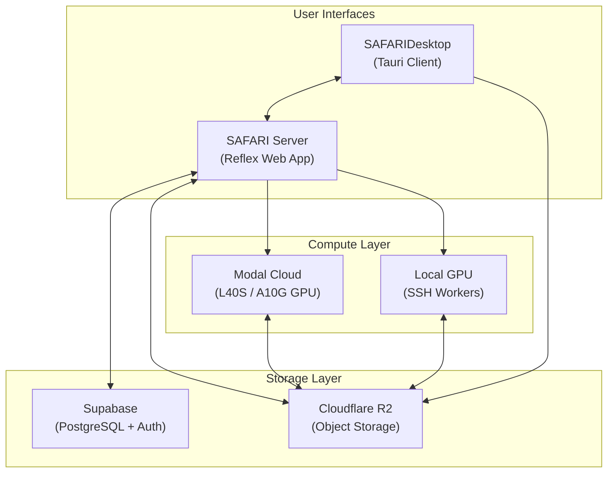

---

## Compute Architecture

All GPU workloads are dispatched via the **Job Router** (`backend/job_router.py`). The compute target — cloud or local GPU — is selected **per action** by the user at dispatch time, not locked per project.

### Action-Level Routing

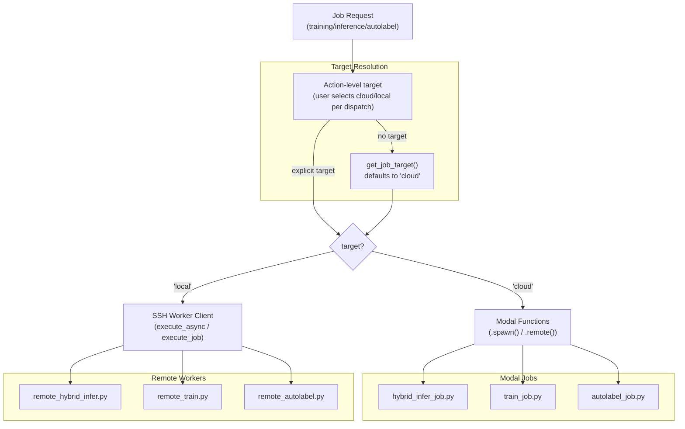

### GPU Assignment by Job Type

| Job Type | Modal GPU | Reason |
|----------|-----------|--------|
| **Hybrid Inference** (single/batch/video) | L40S | SAM3 + classifier = high VRAM |
| **Autolabeling** | L40S | SAM3-based, same VRAM needs |
| **API Inference** | L40S | Public API, same hybrid pipeline |
| **YOLO Detection Inference** | A10G | Lighter workload |
| **Detection Training** | A10G | Standard YOLO training |
| **Classification Training** | A10G | ConvNeXt or YOLO-cls |
| **SAM3 Fine-Tuning** | A10G | SAM3 dataset prep + training |

> All SAM3 operations run with FP16 half precision (`half=True`), providing ~3.5× speedup.

### Inference Implementation Matrix

Full parity is maintained across all input types, model types, and compute targets:

| Input Type | Model Type | Modal (Cloud) | Local GPU |
|------------|------------|:-------------:|:---------:|
| Single Image | YOLO Detection | ✅ | ✅ |
| Single Image | Hybrid (SAM3 + Classifier) | ✅ | ✅ |
| Batch Images | YOLO Detection | ✅ | ✅ |
| Batch Images | Hybrid (SAM3 + Classifier) | ✅ | ✅ |
| Video | YOLO Detection | ✅ | ✅ |
| Video | Hybrid (SAM3 + Classifier) | ✅ | ✅ |

### Inference Router Flow

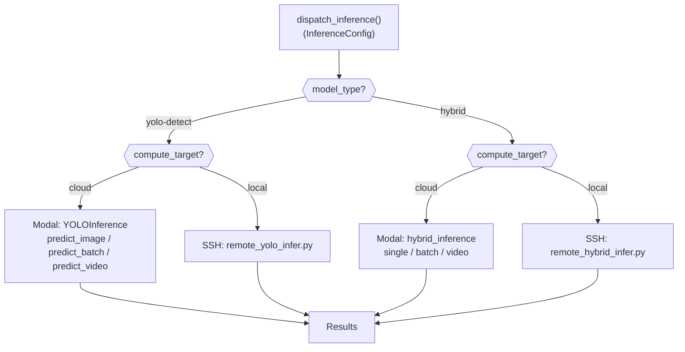

---

## Shared Core Pattern

The `backend/core/` package contains **pure logic** shared between Modal jobs and remote workers. This eliminates code duplication and ensures automatic parity — a bug fix in a core module propagates to all execution environments.

### Inference Cores

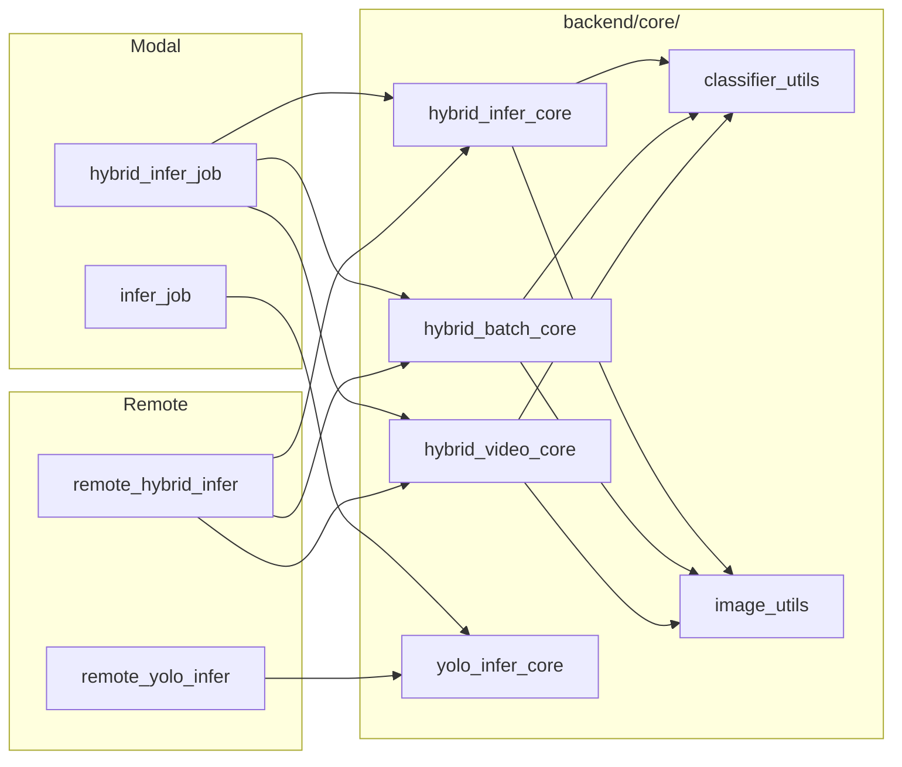

### Core Module Reference

| Module | Key Functions | Used By |
|--------|--------------|---------|
| `hybrid_infer_core.py` | `run_hybrid_inference()`, `run_sam3_detection()`, `run_classification_loop()`, `mask_to_polygon()` | Hybrid inference (single) |
| `hybrid_batch_core.py` | `run_hybrid_batch_inference()` | Hybrid inference (batch) |
| `hybrid_video_core.py` | `run_hybrid_video_inference()`, `classify_unique_tracks()`, `select_diverse_frames()`, `crop_quality_score()` | Hybrid inference (video) |
| `yolo_infer_core.py` | `run_yolo_single_inference()`, `run_yolo_batch_inference()`, `run_yolo_video_inference()` | YOLO detection |
| `autolabel_core.py` | `run_yolo_autolabel()`, `run_sam3_autolabel()` | Autolabeling |
| `train_detect_core.py` | `prepare_yolo_dataset()`, `run_yolo_training()`, `parse_training_results()` | Detection training |
| `train_classify_core.py` | `create_classification_crops()`, `train_classification()` | Classification training |
| `sam3_dataset_core.py` | `prepare_sam3_dataset()` | SAM3 fine-tuning |
| `classifier_utils.py` | `load_classifier()`, `classify_with_convnext()` | Model loading & classification |
| `image_utils.py` | `crop_from_box()`, `download_image()` | Image manipulation |
| `thumbnail_generator.py` | `generate_thumbnail()` | Result thumbnails (masks + boxes) |

### Thin Wrapper Pattern

Modal jobs and remote workers are thin wrappers (~30–50 lines) that simply call core functions, injecting environment-specific parameters:

| Parameter | Modal (Cloud) | Local GPU |
|-----------|---------------|-----------|
| `sam3_model_path` | `/models/sam3.pt` (Modal Volume) | `~/.safari/models/sam3.pt` |
| `download_classifier_fn` | Direct R2 download | Cached R2 download with hash |
| `SAFARI_ROOT` env var | N/A | Set by SSH client to `~/.safari` |

### File Parity Matrix

| Modal Job | Remote Worker | Shared Core | Parity |
|-----------|---------------|-------------|--------|
| `hybrid_infer_job.py` | `remote_hybrid_infer.py` | `hybrid_infer_core.py` | ✅ Automatic |
| `train_job.py` | `remote_train.py` | `train_detect_core.py` | ✅ Automatic |
| `train_classify_job.py` | `remote_train_classify.py` | `train_classify_core.py` | ✅ Automatic |
| `autolabel_job.py` | `remote_autolabel.py` | `autolabel_core.py` | ✅ Automatic |
| `infer_job.py` | `remote_yolo_infer.py` | `yolo_infer_core.py` | ✅ Automatic |
| `train_sam3_job.py` | N/A | `sam3_dataset_core.py` | Cloud only |
| `api_infer_job.py` | N/A | `hybrid_infer_core.py` | Isolated |

---

## Hybrid Inference Pipeline

The hybrid inference pipeline is the platform's most sophisticated flow — a two-stage detection + classification approach powered by SAM3.

### Pipeline Architecture

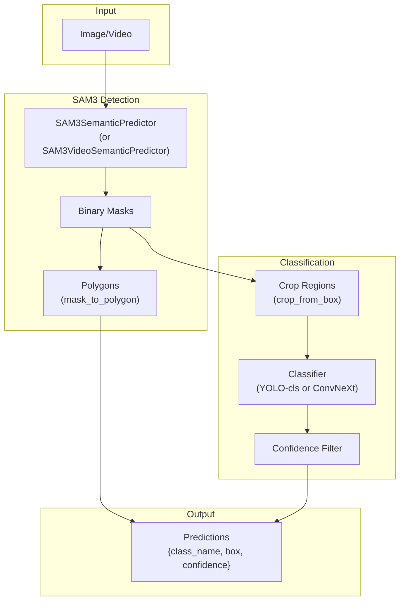

### Backbone Auto-Detection

The classifier backbone is auto-detected by file extension via `backend/core/classifier_utils.py`:

| Extension | Backbone | Loader |
|-----------|----------|--------|
| `.pth` | ConvNeXt | `load_convnext_classifier()` + `timm.create_model()` |
| `.pt` | YOLO-cls | `YOLO(path)` via Ultralytics |

### Quality-Diverse Top-K Classification (Video)

When a video has an animal tracked across many frames, classifying every frame is expensive, and classifying just one is unreliable (a single bad crop kills accuracy). The Top-K strategy picks the **best K frames** per track and uses majority voting for robust species identification.

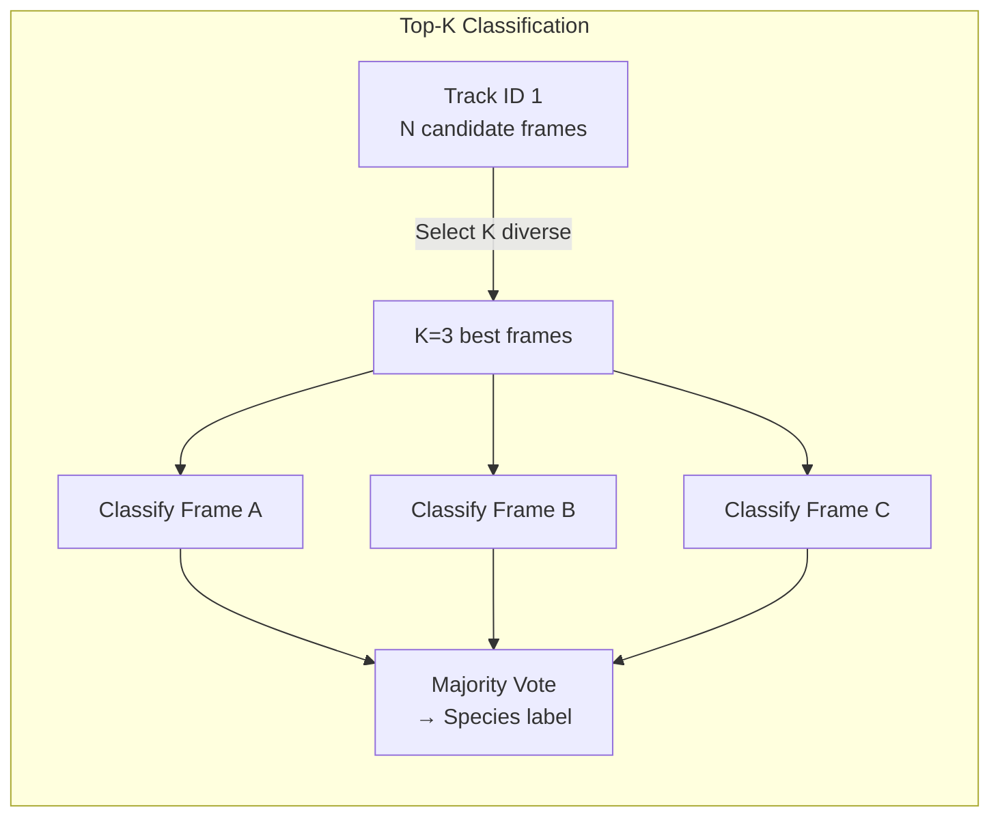

**Step-by-step flow** for each unique `track_id`:

1. **Collect candidates** — every frame where that animal was detected (with bounding box)
2. **Select K diverse frames** via `select_diverse_frames()`:
   - Score ALL candidates using `crop_quality_score()`
   - Pick the highest-quality frame as seed
   - Compute `min_gap = track_span / (K+1)` — ensures temporal spread
   - Greedily add frames: best quality first, but only if ≥ `min_gap` apart from all selected frames
3. **Extract & crop** — OpenCV seeks to each selected frame, crops the detection box with 5% padding
4. **Classify each crop** — ConvNeXt or YOLO-cls (auto-detected by backbone)
5. **Majority vote** via `vote_classifications()`:
   - Filter out failed or below-confidence results
   - Winner = most common species label
   - Returns winner's average confidence + agreement ratio
6. **Store K crop images** — uploaded to R2 for UI preview in the result viewer

### Crop Quality Scoring Heuristic

`crop_quality_score()` returns a [0, 1] score using three GPU-free signals:

| Factor | Weight | Logic |
|--------|--------|-------|
| **Area** | 50% | Larger crop → more detail. Saturates at 10% of frame area |
| **Edge proximity** | 30% | Penalises boxes touching frame borders (likely clipped animal) |
| **Aspect ratio** | 20% | Penalises very elongated boxes (partial animal) |

> The `min_gap` temporal spread is the key design choice. For a track spanning frames 0–300 with K=3, the gap is 75, so frames are picked at roughly 0, ~100, ~200 rather than three consecutive frames where the animal is in the same pose.

### SAM3 Resolution Control

SAM3 inference resolution is configurable per-session (Playground) and per-model (API):

| Resolution | Stride-14 Value | Speed | Quality |
|------------|----------------|-------|---------|
| Low | 490 | Fastest | Lower detail |
| Standard | 644 | Fast | Good balance |
| High | 1036 | Medium | High detail |
| Very High | 1288 | Slow | Very high detail |
| Maximum | 1918 | Slowest | Maximum fidelity |

> All SAM3 resolutions must be stride-14 aligned (divisible by 14). The UI enforces only valid values.

---

## Training Pipeline

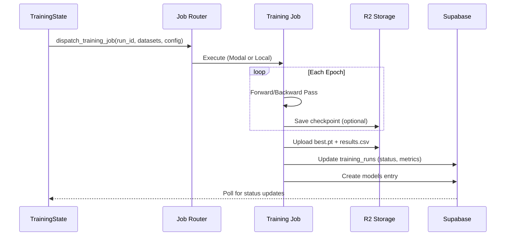

### Training Types

| Type | Modal Job | Local Worker | Output |
|------|-----------|--------------|--------|
| Detection | `train_job.py` | `remote_train.py` | `best.pt` |
| YOLO Classify | `train_classify_job.py` | `remote_train_classify.py` | `best.pt` |
| ConvNeXt Classify | `train_classify_job.py` | `remote_train_classify.py` | `best.pth` |
| SAM3 Fine-Tune | `train_sam3_job.py` | N/A (cloud only) | Fine-tuned SAM3 weights |

> **Extension matters**: YOLO outputs `.pt`, ConvNeXt outputs `.pth`. The inference loader detects backbone by extension.

---

## Storage Architecture

### Overview

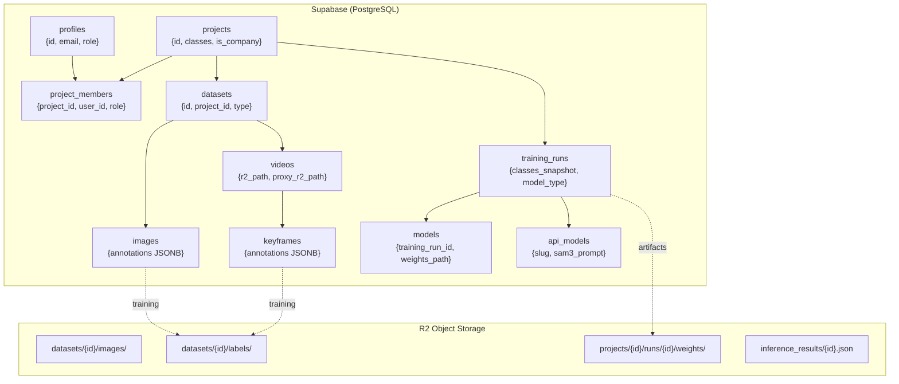

### Supabase Tables

| Table | Purpose | Key Columns |
|-------|---------|-------------|
| `profiles` | User accounts & roles | `role` ('admin'/'user'), `email`, `display_name` |
| `projects` | Container for datasets/models | `classes` (JSONB), `is_company` |
| `project_members` | Multi-user project sharing | `project_id`, `user_id`, `role` |
| `datasets` | Image or video dataset | `type` ("image"/"video"), `usage_tag` |
| `images` | Individual images | `annotations` (JSONB), `labeled`, `annotation_count` |
| `videos` | Video files | `r2_path`, `proxy_r2_path` |
| `keyframes` | Extracted video frames | `annotations` (JSONB), `annotation_count` |
| `training_runs` | Training job records | `classes_snapshot`, `artifacts_r2_prefix`, `model_type` |
| `models` | Trained model registry | `training_run_id`, `weights_path` |
| `api_models` | Promoted API models | `slug`, `sam3_prompt`, `sam3_confidence`, `sam3_imgsz` |

### Dual-Write Pattern

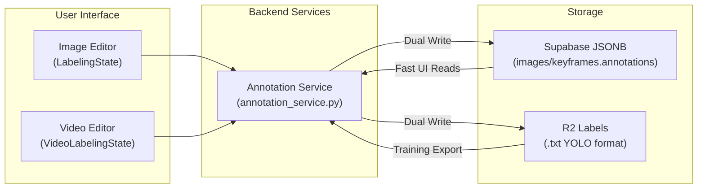

All annotation saves write to **both** storage layers:

| Storage | Format | Purpose | Speed |
|---------|--------|---------|-------|
| Supabase JSONB | `{class_id, x, y, width, height}` | UI reads | ~10ms |
| R2 Labels | YOLO `.txt` format | Training export | ~50ms |

### Annotation Schema

Annotations are JSONB arrays stored in `images.annotations` and `keyframes.annotations`:

```json
[
  {"class_id": 0, "x": 0.25, "y": 0.3, "width": 0.2, "height": 0.15},
  {"class_id": 1, "x": 0.5, "y": 0.4, "width": 0.3, "height": 0.25}
]
```

> **Class name resolution**: Annotations store only `class_id`. Names are resolved at read time via the project's `classes` array. This makes class renames O(1) — no annotation updates needed.

### Coordinate Formats

| Format | Fields | Used By |
|--------|--------|---------|
| **Prediction box** | `[x1, y1, x2, y2]` | Inference outputs, video results |
| **Annotation** | `{x, y, width, height}` | Database storage, labeling UI |
| **YOLO label** | `class_id x_center y_center width height` | Training export |

All coordinates are normalized to 0–1 range.

### R2 Storage Paths

| Content | Path Pattern |
|---------|-------------|
| Dataset images | `datasets/{dataset_id}/images/` |
| Dataset labels | `datasets/{dataset_id}/labels/` |
| Training weights | `projects/{project_id}/runs/{run_id}/weights/` |
| Inference results | `inference_results/{result_id}.json` |
| Classification crops | `inference_results/{result_id}/crops/` |
| Video uploads | `inference_temp/{user_id}/` |
| Thumbnails | `projects/{id}/thumbnail.jpg`, `datasets/{id}/thumbnail.jpg` |

---

## State Management

### Key State Classes

| State Class | Location | Purpose |
|-------------|----------|---------|
| `AuthState` | `app_state.py` | Authentication & session management |
| `HubState` | `modules/auth/hub_state.py` | Dashboard hub |
| `InferenceState` | `modules/inference/state.py` | Playground inference |
| `TrainingState` | `modules/training/state.py` | Training dashboard |
| `LabelingState` | `modules/labeling/state.py` | Image labeling editor |
| `VideoLabelingState` | `modules/labeling/video_state.py` | Video labeling editor |
| `ApiState` | `modules/api/state.py` | API key management |
| `AdminState` | `modules/admin/admin_state.py` | Admin panel & project sharing |

### Key Data Holders

| Data | Held By | Accessed From |
|------|---------|---------------|
| `project_id` | `ProjectDetailState` | Training, Labeling |
| `selected_model_id` | `InferenceState` | Inference dispatch |
| `classifier_r2_path` | `InferenceState` | Hybrid inference |
| `is_hybrid_mode` | `InferenceState` | Flow routing |
| `user_role` | `AuthState` | Admin panel visibility |

---

## API Infrastructure

The REST API runs as a FastAPI ASGI application deployed on Modal, completely isolated from the Playground workers.

### API Architecture

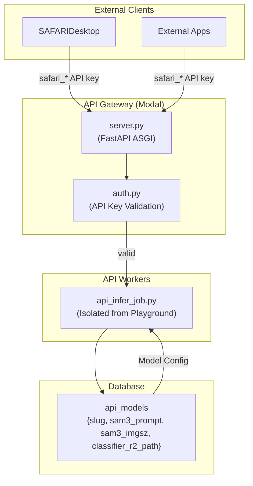

### Components

| Component | File | Purpose |
|-----------|------|---------|
| API Gateway | `backend/api/server.py` | FastAPI ASGI on Modal |
| API Inference Worker | `backend/modal_jobs/api_infer_job.py` | Isolated GPU worker |
| Authentication | `backend/api/auth.py` | `safari_*` API key validation |
| Inference Routes | `backend/api/routes/inference.py` | Image, batch, video endpoints |
| Jobs Routes | `backend/api/routes/jobs.py` | Async job status polling |

### API Model Configuration

| Column | Purpose | Example |
|--------|---------|---------|
| `slug` | URL-safe model identifier | `"lynx-detector-v2"` |
| `sam3_prompt` | SAM3 detection prompt | `"animal"` |
| `sam3_confidence` | SAM3 detection threshold | `0.25` |
| `sam3_imgsz` | SAM3 inference resolution | `644` |
| `classes_snapshot` | Class list frozen at promotion time | `["Lynx", "Deer"]` |
| `include_masks` | Return mask polygons | `true` |

### Worker Isolation

API workers are completely separate from Playground workers, but both import from the same `backend/core/` shared logic. Bug fixes propagate automatically, while scaling remains independent.

---

## Model Loading Reference

### Model Families

| Model Family | Extension | Loader | Package |
|--------------|-----------|--------|---------|
| YOLO Detection | `.pt` | `YOLO(path)` | `ultralytics` |
| YOLO Classify | `.pt` | `YOLO(path)` | `ultralytics` |
| ConvNeXt Classify | `.pth` | `torch.load()` + `timm` | `torch`, `timm` |
| SAM3 (Image) | `sam3.pt` | `SAM3SemanticPredictor` | `ultralytics>=8.3.237` |
| SAM3 (Video) | `sam3.pt` | `SAM3VideoSemanticPredictor` | `ultralytics>=8.3.237` |

### SAM3 Model Locations

| Context | Path | Source |
|---------|------|--------|
| Modal (Cloud) | `/models/sam3.pt` | Modal Volume `sam3-volume` |
| Local GPU | `~/.safari/models/sam3.pt` | Downloaded by `install.sh` |

> SAM3 weights are never auto-downloaded. They must be explicitly pre-staged. SAM3 is Ultralytics' implementation — import: `from ultralytics.models.sam import SAM3SemanticPredictor`.

### SAM3 API Patterns

| Use Case | Class | Pattern |
|----------|-------|---------|
| **Image (text prompt)** | `SAM3SemanticPredictor` | `predictor.set_image(path)` → `predictor(text=["mammal"])` |
| **Video (text prompt)** | `SAM3VideoSemanticPredictor` | `predictor(source=path, text=["mammal"], stream=True)` |
| **Single object (click/box)** | `SAM` | `model.predict(source=path, points=[x,y])` |

---

## SAFARIDesktop Integration

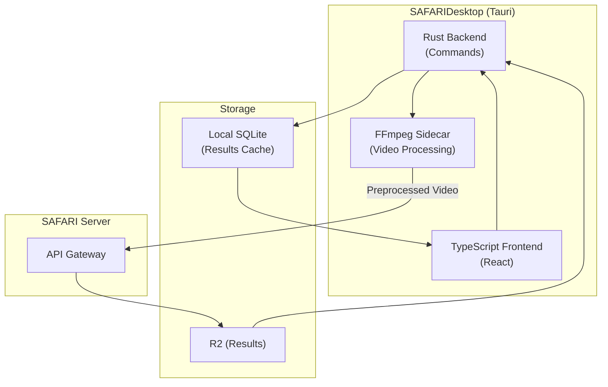

| Stage | Technology | Notes |
|-------|-----------|-------|
| Video Preprocessing | FFmpeg sidecar (libx264) | 640 / 1024 / HD resize targets |
| API Communication | Rust `reqwest` | OpenAPI contract |
| Results Display | Canvas overlays | 60Hz RAF rendering |
| Local Persistence | SQLite | Results gallery + analytics |

---

## Session & Authentication

The platform uses a multi-layered session resilience strategy:

| Layer | Mechanism | Purpose |
|-------|-----------|---------|
| **Token Storage** | localStorage / sessionStorage | Persist credentials |
| **Proactive Refresh** | Refresh before expiration | Prevent session drops |
| **JWT Retry** | Re-auth on PGRST303 errors | Handle expired tokens |
| **Self-Healing** | Auto-restore from storage | Recover from failures |
| **Controlled Reload** | Full reload after >30 min idle | Bypass stale WebSocket |

---

## Common Gotchas

| # | Issue | Symptom | Resolution |
|---|-------|---------|------------|
| 3 | Video Persistence | Large JSON, UI crashes | Store full data in R2, summary in DB |
| 7 | Presigned URL Expiry | 403 errors in Modal | Regenerate URLs before `.remote()` |
| 18 | UUID Empty String | `invalid syntax for type uuid` | Return early if `project_id` empty |
| 19 | Hardcoded Extensions | Wrong model loaded | Check backbone for `.pt` vs `.pth` |
| 25 | SAM3 Video API | `AttributeError: set_video` | Use streaming iterator pattern |
| 26 | SAM3 Model Path | `NoneType` error | Always pass explicit model path |
| 27 | Class ID Zero Falsy | First class ignored | Use `class_id is not None` not `if class_id` |
