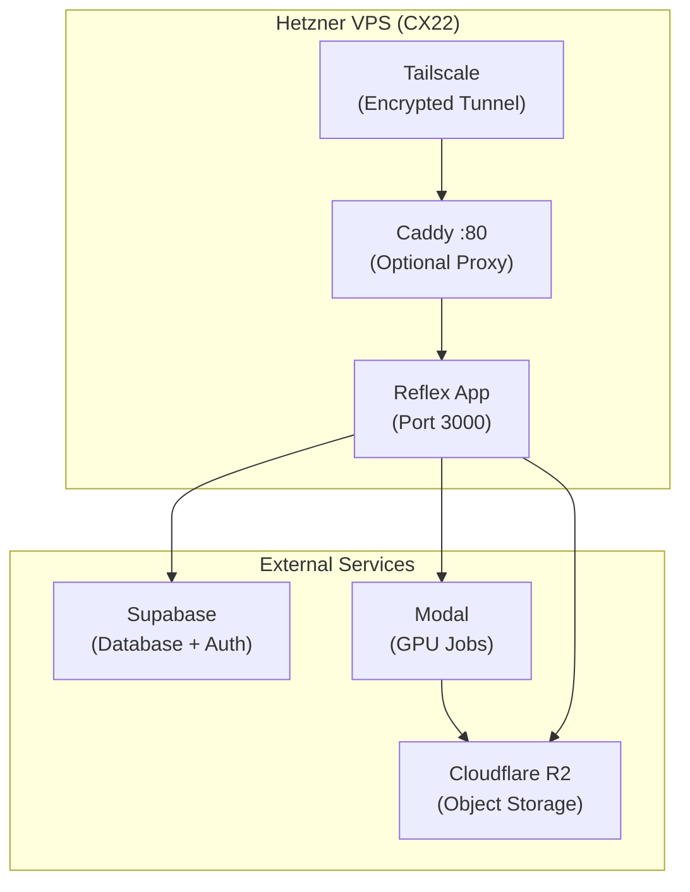

# Deployment

> Deploy SAFARI on a VPS behind Tailscale using systemd. All heavy compute runs on Modal — the VPS only serves the UI.

---

## Deployment Architecture



---

## Prerequisites

| Requirement | Details |
|-------------|---------|
| **VPS** | Hetzner CX22 (2 vCPU, 4 GB RAM, ~€4/mo) or equivalent |
| **OS** | Ubuntu 24.04 LTS |
| **Tailscale** | Installed on both server and all client machines |
| **Credentials** | Supabase URL + keys, Cloudflare R2 keys, Modal token |

> No public domain or SSL certificate needed. Tailscale provides encrypted point-to-point tunnels. The app is only accessible within your Tailscale network.

---

## 1. Server Setup

SSH into your VPS and install system packages:

```bash
ssh root@YOUR_SERVER_IP

# System updates
apt update && apt upgrade -y

# Add deadsnakes PPA for Python 3.11
# (Ubuntu 24.04 ships with 3.12, but we match the dev environment exactly)
add-apt-repository ppa:deadsnakes/ppa -y
apt update

# Install Python 3.11 and system dependencies
apt install -y python3.11 python3.11-venv git curl ffmpeg unzip

# Install Tailscale
curl -fsSL https://tailscale.com/install.sh | sh
tailscale up

# Create service user and app directory
useradd -r -m -s /bin/bash safari
mkdir -p /opt/safari
chown safari:safari /opt/safari
```

---

## 2. Application Setup

```bash
# Switch to service user
su - safari
cd /opt/safari

# Clone repository
git clone https://github.com/biota-cloud/safari.git .

# Create virtual environment
python3.11 -m venv .venv
source .venv/bin/activate
pip install -r requirements.txt

# Configure environment
cp .env.production.example .env
nano .env  # Fill in Supabase, R2, and app settings
chmod 600 .env  # Restrict secrets to safari user only
```

See `.env.production.example` for all required variables with descriptions.

---

## 3. Supabase Database Setup

For a fresh deployment, create all tables, RLS policies, and triggers by running the consolidated schema in the Supabase SQL Editor:

1. Go to your Supabase project → **SQL Editor**
2. Copy the contents of `migrations/schema.sql`
3. Paste and run — creates all 13 tables, helper functions, RLS policies, and the auto-profile trigger

> **Important**: Run the schema **before** your first login. The `handle_new_user` trigger auto-creates a user profile when someone signs up via Supabase Auth.

---

## 4. Modal Authentication & Secrets

Modal handles GPU jobs (inference, training). Set it up on the server:

### Modal Token

1. Go to [modal.com/settings](https://modal.com/settings) → **API Tokens** → **Create new token**
2. Modal will show you a ready-to-paste command — copy it:
   ```
   modal token set --token-id ak-... --token-secret as-...
   ```
3. Paste and run it on the server
4. Verify: `modal app list` — should list your deployed apps

This writes credentials to `~/.modal.toml` — one-time setup per machine.

### Modal Secrets

Before deploying jobs, create these secrets in the [Modal dashboard](https://modal.com/secrets):

| Secret Name | Variables |
|-------------|-----------|
| **`r2-credentials`** | `R2_ENDPOINT_URL`, `R2_ACCESS_KEY_ID`, `R2_SECRET_ACCESS_KEY`, `R2_BUCKET_NAME` |
| **`supabase-credentials`** | `SUPABASE_URL`, `SUPABASE_KEY`, `SUPABASE_SERVICE_ROLE` |

---

## 5. Deploy Modal Jobs

```bash
./scripts/deploy_modal.sh
```

This deploys all 6 GPU jobs + the API server in one command:

| Modal App | Purpose |
|-----------|---------|
| `safari-hybrid-inference` | SAM3 + classifier (single/batch/video) |
| `safari-yolo-inference` | YOLO detection inference |
| `safari-training` | Detection training |
| `safari-classify-training` | Classification training (YOLO-cls + ConvNeXt) |
| `safari-autolabel` | SAM3 and YOLO autolabeling |
| `safari-api-inference` | Public REST API (FastAPI ASGI) |

---

## 6. systemd Service

```bash
sudo tee /etc/systemd/system/safari.service > /dev/null << 'EOF'
[Unit]
Description=SAFARI Wildlife Platform
After=network.target

[Service]
Type=simple
User=safari
WorkingDirectory=/opt/safari
EnvironmentFile=/opt/safari/.env
ExecStart=/opt/safari/.venv/bin/reflex run --env prod
Restart=always
RestartSec=5

[Install]
WantedBy=multi-user.target
EOF

# Enable and start
sudo systemctl enable --now safari
```

The service will:
- **Start automatically** on boot
- **Restart on crash** (after 5 seconds)
- **Persist after SSH disconnect** — managed by the OS, not your session

---

## 7. Verify

```bash
# Check service status
systemctl status safari

# Check logs
journalctl -u safari -f
```

From any machine on your Tailscale network, open `http://<server-tailscale-ip>:3000` in a browser.

### Post-deployment checklist

- [ ] App loads at Tailscale URL
- [ ] Login page shows "SAFARI" branding
- [ ] Login with Supabase works
- [ ] Modal inference jobs trigger successfully
- [ ] R2 image uploads/downloads function
- [ ] WebSocket connection is stable (no frequent disconnects)

---

## 8. (Optional) Caddy Reverse Proxy

Caddy provides a clean `:80` URL, gzip compression, and security headers. It's **not required** — without it, access the app directly on port `3000`.

```bash
# Install Caddy
apt install -y debian-keyring debian-archive-keyring apt-transport-https
curl -1sLf 'https://dl.cloudsmith.io/public/caddy/stable/gpg.key' \
  | gpg --dearmor -o /usr/share/keyrings/caddy-stable-archive-keyring.gpg
curl -1sLf 'https://dl.cloudsmith.io/public/caddy/stable/debian.deb.txt' \
  | tee /etc/apt/sources.list.d/caddy-stable.list
apt update && apt install -y caddy

# Copy the included Caddyfile
cp /opt/safari/Caddyfile /etc/caddy/Caddyfile
systemctl reload caddy
```

The included Caddyfile listens on `:80` and proxies to the local Reflex app. With Caddy, access the app at `http://<server-tailscale-ip>` (no port needed).

> If you ever need public access, change `:80` to your domain name (e.g., `safari.example.com`) in the Caddyfile and Caddy will auto-provision SSL via Let's Encrypt.

---

## Operations

### View Logs

```bash
# Live logs
journalctl -u safari -f

# Last 100 lines
journalctl -u safari -n 100

# Logs since last boot
journalctl -u safari -b
```

### Update Deployment

```bash
cd /opt/safari && git pull
source .venv/bin/activate
pip install -r requirements.txt
sudo systemctl restart safari
```

### Restart / Stop

```bash
sudo systemctl restart safari
sudo systemctl stop safari
```

### Enable Firewall

```bash
apt install ufw -y
ufw allow 22      # SSH
ufw allow 3000    # Reflex (direct access, skip if using Caddy)
ufw allow 80      # HTTP (only if using Caddy)
ufw allow 41641   # Tailscale
ufw enable
```

> Tailscale traffic uses UDP port 41641 (or may use DERP relays without any port opening). Port 443 is not needed unless you add public SSL via Caddy.

---

## Cost Breakdown

| Service | Monthly Cost |
|---------|-------------|
| Hetzner CX22 | ~€4 |
| Tailscale | Free (personal) / included (company) |
| Modal | Pay-per-use (existing) |
| Supabase | Free tier / existing |
| Cloudflare R2 | Pay-per-use (existing) |
| **Total** | **~€4/month** + usage |
