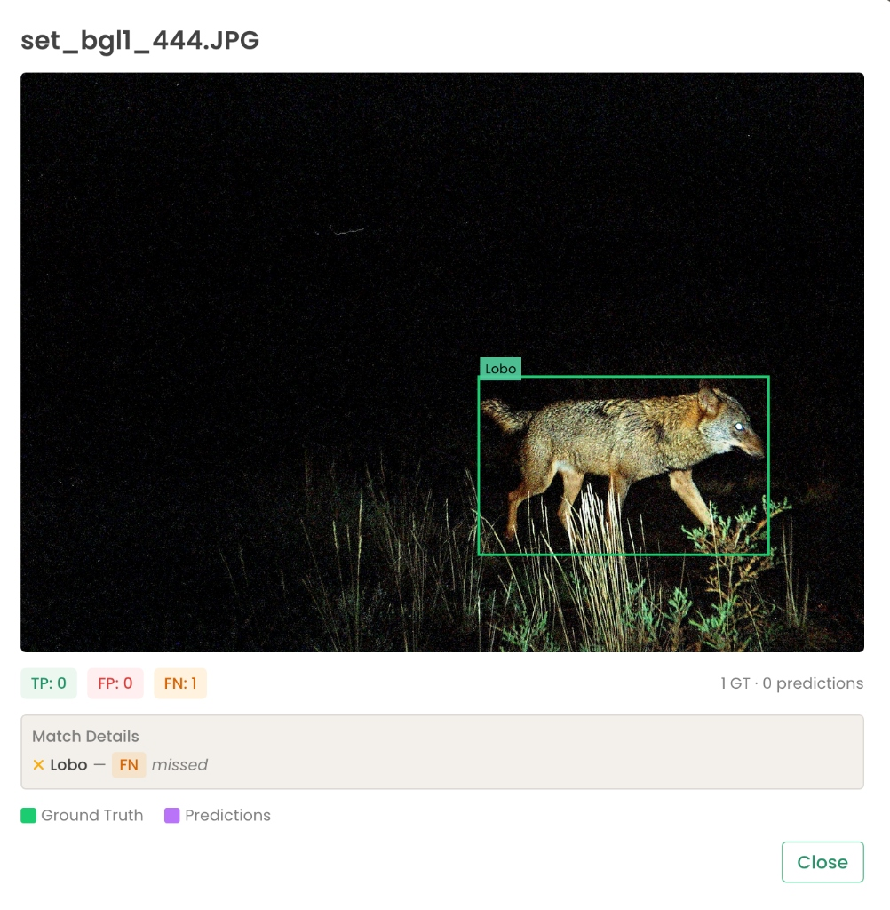
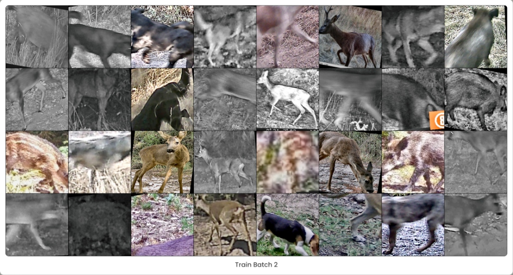
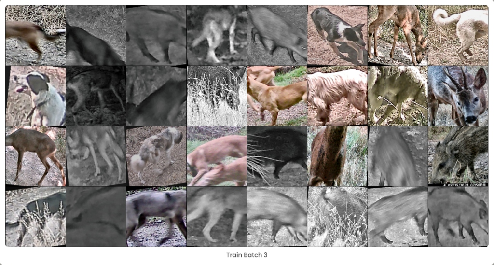
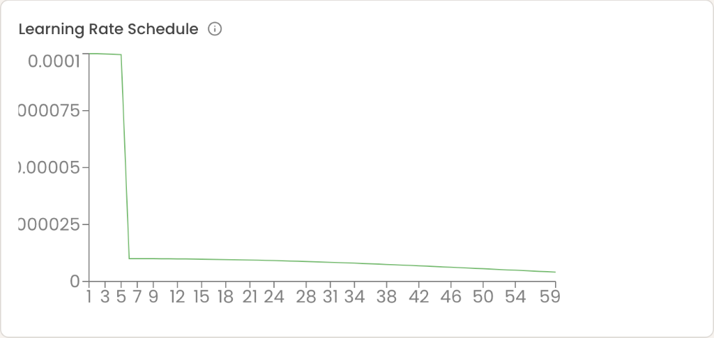
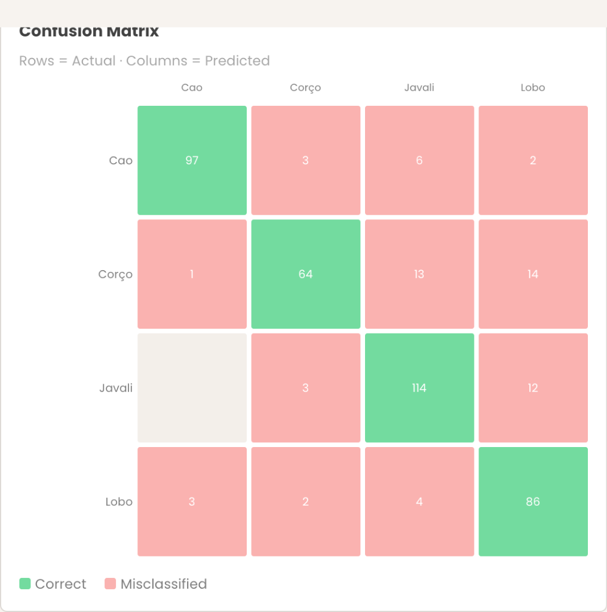
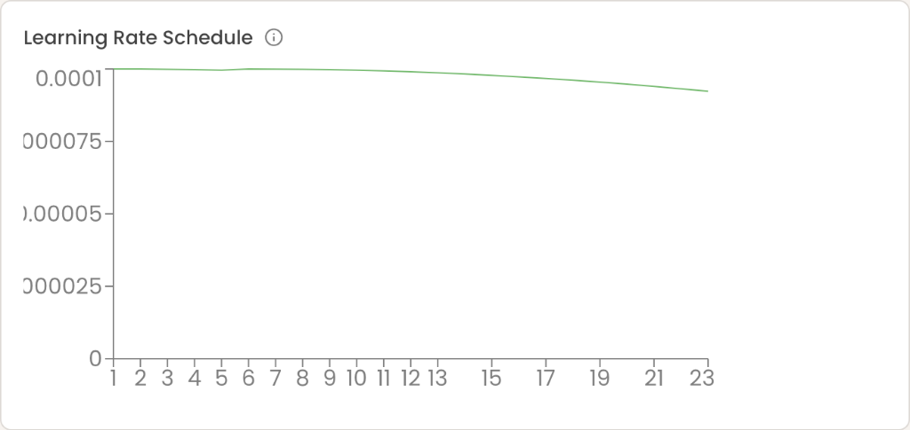
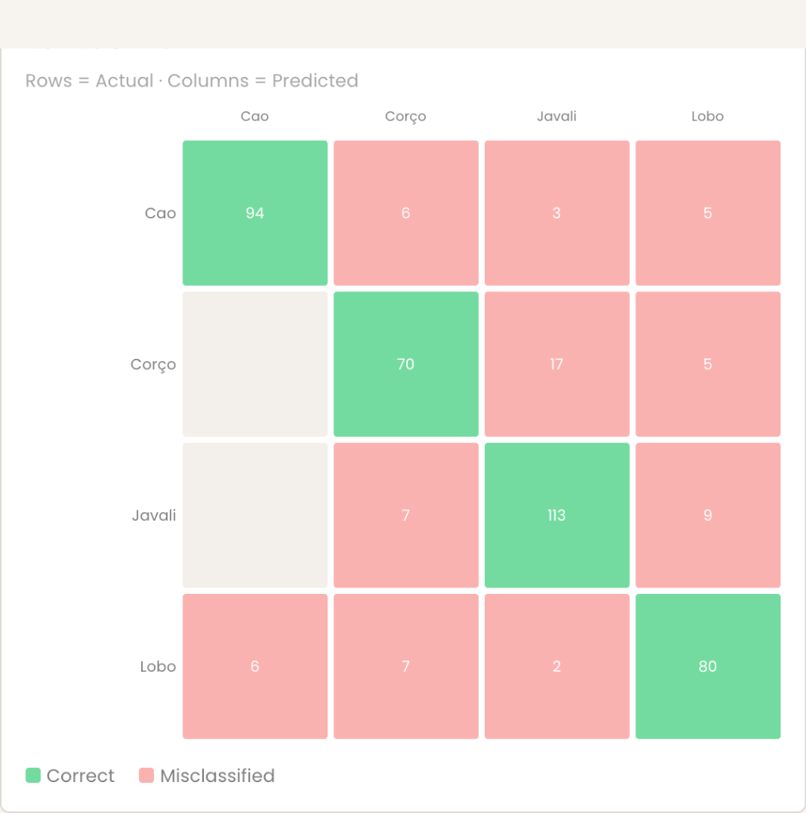
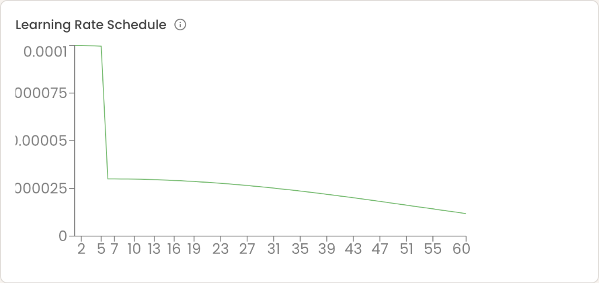
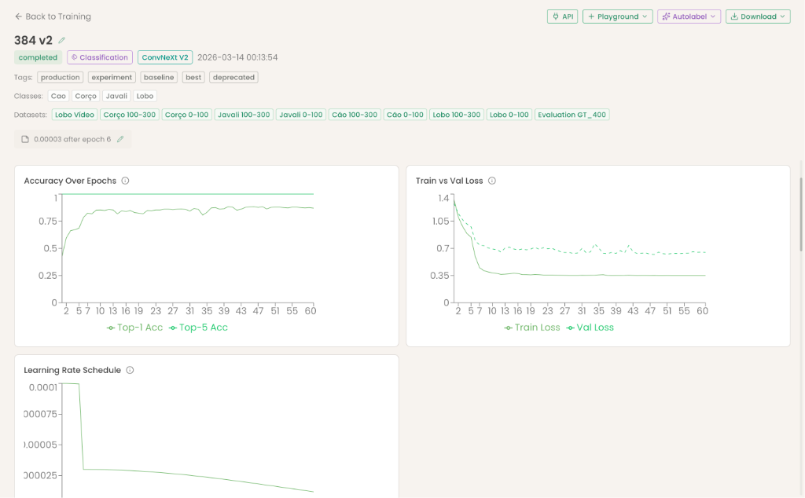

# ConvNeXt V2 Classification Training: Experiment Log

> **Date**: 2026-03-13  
> **Author**: Jorge + AI Assistant  
> **Dataset**: 833 images (970 train crops, 424 val crops) — 4 classes: Cão, Corço, Javali, Lobo  
> **Hardware**: Modal A10G GPU  
> **Final Result**: 0.884 top-1 accuracy (from 0.844 baseline — +4.7% improvement)

---

## Table of Contents

1. [Context & Motivation](#context--motivation)
2. [Baseline: ConvNeXt V1 → V2 Upgrade](#baseline-convnext-v1--v2-upgrade)
3. [Experiment 1: Data Augmentation Analysis](#experiment-1-data-augmentation-analysis)
4. [Experiment 2: Gentle Transforms](#experiment-2-gentle-transforms)
5. [Experiment 3: Compromise Transforms](#experiment-3-compromise-transforms)
6. [Experiment 4: CLAHE + Label Smoothing + Backbone Freezing](#experiment-4-clahe--label-smoothing--backbone-freezing)
7. [Experiment 5: Post-Unfreeze LR Tuning](#experiment-5-post-unfreeze-lr-tuning)
8. [Final Configuration](#final-configuration)
9. [Key Concepts Explored](#key-concepts-explored)
10. [Remaining Bottlenecks & Next Steps](#remaining-bottlenecks--next-steps)

---

## Context & Motivation

The SAFARI platform uses a hybrid inference pipeline:

```
Full image → SAM3 detection → Crop animal → ConvNeXt classification → Species ID
```

The classification model receives pre-cropped animal images from SAM3 and must distinguish between 4 visually similar Iberian wildlife species. Key challenges:

- **Lobo ↔ Corço confusion** — similar body shapes in IR/night images
- **Small dataset** — only ~240 images per class
- **Camera trap variability** — IR, night flash, daylight, motion blur, partial occlusion

Prior to this session, the platform used ConvNeXt V1 with default ImageNet training settings.

---

## Baseline: ConvNeXt V1 → V2 Upgrade

**Goal**: Upgrade from ConvNeXt V1 to V2 architecture for improved feature learning.

ConvNeXt V2 adds **Global Response Normalization (GRN)** and uses a **Fully Convolutional Masked Autoencoder (FCMAE)** pretraining strategy, which produces better representations for fine-grained classification.

### Implementation Changes
- Added `convnextv2` as a backbone option alongside `convnext`
- Model checkpoints store a `model_version` field (`v1` or `v2`) for backward compatibility
- Updated all UI badges: `CNX` for V1, `CN2` for V2 (teal color scheme)
- Updated inference pipeline to handle both `.pth` (ConvNeXt) and `.pt` (YOLO) model formats

### V2 Baseline Result

| Setting | Value |
|---------|-------|
| Backbone | ConvNeXt V2 Tiny |
| Image size | 384 |
| LR | 0.0001 |
| Weight decay | 0.05 |
| Augmentation | ImageNet defaults |
| **Best val_acc** | **0.844** |

This became our baseline for all subsequent experiments.

---

## Experiment 1: Data Augmentation Analysis

**Hypothesis**: The aggressive ImageNet-default augmentation is degrading classification performance because the model receives pre-cropped animals, not full scenes.

### The Problem

The training pipeline used `RandomResizedCrop(scale=(0.08, 1.0))` — meaning crops could be as small as **8% of the original image area**. Since inputs are already SAM3 crops of individual animals, this produced unrecognizable fragments:



### Detection vs Classification Augmentation — Key Insight

| | Detection (YOLO) | Classification (ConvNeXt) |
|---|---|---|
| **Input** | Full scene with objects at various scales | Pre-cropped single subject |
| **Aggressive crops** | ✅ Teaches scale invariance | ❌ Destroys discriminative features |
| **What matters** | "Where is the animal?" | "Which species is this?" |

YOLO has built-in augmentation because detection needs scale/position invariance. ConvNeXt doesn't because classification relies on fine-grained features — antler shape, ear proportions, fur patterns — that aggressive crops destroy.

---

## Experiment 2: Gentle Transforms

**Change**: `scale=(0.08, 1.0)` → `scale=(0.7, 1.0)`, removed GaussianBlur and RandomErasing, reduced ColorJitter.

### Result: FAILURE — Classic Overfitting

| Metric | Baseline (0.08) | Gentle (0.7) |
|--------|-----------------|--------------|
| **Best val_acc** | **0.844** | 0.792 |
| Train loss at end | 0.053 | **0.0001** |
| Val loss | 0.677 | 1.028 |

**What went wrong**: With 970 training images and ~28M parameters, the model memorized the training set within 25 epochs. Train loss plummeted to 0.0001 (perfect memorization) while val accuracy stagnated. The aggressive augmentation, despite producing ugly images, was acting as **essential regularization** — preventing memorization by making every epoch present "new" data.

### Lesson Learned
> With small datasets, augmentation intensity is NOT about image quality — it's about preventing memorization. The model needs augmentation noise to generalize, even if individual augmented images look terrible to humans.

---

## Experiment 3: Compromise Transforms

**Change**: `scale=(0.35, 1.0)` — keeps at least 35% of the animal visible while providing enough variation to prevent memorization. Light blur restored, RandomErasing removed permanently.

### Transform Comparison

| Transform | Old (0.08) | Too gentle (0.7) | **Compromise (0.35)** |
|-----------|-----------|------------------|----------------------|
| Crop scale | 0.08–1.0 | 0.7–1.0 | **0.35–1.0** |
| ColorJitter | b/c=0.3, s=0.3, h=0.1 | b/c=0.2, s=0.15, h=0.05 | **b/c=0.25, s=0.2, h=0.05** |
| GaussianBlur | p=0.1 | removed | **p=0.1** |
| RandomErasing | p=0.1 | removed | **removed** |

### Result: NEW BEST

| Metric | Baseline (0.08) | Gentle (0.7) | Compromise (0.35) |
|--------|-----------------|--------------|-------------------|
| **Best val_acc** | 0.844 | 0.792 | **0.858** |
| Train loss | 0.053 | 0.0001 | 0.016 |

**Why it worked**: The compromise prevented memorization (train loss stayed at 0.016, not 0.0001) while keeping crops recognizable. The sweet spot between "too noisy" and "too clean."

> **Note on variance**: With ~970 training samples, run-to-run variance of ±3-4% is normal due to random shuffling and weight initialization. We observed this across multiple runs with identical settings (0.818 vs 0.858).

---

## Experiment 4: CLAHE + Label Smoothing + Backbone Freezing

Three enhancements implemented simultaneously, plus CLAHE added to the inference pipeline.

### 4.1 CLAHE (Contrast Limited Adaptive Histogram Equalization)

**Purpose**: Enhance local contrast in IR/night images where animals appear as flat-gray silhouettes.

**Implementation**: Applied to both training and inference paths — converts image to LAB color space, applies CLAHE to L (lightness) channel only, preserving color information.

```python
# Applied as first step in both train and val transforms
lab = cv2.cvtColor(img, cv2.COLOR_RGB2LAB)
clahe = cv2.createCLAHE(clipLimit=2.0, tileGridSize=(8, 8))
lab[:, :, 0] = clahe.apply(lab[:, :, 0])
result = cv2.cvtColor(lab, cv2.COLOR_LAB2RGB)
```

**Critical rule**: Whatever preprocessing is applied at inference MUST also be applied during training. The model is trained with CLAHE-enhanced images, so inference must use CLAHE too.

The difference is dramatic — look at the IR/night image improvement:





### 4.2 Label Smoothing

**Purpose**: Prevent overconfidence on easy examples, improve gradient signal for hard cases.

```python
criterion = nn.CrossEntropyLoss(label_smoothing=0.1)
# Hard labels: [1.0, 0.0, 0.0, 0.0] → Smooth labels: [0.925, 0.025, 0.025, 0.025]
```

This keeps the training loss floor higher (~0.35 instead of approaching 0), which acts as an additional regularizer and prevents overfitting.

### 4.3 Backbone Freezing

**Purpose**: Protect pretrained ImageNet features from being corrupted by early noisy gradients.

**How it works**:
- **Epochs 1-5**: Only the classification head (Linear: 768→4) trains. The ConvNeXt backbone acts as a fixed feature extractor.
- **Epoch 6+**: All parameters unfreeze. The backbone now receives meaningful gradient signals because the head has already learned a reasonable class mapping.

**Without freezing**: The untrained head sends random gradients backward through the backbone, partially overwriting the valuable pretrained features in the first few epochs. This damage is irreversible.

### First Result: LR Too Low After Unfreeze

The initial implementation used `lr0 * 0.1 = 0.00001` after unfreezing the backbone.



| Metric | Value |
|--------|-------|
| **Best val_acc** | 0.851 |
| Epochs trained | 59 |
| Train loss plateau | ~0.35 (stuck — LR too low to make progress) |



**Per-class improvements from CLAHE/freezing** (vs prior best without these enhancements):

| Class | Before | After (low LR) | Change |
|-------|--------|----------------|--------|
| Cão | 84% | 90% | +6% |
| Corço | 70% | 70% | — |
| Javali | 85% | 88% | +3% |
| Lobo | 86% | 91% | +5% |

**Conclusion**: CLAHE + label smoothing + backbone freezing were clearly helping, but the 0.1x LR was too conservative — the backbone couldn't fine-tune fast enough.

---

## Experiment 5: Post-Unfreeze LR Tuning

### 5a: Full LR (1x = 0.0001 after unfreeze)

**Result**: Too volatile — val_acc oscillated between 0.84 and 0.76, early stopped at epoch 23.





The high LR caused the backbone to "forget" what it learned — Lobo dropped from 91% to 84%.

### 5b: 0.3x LR (0.00003 after unfreeze) — THE SWEET SPOT

**Result**: Stable, gradual improvement over 60 epochs.






### LR Comparison Summary

| Post-unfreeze LR | Value | Best Acc | Stability | Epochs |
|-------------------|-------|----------|-----------|--------|
| 0.1x (too low) | 0.00001 | 0.851 | Very stable but plateaued | 59 |
| **0.3x (optimal)** | **0.00003** | **0.884** | **Stable with gradual climb** | **60** |
| 1.0x (too high) | 0.0001 | 0.842 | Volatile, early stopped | 23 |

---

## Final Configuration

### Training Settings

| Parameter | Value | Notes |
|-----------|-------|-------|
| Backbone | ConvNeXt V2 Tiny | 28M params, pretrained on ImageNet |
| Image size | 384 | Sweet spot for SAM3 crops |
| Batch size | 32 | ~30 batches/epoch with 970 samples |
| Epochs | 100 (max) | Early stops ~60 |
| Patience | 20 | Enough room for late improvements |
| Initial LR | 0.0001 | For frozen head phase |
| Post-unfreeze LR | 0.00003 | 0.3x of initial LR |
| Weight decay | 0.05 | ConvNeXt V2 paper default |
| Optimizer | AdamW | Standard for transformer-based architectures |
| LR schedule | Cosine annealing | T_max = epochs - freeze_epochs |

### Transforms (Training)

```python
transforms.Compose([
    ApplyCLAHE(),                                           # Enhance contrast (LAB space)
    transforms.RandomRotation(10),                          # Mild rotation
    transforms.RandomResizedCrop(384, scale=(0.35, 1.0)),  # Keep ≥35% of animal
    transforms.RandomHorizontalFlip(),                      # Animals face either way
    transforms.ColorJitter(b=0.25, c=0.25, s=0.2, h=0.05),# Moderate color variation
    transforms.RandomApply([GaussianBlur(3)], p=0.1),      # Light blur for regularization
    transforms.ToTensor(),
    transforms.Normalize([0.485, 0.456, 0.406], [0.229, 0.224, 0.225]),
])
```

### Transforms (Validation & Inference)

```python
transforms.Compose([
    ApplyCLAHE(),                                    # Must match training
    transforms.Resize(int(384 * 1.14)),              # Resize to 438
    transforms.CenterCrop(384),                      # Center crop to 384
    transforms.ToTensor(),
    transforms.Normalize([0.485, 0.456, 0.406], [0.229, 0.224, 0.225]),
])
```

### Enhancements

| Feature | Detail |
|---------|--------|
| CLAHE | `clipLimit=2.0`, `tileGridSize=(8,8)` on L channel in LAB space |
| Label smoothing | 0.1 in `CrossEntropyLoss` |
| Backbone freezing | 5 epochs head-only, then unfreeze all |
| Post-unfreeze LR | 0.3× initial LR with fresh cosine schedule |

---

## Key Concepts Explored

### 1. Classification vs Detection Confidence

- **Detection (YOLO/SAM3)**: Outputs bounding boxes with confidence scores. A threshold filters low-confidence detections.
- **Classification (ConvNeXt)**: Outputs softmax probability distribution over classes. No threshold — argmax wins. Two classes cannot both have high confidence simultaneously due to softmax normalization.

### 2. Training Accuracy vs End-to-End Evaluation

Training accuracy measures: "Given a perfect crop, is the species correct?"
Evaluation measures: "Given a full image, does the entire pipeline (detect + crop + classify) produce correct results?"

Every classification error creates both an FP (for the wrong class) and an FN (for the missed class). Detection misses add additional FN/FP on top.

### 3. Dataset Size Guidelines

| Images per class | Expected accuracy | Status |
|------------------|-------------------|--------|
| ~50 | 60-70% | Barely viable |
| **~240** | **~85-88%** | **← Current** |
| ~500 | 90-93% | Target |
| ~1,000 | 93-96% | Strong production |

### 4. Impact of Annotation Errors

10 wrong-place annotations out of 800 = 1.25% noise. Deep networks are robust to up to 5-10% label noise. At 1.25%, the model effectively ignores the bad samples. Impact depends on whether errors concentrate in rare classes.

### 5. Image Size for Classification

384px is the sweet spot because:
- ConvNeXt V2 pretrained at 224px; position embeddings interpolate well to 384
- SAM3 crops are often smaller than 384px already (upscaled)
- Going to 512 means more upscaling of small crops — adding noise, not detail
- Larger images need more data to avoid overfitting

---

## Complete Run Log

| # | Transforms | Enhancements | LR Strategy | Best Acc | Early Stop |
|---|-----------|-------------|-------------|----------|------------|
| 1 | Aggressive (0.08) | None | Constant 0.0001 | 0.844 | Epoch 33 |
| 2 | Gentle (0.7) | None | Constant 0.0001 | 0.792 | Epoch 36 |
| 3 | Compromise (0.35) | None | Constant 0.0001 | 0.858 | Epoch 32 |
| 4 | Compromise (0.35) | None | Constant 0.0001 | 0.818 | Epoch 22 |
| 5 | Compromise (0.35) | CLAHE + LS + Freeze | 0.1x post-unfreeze | 0.851 | Epoch 59 |
| 6 | Compromise (0.35) | CLAHE + LS + Freeze | 1.0x post-unfreeze | 0.842 | Epoch 23 |
| **7** | **Compromise (0.35)** | **CLAHE + LS + Freeze** | **0.3x post-unfreeze** | **0.884** | **Epoch 60** |

---

## Remaining Bottlenecks & Next Steps

### Current Confusion Hotspots
- **Corço → Javali** (14 misclassifications) — body shape similarity in IR
- **Lobo → Cão** (8 misclassifications) — dogs and wolves genuinely look similar
- **Corço at 77%** — lowest per-class accuracy, needs more training data

### Actionable Next Steps
1. **More Corço training data** — biggest accuracy bottleneck
2. **YOLO detector parameter tuning** — apply similar augmentation analysis to detection training
3. **Ablation study** — isolate individual contribution of CLAHE, label smoothing, backbone freezing
4. **Mixup augmentation** — blending two training images may help borderline cases
5. **Progressive resizing** — train at 224 then fine-tune at 384

---

## Files Modified in This Session

| File | Changes |
|------|---------|
| `backend/core/train_classify_core.py` | V2 model resolution, CLAHE, label smoothing, backbone freezing, transform tuning |
| `backend/core/classifier_utils.py` | V2-aware loading, CLAHE in inference transform |
| `backend/modal_jobs/train_classify_job.py` | No code changes (deploys core changes) |
| `modules/training/state.py` | `selected_run_is_convnextv2` computed var |
| `modules/training/dashboard.py` | CN2/CNX/YOLO badge distinction |
| `modules/training/run_detail.py` | ConvNeXt V2 badge |
| `modules/api/page.py` | CN2 badge |
| `modules/inference/playground.py` | CN2 badge with teal styling |
| `modules/inference/state.py` | `.pth` extension for V2 |
| `modules/evaluation/state.py` | V2 backbone matching |
