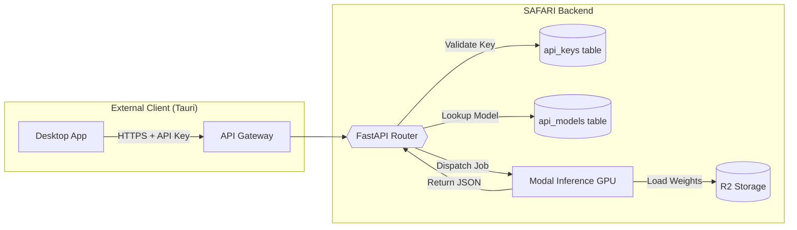

# 🔌 SAFARI Inference API Roadmap

> **Goal**: Expose a public-facing REST API for external clients (Tauri Desktop, Mobile, 3rd Party) to run inference using trained models.
> **Philosophy**: API-Key Authentication • Rate-Limited • Stateless • High Throughput on A10G GPUs
> 
> **Decisions**:
> - 🚀 **Deployment**: Modal ASGI (scales to zero, same GPU pool)
> - 📹 **Video**: Async processing with real-time progress feedback
> - 🔑 **Key Prefix**: `safari_` (e.g., `safari_xxxx...`)

---

> [!IMPORTANT]
> ## 📍 Current Focus
> **Phase**: A4 — Rate Limiting & Quotas
> **Last Completed**: A3 (Inference API Endpoint) ✅
> **Active Steps**: A4.1 — Rate limiting middleware
> **Blocked On**: None


---

## 🏗️ Architecture Overview



### Key Concepts

| Concept | Description |
|---------|-------------|
| **API Model** | A training run "promoted" for external access. Has a unique `slug`, versioned weights, and usage quotas. |
| **API Key** | Secret token scoped to a user/project. Used in `Authorization: Bearer <key>` header. |
| **Inference Endpoint** | `/api/v1/infer/{model_slug}` — Accepts image/video, returns predictions. |

### 🛡️ Isolation Principles (DO NOT BREAK EXISTING CODE)

> [!CAUTION]
> The API implementation must be **completely isolated** from existing SAFARI code.
> We are **ADDING** new functionality, not modifying existing inference/training flows.

**Files we will CREATE (new):**
| File | Purpose |
|------|---------|
| `backend/api/server.py` | New FastAPI app for API endpoints |
| `backend/api/auth.py` | API key validation logic |
| `backend/api/routes/inference.py` | `/api/v1/infer/` routes |
| `backend/api/routes/jobs.py` | `/api/v1/jobs/` async polling routes |
| `backend/modal_jobs/api_infer_job.py` | **NEW** Modal job for API inference (separate from `infer_job.py`) |
| `modules/api/state.py` | Reflex state for API management page |
| `modules/api/page.py` | API keys & models management UI |
| `migrations/X.X.X_api_tables.sql` | New tables only |

**Files we will MODIFY (minimal, additive only):**
| File | Change |
|------|--------|
| `modules/training/dashboard.py` | Add "+ API" button in run row actions (next to trash) |
| `modules/training/state.py` | Add `promote_run_to_api()` method and modal state |
| `backend/supabase_client.py` | Add new functions for `api_models`, `api_keys` tables |
| `rxconfig.py` | Add route for `/projects/{id}/api` |

**Files we will NOT TOUCH:**
- ❌ `backend/modal_jobs/infer_job.py` — Existing inference stays untouched
- ❌ `backend/modal_jobs/hybrid_infer_job.py` — Hybrid inference stays untouched
- ❌ `modules/inference/state.py` — Model Playground unchanged
- ❌ `modules/inference/page.py` — Playground UI unchanged
- ❌ Any Modal Volume configurations
- ❌ Existing R2 storage paths

**Database changes are ADDITIVE only:**
- ✅ New tables: `api_models`, `api_keys`, `api_usage_logs`, `api_jobs`
- ✅ No changes to existing tables (`training_runs`, `models`, etc.)
- ✅ `api_models.training_run_id` references existing data (read-only link)

---

## 📋 Database Schema Additions

### `api_models` Table
Models explicitly promoted for API access (subset of all trained models).

```sql
CREATE TABLE api_models (
    id UUID PRIMARY KEY DEFAULT gen_random_uuid(),
    training_run_id UUID REFERENCES training_runs(id) NOT NULL,
    project_id UUID REFERENCES projects(id) NOT NULL,
    user_id UUID REFERENCES auth.users(id) NOT NULL,
    
    -- Identity
    slug TEXT UNIQUE NOT NULL, -- e.g., "lynx-detector-v2"
    display_name TEXT NOT NULL,
    description TEXT,
    version INTEGER DEFAULT 1,
    
    -- Model Metadata (snapshot from training_run)
    model_type TEXT NOT NULL, -- "detection" | "classification"
    classes_snapshot JSONB NOT NULL, -- ["Lynx", "Fox", "Deer"]
    weights_r2_path TEXT NOT NULL, -- Path to best.pt in R2
    
    -- Status
    is_active BOOLEAN DEFAULT TRUE,
    is_public BOOLEAN DEFAULT FALSE, -- For future marketplace
    
    -- Usage Tracking
    total_requests BIGINT DEFAULT 0,
    last_used_at TIMESTAMPTZ,
    
    -- Timestamps
    created_at TIMESTAMPTZ DEFAULT NOW(),
    updated_at TIMESTAMPTZ DEFAULT NOW()
);

CREATE INDEX idx_api_models_slug ON api_models(slug);
CREATE INDEX idx_api_models_project ON api_models(project_id);
```

### `api_keys` Table
Manage client authentication tokens.

```sql
CREATE TABLE api_keys (
    id UUID PRIMARY KEY DEFAULT gen_random_uuid(),
    user_id UUID REFERENCES auth.users(id) NOT NULL,
    project_id UUID REFERENCES projects(id), -- NULL = user-wide key
    
    -- Key Data
    key_hash TEXT NOT NULL, -- SHA256 hash of the actual key
    key_prefix TEXT NOT NULL, -- First 8 chars for display (e.g., "safari_xxxx")
    name TEXT NOT NULL, -- User-given name
    
    -- Permissions
    scopes TEXT[] DEFAULT ARRAY['infer'], -- Future: ['infer', 'train', 'admin']
    
    -- Rate Limiting
    rate_limit_rpm INTEGER DEFAULT 60, -- Requests per minute
    monthly_quota INTEGER, -- NULL = unlimited
    requests_this_month INTEGER DEFAULT 0,
    
    -- Status
    is_active BOOLEAN DEFAULT TRUE,
    last_used_at TIMESTAMPTZ,
    expires_at TIMESTAMPTZ, -- NULL = never expires
    
    -- Timestamps
    created_at TIMESTAMPTZ DEFAULT NOW()
);

CREATE INDEX idx_api_keys_hash ON api_keys(key_hash);
CREATE INDEX idx_api_keys_user ON api_keys(user_id);
```

### `api_usage_logs` Table (Optional)
For detailed analytics and billing.

```sql
CREATE TABLE api_usage_logs (
    id UUID PRIMARY KEY DEFAULT gen_random_uuid(),
    api_key_id UUID REFERENCES api_keys(id) NOT NULL,
    api_model_id UUID REFERENCES api_models(id) NOT NULL,
    
    -- Request Details
    request_type TEXT NOT NULL, -- "image" | "video"
    file_size_bytes BIGINT,
    inference_time_ms INTEGER,
    prediction_count INTEGER,
    
    -- Response
    status_code INTEGER NOT NULL,
    error_message TEXT,
    
    -- Metadata
    client_ip TEXT,
    user_agent TEXT,
    
    created_at TIMESTAMPTZ DEFAULT NOW()
);

CREATE INDEX idx_api_usage_logs_key ON api_usage_logs(api_key_id);
CREATE INDEX idx_api_usage_logs_time ON api_usage_logs(created_at);
```

---

## 🛠️ Phase A1: Model Promotion & API Registry ✅

**Goal**: Allow users to "promote" a training run to the API registry with a "+ API" button.

### A1.1 Backend Functions (`backend/supabase_client.py`)

* [x] **A1.1.1** `promote_model_to_api(training_run_id, slug, display_name, description) -> dict`
  - Validates training run exists and is completed
  - Creates `api_models` record with classes_snapshot from training_run
  - Returns the new api_model record

* [x] **A1.1.2** `get_project_api_models(project_id) -> list[dict]`
  - List all API models for a project

* [x] **A1.1.3** `get_api_model_by_slug(slug) -> dict | None`
  - Lookup by unique slug for inference routing

* [x] **A1.1.4** `deactivate_api_model(api_model_id) -> bool`
  - Soft-delete (set is_active = False)

### A1.2 Training Dashboard UI (`modules/training/dashboard.py`)

* [x] **A1.2.1** Add "+ API" button to **training run row actions** (next to trash icon)
  - Only visible for `status == "completed"` runs
  - Opens `api_promote_modal`

* [x] **A1.2.2** Create `api_promote_modal()` component
  - Input: Slug (auto-generated from alias or run ID)
  - Input: Display Name
  - Input: Description (optional)
  - Button: "Promote to API"

* [x] **A1.2.3** Add `TrainingState` methods:
  - `open_api_promote_modal(run_id)`
  - `set_api_slug`, `set_api_display_name`, `set_api_description`
  - `promote_run_to_api()` — calls backend, shows toast

### A1.3 Training State Additions (`modules/training/state.py`)

* [x] **A1.3.1** Add state variables:
  ```python
  api_promote_modal_open: bool = False
  api_promote_run_id: str = ""
  api_slug: str = ""
  api_display_name: str = ""
  api_description: str = ""
  api_promoting: bool = False
  ```

* [x] **A1.3.2** Add computed property `suggested_api_slug` based on run alias

---

## ⚡ Phase A2: API Key Management ✅

**Goal**: Let users create/manage API keys from a new "API" section in project settings.

### A2.1 New Page: API Settings (`modules/api/`)

* [x] **A2.1.1** Create `modules/api/state.py` with `APIState`:
  - `api_keys: list[dict]`
  - `api_models: list[dict]`
  - `load_api_data(project_id)`
  - `create_api_key(name) -> str` (returns raw key ONCE)
  - `revoke_api_key(key_id)`

* [x] **A2.1.2** Create `modules/api/page.py`:
  - Route: `/projects/{project_id}/api`
  - Section 1: **API Models** — Table of promoted models with usage stats
  - Section 2: **API Keys** — Table with create/revoke actions

* [x] **A2.1.3** Key generation logic:
  - Generate 32-byte random key
  - Prefix with `safari_` for easy identification
  - Store SHA256 hash in database (never store raw key)
  - Display raw key ONCE in modal (user must copy)

### A2.2 Backend Functions

* [x] **A2.2.1** `create_api_key(user_id, project_id, name) -> (raw_key, key_record)`
* [x] **A2.2.2** `validate_api_key(raw_key) -> dict | None` (lookup by hash)
* [x] **A2.2.3** `revoke_api_key(key_id) -> bool`
* [x] **A2.2.4** `get_user_api_keys(user_id, project_id) -> list[dict]`


---

## 🌐 Phase A3: Inference API Endpoint

**Goal**: Expose a REST endpoint for external inference requests.

### A3.1 FastAPI Router (`backend/api_routes/inference.py`)

> [!NOTE]
> This is a **new** FastAPI app separate from Reflex, deployed alongside or as a Modal ASGI function.

* [x] **A3.1.1** Create `/api/v1/infer/{model_slug}` POST endpoint
  - Accept: `multipart/form-data` with `file` field
  - Headers: `Authorization: Bearer <api_key>`
  - Optional query params: `confidence=0.25`, `format=json|yolo`

* [x] **A3.1.2** Middleware: `validate_api_key_middleware`
  - Extract key from header
  - Lookup in `api_keys` table by hash
  - Check `is_active`, `expires_at`, rate limits
  - Attach `user_id`, `project_id` to request context

* [x] **A3.1.3** Request handler flow:
  ```
  1. Validate API key
  2. Lookup model by slug in api_models
  3. Determine model_type (detection/classification)
  4. Download file to temp or stream to Modal
  5. Call appropriate Modal inference function
  6. Format response as JSON
  7. Log to api_usage_logs
  8. Return predictions
  ```

### A3.2 Response Format

```json
{
  "model": "lynx-detector-v2",
  "model_type": "detection",
  "predictions": [
    {
      "class_name": "Lynx",
      "class_id": 0,
      "confidence": 0.92,
      "box": [0.12, 0.34, 0.56, 0.78],
      "box_format": "xyxy_normalized"
    }
  ],
  "image_width": 1920,
  "image_height": 1080,
  "inference_time_ms": 145,
  "request_id": "uuid..."
}
```

### A3.3 Video Support

* [x] **A3.3.1** Video endpoint: `/api/v1/infer/{model_slug}/video`
  - Accept: Video file upload OR presigned URL
  - Optional: `frame_skip`, `start_time`, `end_time`
  - Returns: Frame-indexed predictions

* [x] **A3.3.2** Async video processing with progress:
  - Return `202 Accepted` with `job_id`
  - Client polls `/api/v1/jobs/{job_id}` for status + progress %
  - Progress updates: `{"status": "processing", "progress": 45, "frames_done": 450, "frames_total": 1000}`
  - Webhook callback option for completion notification

---

## 🔒 Phase A4: Rate Limiting & Security

### A4.1 Rate Limiting

* [ ] **A4.1.1** Implement token bucket or sliding window rate limiter
* [ ] **A4.1.2** Per-key limits stored in `api_keys.rate_limit_rpm`
* [ ] **A4.1.3** Return `429 Too Many Requests` with `Retry-After` header

### A4.2 Security Hardening

* [ ] **A4.2.1** CORS configuration (allow only known origins for browser clients)
* [ ] **A4.2.2** Request size limits (e.g., 50MB for images, 500MB for videos)
* [ ] **A4.2.3** Input validation (file type, dimensions)
* [ ] **A4.2.4** Abuse detection (anomaly scoring, IP blocking)

---

## 🚀 Deployment Strategy

### Option A: Modal ASGI ✅ (Selected)
Deploy the FastAPI app as a Modal ASGI function. Benefits:
- Scales to zero when idle
- Same GPU pool as training/inference jobs
- Simple deployment: `modal deploy backend/api_server.py`

### Memory Snapshot Optimization

> [!TIP]
> Enable `enable_memory_snapshot=True` to dramatically reduce cold start times.
> See [Documentation/modal.md](./Documentation/modal.md) for full details.

Use CPU memory snapshots with two-stage model loading:

```python
@app.cls(
    gpu="a10g",
    enable_memory_snapshot=True,
)
class InferenceService:
    @modal.enter(snap=True)
    def load_model_to_cpu(self):
        # Load model to CPU - captured in snapshot
        from ultralytics import YOLO
        self.model = YOLO("/models/best.pt")
        self.model.to("cpu")  # Keep on CPU during snapshot

    @modal.enter(snap=False)
    def move_to_gpu(self):
        # After restore, move to GPU (fast since weights are cached)
        self.model.to("cuda")

    @modal.method()
    def predict(self, image_bytes: bytes):
        # Model ready on GPU!
        ...
```

**Cold Start Improvements:**
| Without Snapshot | With CPU Snapshot |
|------------------|-------------------|
| ~6-8 seconds | ~2-3 seconds |

### Option B: Standalone FastAPI + Modal RPC
Dedicated FastAPI server (e.g., Railway, Render) that calls Modal functions via RPC.
- More control over routing
- Separate scaling for API vs inference

---

## 📊 Phase A5: Usage & Billing Dashboard

* [ ] **A5.1** Usage graphs: requests/hour, requests/day
* [ ] **A5.2** Per-model usage breakdown
* [ ] **A5.3** Monthly quota warnings
* [ ] **A5.4** Export usage logs as CSV

---

## 🔗 Integration with Tauri Client

After this API is complete, update `Tauri_roadmap.md` to use:

```rust
// Example Rust client code
let client = SafariClient::new("safari_xxxx...");
let result = client.infer("lynx-detector-v2", image_bytes).await?;
```

Key integration points:
1. **Authentication**: Store API key (`safari_...`) in system keychain
2. **Batch Upload**: Send multiple frames in parallel
3. **Error Handling**: Retry with exponential backoff on 429/5xx
4. **Offline Queue**: Queue requests when offline, sync when connected
5. **Video Progress**: Poll `/api/v1/jobs/{job_id}` and display progress bar

---

## ✅ Acceptance Criteria

1. User can promote a completed training run to API from the dashboard
2. User can generate and manage API keys from project settings
3. External client can POST an image and receive JSON predictions
4. Rate limiting prevents abuse
5. Usage is logged for analytics

---

## 🚫 Out of Scope (v1)

- ~~Webhook callbacks for async video processing~~ (Now in scope for progress)
- Public model marketplace
- Custom model fine-tuning via API
- Streaming inference (WebSocket)
- Batch file upload (ZIP of images)

---

## 🧪 Verification Plan

### Automated Tests
| Test | Command | Coverage |
|------|---------|----------|
| API key validation | `pytest tests/test_api_keys.py` | Create, validate, revoke keys |
| Model promotion | `pytest tests/test_api_models.py` | Promote, list, deactivate models |
| Inference endpoint | `pytest tests/test_api_inference.py` | Auth, inference, rate limits |

### Manual Verification
1. **Promote Model**: From training dashboard, click "+ API" on a completed run → fill modal → verify appears in API settings page
2. **Create API Key**: Generate key → copy raw key → use in cURL request
3. **Test Inference**: `curl -X POST -H "Authorization: Bearer safari_..." -F "file=@test.jpg" https://api.safari.app/v1/infer/my-model`
4. **Video Async**: Submit video → poll job status → verify progress updates → get final results
5. **Rate Limit**: Exceed RPM limit → verify 429 response
