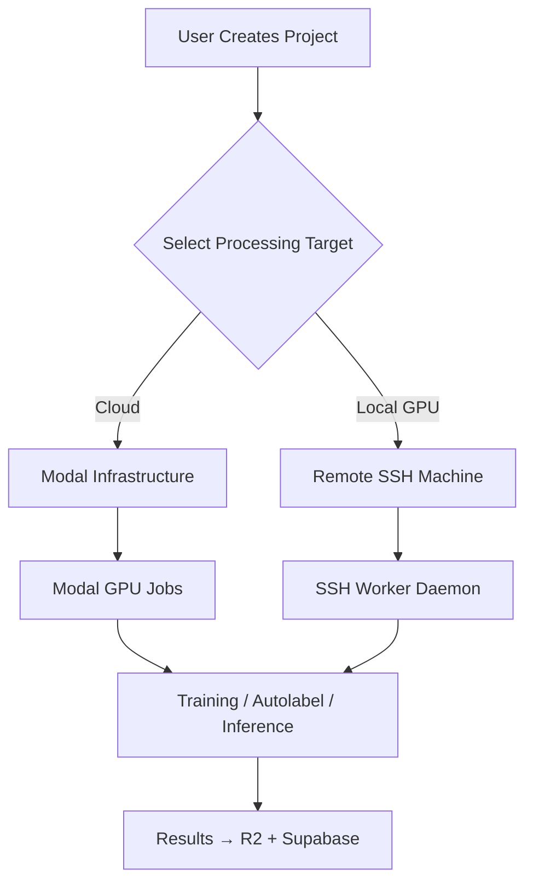
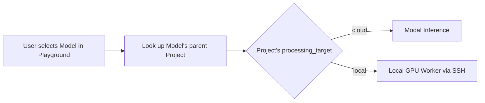

# 🖥️ Local GPU Processing: Remote Machine Infrastructure Roadmap

> **Goal**: Enable optional local GPU processing for training, autolabeling, playground inference, and API inference via a dedicated remote machine accessed over SSH.
> **Philosophy**: Project-level configuration for processing target. Modal remains the default; local GPU is an addition, not a replacement.

---

> [!IMPORTANT]
> ## 📍 Current Focus
> **Phase**: L3 — Processing Router (Complete)
> **Active Steps**: L3.3.6 — User testing with local GPU project
> **Last Completed**: L3.3 — Inference Playground Routing implemented (all 4 Modal spawn sites now use job router)
> **Blocked On**: None

> **Context for Agent**: L3.3 implemented! All hybrid inference calls in `modules/inference/state.py` now route through `dispatch_hybrid_inference*` functions. Routing is based on model's parent project via `get_project_id_from_model()`. Next: User testing with local GPU project, then L3.4 (Heartbeat-Based Job Health).

---

## 🏗️ Architecture Overview

### Processing Target Flow



### Key Principles

1. **Project-Level Configuration**: Processing target is set at project creation, not per-operation
2. **Immutable After Data**: Cannot change processing target if project has datasets (prevents split-brain)
3. **Modal as Default**: If no local GPU configured, system uses Modal transparently
4. **SSH-Based Execution**: All local GPU work happens via SSH commands to the remote machine
5. **Local Storage for R2**: Local GPU machine uses filesystem storage instead of R2 for data during processing
6. **Playground Inherits from Model**: Playground inference routes based on the selected model's parent project

### Playground Inference Routing (Critical Design)

> [!IMPORTANT]
> **The Playground becomes project-dependent through the selected model.**

When a user selects a model in the Playground, that model was trained under a specific project. The inference routing follows that model's parent project's processing target:



**Why this design:**
- **No ambiguity** — there's no question of "which backend should I use?"
- **Consistent behavior** — training and inference for a model always use the same backend
- **No separate toggle in Playground** — routing is automatic based on model selection
- **Clear mental model** — "Cloud projects use cloud, local projects use local GPU"

**Example:** If a classifier was trained on a "Local GPU" project, selecting that classifier in the Playground automatically routes inference to the local GPU machine.

---


## 🎯 Target Machine Specifications

Based on user-provided nvidia-smi output:

| Spec | Value |
|------|-------|
| **GPU** | NVIDIA GeForce RTX 4090 Laptop (16GB VRAM) |
| **Driver** | 580.95.05 |
| **CUDA** | 13.0 |
| **OS** | Linux (Ubuntu-based) |
| **Access** | SSH only |
| **User** | `ise@ise-Alienware-m18-R2` |

---

## 📊 Phase L0: Database & Architecture Foundation

**Goal**: Extend the database schema and backend to support processing target configuration.

### L0.1 Schema Updates

> [!WARNING]
> **User must run these SQL scripts in Supabase Dashboard → SQL Editor**.

**Step 1**: Add `processing_target` to projects table:

```sql
-- Add processing_target to projects table (cloud = Modal, local = SSH machine)
ALTER TABLE projects 
ADD COLUMN IF NOT EXISTS processing_target TEXT DEFAULT 'cloud' 
CHECK (processing_target IN ('cloud', 'local'));

-- Add SSH configuration fields (only used when processing_target = 'local')
ALTER TABLE projects
ADD COLUMN IF NOT EXISTS local_gpu_config JSONB DEFAULT NULL;
-- Structure: {"host": "192.168.x.x", "port": 22, "user": "ise", "key_path": "~/.ssh/id_rsa"}
```

- [x] **L0.1.1** Run Step 1 SQL in Supabase Dashboard
- [x] **L0.1.2** Verify: Query `projects` table → `processing_target` column exists with default 'cloud'
- [x] **L0.1.3** Verify: Query `projects` table → `local_gpu_config` column exists

> [!IMPORTANT]
> **Checkpoint L0.1**: Schema updated with processing target columns.

---

### L0.2 Backend CRUD Updates

**Goal**: Update `backend/supabase_client.py` to handle processing target in projects.

**Files to modify**: `backend/supabase_client.py`

- [x] **L0.2.1** Update `create_project()` to accept optional `processing_target='cloud'` param
- [x] **L0.2.2** Update `create_project()` to accept optional `local_gpu_config` dict param
- [x] **L0.2.3** Add `get_project_processing_target(project_id)` function → returns `'cloud'` or `'local'`
- [x] **L0.2.4** Add `can_change_processing_target(project_id)` function → returns `True` if no datasets exist
- [x] **L0.2.5** Add `update_project_processing_target(project_id, target, config)` with dataset check

> [!IMPORTANT]
> **Checkpoint L0.2**: Backend CRUD supports processing target configuration.

---

### L0.3 Global SSH Configuration

**Goal**: Store SSH credentials for the local GPU machine at the user profile level (hub-wide access).

**Step 1**: Add SSH config to profiles table:

```sql
-- Add local_gpu_machines array to user profile
ALTER TABLE profiles
ADD COLUMN IF NOT EXISTS local_gpu_machines JSONB DEFAULT '[]'::jsonb;
-- Structure: [{"name": "Alienware", "host": "192.168.x.x", "port": 22, "user": "ise", "fingerprint": "..."}]
```

**Files to modify**: `backend/supabase_client.py`

- [x] **L0.3.1** Run SQL in Supabase Dashboard
- [x] **L0.3.2** Add `get_user_local_machines(user_id)` function
- [x] **L0.3.3** Add `add_local_machine(user_id, machine_config)` function
- [x] **L0.3.4** Add `remove_local_machine(user_id, machine_name)` function
- [x] **L0.3.5** Add `test_ssh_connection(host, port, user)` utility function

> [!IMPORTANT]
> **Checkpoint L0.3**: SSH configuration stored at user profile level.

---

## 🖥️ Phase L1: Project Creation UI

**Goal**: Add processing target selection to the new project modal.

### L1.1 New Project Modal Updates

**Files to modify**: 
- `modules/projects/new_project_modal.py`
- `modules/projects/state.py`

**UI Changes**:

```
┌────────────────────────────────────────┐
│ New Project                            │
├────────────────────────────────────────┤
│ Project Name                           │
│ ┌────────────────────────────────────┐ │
│ │ My Detection Project               │ │
│ └────────────────────────────────────┘ │
│                                        │
│ Description (optional)                 │
│ ┌────────────────────────────────────┐ │
│ │ Brief description...               │ │
│ └────────────────────────────────────┘ │
│                                        │
│ Processing Target                      │
│ ┌─────────────┬──────────────────────┐ │
│ │ ☁️ Cloud    │  🖥️ Local GPU        │ │
│ └─────────────┴──────────────────────┘ │
│                                        │
│ [If Local GPU selected:]               │
│ Machine: [Dropdown of configured VMs]  │
│ └─ Alienware (192.168.x.x) ✓ Online   │
│                                        │
│           [Cancel]  [Create Project]   │
└────────────────────────────────────────┘
```

**Implementation steps**:

- [x] **L1.1.1** Add `processing_target: str = 'cloud'` state variable to `ProjectsState`
- [x] **L1.1.2** Add `selected_local_machine: str = ''` state variable
- [x] **L1.1.3** Add `local_machines: list[dict] = []` computed variable (from profile)
- [x] **L1.1.4** Add segmented control for Cloud/Local GPU selection
- [x] **L1.1.5** Add conditional machine dropdown (visible when Local GPU selected)
- [x] **L1.1.6** Update `create_project()` to pass processing_target and config
- [x] **L1.1.7** Add connection status indicator next to machine dropdown

> [!IMPORTANT]
> **Checkpoint L1.1**: Users can select processing target when creating a project.

---

### L1.2 Project Settings — Processing Target Display

**Goal**: Show processing target in project detail view with change capability (if no datasets).

**Files to modify**: 
- `modules/project_detail/project_detail.py` (or equivalent)
- `modules/project_detail/state.py`

- [x] **L1.2.1** Display current processing target badge in project header
- [x] **L1.2.2** Add "Change" button (disabled if project has datasets)
- [x] **L1.2.3** Implement change modal with target selection
- [x] **L1.2.4** Show tooltip explaining why change is disabled when datasets exist

> [!IMPORTANT]
> **Checkpoint L1.2**: Processing target visible and changeable (before data exists).

---

## 🔧 Phase L2: Remote Machine Setup & Worker

**Goal**: Create scripts and worker daemon for the remote GPU machine.

### L2.1 Remote Environment Setup Script

**Create**: `scripts/remote_setup.sh`

This script will be run on the target machine to set up the environment:

```bash
#!/bin/bash
# SAFARI Remote GPU Worker Setup Script
# Run this on your local GPU machine to prepare it for SAFARI workloads

set -e

SAFARI_HOME="${HOME}/.safari"
VENV_PATH="${SAFARI_HOME}/venv"
SCRIPTS_PATH="${SAFARI_HOME}/scripts"
MODELS_PATH="${SAFARI_HOME}/models"
DATA_PATH="${SAFARI_HOME}/data"

# 1. Create directory structure
mkdir -p "${SAFARI_HOME}" "${SCRIPTS_PATH}" "${MODELS_PATH}" "${DATA_PATH}"

# 2. Create Python virtual environment
python3.11 -m venv "${VENV_PATH}"
source "${VENV_PATH}/bin/activate"

# 3. Install dependencies
pip install --upgrade pip
pip install \
    ultralytics>=8.3.237 \
    boto3 \
    supabase \
    requests \
    pillow \
    huggingface_hub \
    timm \
    regex \
    fastapi \
    uvicorn

# 4. Install CLIP for SAM3
pip install git+https://github.com/ultralytics/CLIP.git

# 5. Download SAM3 base model
python -c "from ultralytics import SAM; SAM('sam3_b.pt')"

echo "✅ SAFARI Remote GPU Worker setup complete!"
echo "   SAFARI_HOME: ${SAFARI_HOME}"
echo "   Python: $(which python)"
echo "   GPU: $(nvidia-smi --query-gpu=name --format=csv,noheader)"
```

**Implementation steps**:

- [x] **L2.1.1** Create `scripts/remote_workers/remote_setup.sh` with environment setup
- [x] **L2.1.2** Create `scripts/remote_workers/remote_requirements.txt` matching Modal image deps
- [x] **L2.1.3** Add SAM3/CLIP/Ultralytics to requirements
- [x] **L2.1.4** Create `scripts/remote_workers/verify_remote.py` to check GPU access

> [!IMPORTANT]
> **Checkpoint L2.1**: Setup script creates consistent environment on remote machine.

---

### L2.2 Worker Scripts (Local Equivalents of Modal Jobs)

**Goal**: Create standalone Python scripts that mirror Modal job functionality.

**Create directory**: `scripts/remote_workers/`

| Modal Job | Remote Worker Script | Purpose |
|-----------|---------------------|---------|
| `train_job.py` | `remote_train.py` | YOLO detection training |
| `train_classify_job.py` | `remote_train_classify.py` | YOLO classification training |
| `autolabel_job.py` | `remote_autolabel.py` | SAM3/YOLO autolabeling |
| `hybrid_infer_job.py` | `remote_hybrid_infer.py` | Hybrid SAM3 + classifier |
| `infer_job.py` | `remote_infer.py` | Standard YOLO inference |

**Key differences from Modal versions**:

1. **No Modal decorators** — standalone Python scripts
2. **Local filesystem instead of R2** — data staged in `~/.safari/data/`
3. **Direct Supabase updates** — same logging pattern via `LogCapture`
4. **STDIN/STDOUT for job params** — receive JSON, output JSON results

**Template structure for each worker**:

```python
#!/usr/bin/env python3
"""
SAFARI Remote Worker — [Training/Autolabel/Inference]

Usage:
    echo '{"run_id": "...", ...}' | python remote_train.py

Environment:
    SUPABASE_URL, SUPABASE_KEY, R2_* credentials loaded from ~/.safari/.env
"""

import sys
import json
from pathlib import Path

# Load environment
from dotenv import load_dotenv
load_dotenv(Path.home() / ".safari" / ".env")

def main():
    # Read job params from stdin
    params = json.load(sys.stdin)
    
    # Execute job logic (copied from Modal job)
    result = run_job(**params)
    
    # Output result as JSON
    json.dump(result, sys.stdout)

if __name__ == "__main__":
    main()
```

**Implementation steps**:

- [x] **L2.2.1** Create `scripts/remote_workers/` directory
- [x] **L2.2.2** Create `remote_train.py` — adapt `train_job.py` for local execution
- [x] **L2.2.3** Create `remote_train_classify.py` — adapt classification training
- [x] **L2.2.4** Create `remote_autolabel.py` — adapt autolabel job
- [x] **L2.2.5** Create `remote_hybrid_infer.py` — adapt hybrid inference
- [x] **L2.2.6** Create `remote_infer.py` — adapt standard inference
- [x] **L2.2.7** Create shared `remote_utils.py` with logging, R2 helpers

> [!IMPORTANT]
> **Checkpoint L2.2**: All worker scripts created and verified on local machine.

---

### L2.3 Script Synchronization

**Goal**: Keep remote worker scripts in sync with local development.

**Files to modify**: `backend/ssh_client.py` (new file)

```python
# SSH client for remote worker management
class SSHWorkerClient:
    def __init__(self, host, port, user, key_path):
        self.connection = paramiko.SSHClient()
        ...
    
    def sync_scripts(self):
        """Copy scripts/remote_workers/* to remote ~/.safari/scripts/"""
        ...
    
    def sync_env(self, env_vars: dict):
        """Update remote ~/.safari/.env with credentials"""
        ...
    
    def execute_job(self, script_name: str, params: dict) -> dict:
        """Run a worker script and return results"""
        ...
```

**Implementation steps**:

- [x] **L2.3.1** Add `paramiko` to project dependencies
- [x] **L2.3.2** Create `backend/ssh_client.py` with `SSHWorkerClient` class
- [x] **L2.3.3** Implement `sync_scripts()` — rsync or SFTP upload
- [x] **L2.3.4** Implement `sync_env()` — secure credential transfer
- [x] **L2.3.5** Implement `execute_job()` — SSH command + JSON I/O
- [x] **L2.3.6** Add connection pooling / keepalive for performance

> [!IMPORTANT]
> **Checkpoint L2.3**: SSH client can sync scripts and execute jobs on remote.

---

## 🚀 Phase L3: Processing Router

**Goal**: Create a router that dispatches jobs to Modal or Local GPU based on project config.

### L3.1 Job Router Implementation

**Create**: `backend/job_router.py`

```python
"""
Job Router — Dispatch training/inference jobs based on project processing target.

Usage:
    from backend.job_router import dispatch_training_job
    
    result = await dispatch_training_job(project_id, run_id, params)
"""

async def get_job_target(project_id: str) -> str:
    """Determine processing target for a project."""
    project = get_project(project_id)
    return project.get("processing_target", "cloud")


async def dispatch_training_job(project_id: str, run_id: str, params: dict):
    """Route training job to appropriate backend."""
    target = await get_job_target(project_id)
    
    if target == "local":
        # Get SSH config and execute locally
        config = get_project(project_id).get("local_gpu_config")
        client = SSHWorkerClient(**config)
        return await client.execute_job("remote_train.py", {"run_id": run_id, **params})
    else:
        # Use Modal (existing behavior)
        train_fn = modal.Function.lookup("yolo-training", "train_yolo")
        return train_fn.spawn(run_id=run_id, **params)
```

**Functions to implement**:

- [x] **L3.1.1** Create `backend/job_router.py`
- [x] **L3.1.2** Implement `dispatch_training_job()` — detection training
- [x] **L3.1.3** Implement `dispatch_classification_training_job()` — classification training
- [x] **L3.1.4** Implement `dispatch_autolabel_job()` — autolabeling
- [x] **L3.1.5** Implement `dispatch_hybrid_inference_job()` — playground inference (deferred)
- [x] **L3.1.6** Implement `dispatch_inference_job()` — standard inference (deferred)

> [!IMPORTANT]
> **Checkpoint L3.1**: Job router dispatches to correct backend based on project config.

---

### L3.2 Update Existing Job Invocations

**Goal**: Replace direct Modal calls with router calls throughout the codebase.

**Files to modify**:

| File | Current Call | New Call |
|------|-------------|----------|
| `modules/training/state.py` | `modal.Function.lookup(...)` | `job_router.dispatch_training_job()` |
| `modules/autolabel/state.py` | `modal.Function.lookup(...)` | `job_router.dispatch_autolabel_job()` |
| `modules/inference/state.py` | `modal.Function.lookup(...)` | `job_router.dispatch_hybrid_inference_job()` |

**Implementation steps**:

- [x] **L3.2.1** Update `TrainingState.start_training()` to use router
- [x] **L3.2.2** Update `TrainingState.start_classification_training()` to use router
- [x] **L3.2.3** Update autolabel state to use router
- [ ] **L3.2.4** Update playground inference state to use router (deferred → L3.3)
- [x] **L3.2.5** Verify training/autolabel Modal spawns go through router

> [!IMPORTANT]
> **Checkpoint L3.2**: Training and autolabel job invocations go through the router.

---

### L3.3 Inference Playground Routing ✅

> [!NOTE]
> **Status: IMPLEMENTED** — All 4 Modal spawn sites now route through job router.

**Summary of changes:**

All hybrid inference calls in `modules/inference/state.py` now use the job router dispatch functions:
- `dispatch_hybrid_inference` — single image hybrid
- `dispatch_hybrid_inference_batch` — batch images
- `dispatch_hybrid_inference_video` — native video tracking

**Routing logic**: Playground looks up model's parent project via `get_project_id_from_model(model_id)`.

- [x] **L3.3.1** Update `_run_hybrid_batch_inference()` to use dispatcher
- [x] **L3.3.2** Update `_run_native_hybrid_video_inference()` to use dispatcher
- [x] **L3.3.3** Update batch inference for frame-skip video to use dispatcher
- [x] **L3.3.4** Update `_run_hybrid_image_inference()` to use dispatcher
- [x] **L3.3.5** Async threading handled — dispatch functions are synchronous, wrapped in `asyncio.to_thread`
- [ ] **L3.3.6** User testing with local GPU project (pending)


---

### L3.4 Heartbeat-Based Job Health Monitoring

**Goal**: Detect and handle failed SSH jobs using a heartbeat pattern.

**Problem**: When jobs run async on local GPU:
- Job may crash after dispatch succeeds
- Database isn't updated → UI polls forever
- User gets stuck on "Processing..." with no way to know job died

**Solution**: Heartbeat pattern
- Jobs update `last_heartbeat` timestamp every 30 seconds
- Poller checks: if heartbeat is stale (>60s), mark job as failed
- Works regardless of how job dies (crash, killed, network drop)

**Schema changes needed**:

```sql
-- Add heartbeat columns
ALTER TABLE autolabel_jobs ADD COLUMN IF NOT EXISTS last_heartbeat TIMESTAMPTZ;
ALTER TABLE training_runs ADD COLUMN IF NOT EXISTS last_heartbeat TIMESTAMPTZ;
```

**Implementation steps**:

- [ ] **L3.4.1** Run schema migration in Supabase
- [ ] **L3.4.2** Add `update_job_heartbeat(job_id)` to `supabase_client.py`
- [ ] **L3.4.3** Update `remote_autolabel.py` to send heartbeat every 30s during processing
- [ ] **L3.4.4** Update `remote_train.py` to send heartbeat every 30s
- [ ] **L3.4.5** Update `remote_train_classify.py` to send heartbeat every 30s
- [ ] **L3.4.6** Modify autolabel polling (`poll_autolabel_status`) to check heartbeat
- [ ] **L3.4.7** Modify training polling to check heartbeat
- [ ] **L3.4.8** Add "Stuck Job" badge/recovery option in UI

> [!IMPORTANT]
> **Checkpoint L3.4**: Jobs that die silently are detected within 60 seconds.

---

## 🗑️ Phase L4: Training Dashboard UI Cleanup

**Goal**: Remove the Cloud/Local toggle from training dashboard since it's now project-level.

### L4.1 Remove Target Selector

**File to modify**: `modules/training/dashboard.py`

**Current UI (lines 447-467)**:
```python
# Target
rx.vstack(
    rx.text("Target", size="1", style={"color": styles.TEXT_SECONDARY}),
    rx.segmented_control.root(
        rx.segmented_control.item(
            rx.text("Cloud", size="1"),
            value="cloud",
        ),
        rx.segmented_control.item(
            rx.text("Local", size="1"),
            value="local",
        ),
        ...
    ),
    ...
),
```

**Replacement**: Show project processing target as read-only badge:

```python
# Processing Target (read-only, set at project level)
rx.hstack(
    rx.text("Target:", size="1", style={"color": styles.TEXT_SECONDARY}),
    rx.cond(
        TrainingState.project_processing_target == "local",
        rx.badge("🖥️ Local GPU", color_scheme="purple", variant="soft"),
        rx.badge("☁️ Cloud", color_scheme="blue", variant="soft"),
    ),
    spacing="2",
    align="center",
),
```

**Implementation steps**:

- [x] **L4.1.1** Add `project_processing_target: str` to `TrainingState`
- [x] **L4.1.2** Load processing target when entering training dashboard
- [x] **L4.1.3** Remove `target` state variable from `TrainingState`
- [x] **L4.1.4** Remove `set_target()` handler
- [x] **L4.1.5** Replace segmented control with read-only badge
- [x] **L4.1.6** Add tooltip: "Processing target is configured at project level"

> [!IMPORTANT]
> **Checkpoint L4.1**: Training dashboard shows project target as read-only badge.

---

## 🔐 Phase L5: Hub-Level Machine Management

**Goal**: Add UI in the main dashboard hub for managing local GPU machines.

### L5.1 Settings Panel for Local Machines

**Create/Modify**: `modules/settings/local_machines.py`

**UI Design**:

```
┌─────────────────────────────────────────────────────────┐
│ ⚙️ Settings → Local GPU Machines                        │
├─────────────────────────────────────────────────────────┤
│                                                         │
│ Configure local machines for GPU processing             │
│                                                         │
│ ┌─────────────────────────────────────────────────────┐ │
│ │ 🖥️ Alienware m18 R2                                 │ │
│ │    Host: 192.168.1.100                              │ │
│ │    User: ise                                        │ │
│ │    Status: ✅ Online (RTX 4090, 16GB)               │ │
│ │                          [Test] [Edit] [Remove]     │ │
│ └─────────────────────────────────────────────────────┘ │
│                                                         │
│ [+ Add Machine]                                         │
│                                                         │
└─────────────────────────────────────────────────────────┘
```

**Add Machine Modal**:

```
┌────────────────────────────────────────┐
│ Add Local GPU Machine                  │
├────────────────────────────────────────┤
│ Name                                   │
│ ┌────────────────────────────────────┐ │
│ │ Alienware m18 R2                   │ │
│ └────────────────────────────────────┘ │
│                                        │
│ Host (IP or hostname)                  │
│ ┌────────────────────────────────────┐ │
│ │ 192.168.1.100                      │ │
│ └────────────────────────────────────┘ │
│                                        │
│ SSH Port                               │
│ ┌────────────────────────────────────┐ │
│ │ 22                                 │ │
│ └────────────────────────────────────┘ │
│                                        │
│ Username                               │
│ ┌────────────────────────────────────┐ │
│ │ ise                                │ │
│ └────────────────────────────────────┘ │
│                                        │
│ ⚠️ SSH key authentication required     │
│    Copy your public key to the remote  │
│    machine's ~/.ssh/authorized_keys    │
│                                        │
│           [Cancel]  [Test & Save]      │
└────────────────────────────────────────┘
```

**Implementation steps**:

- [ ] **L5.1.1** Create `modules/settings/` directory if needed
- [ ] **L5.1.2** Create `modules/settings/local_machines.py` component
- [ ] **L5.1.3** Create `modules/settings/state.py` with machine management state
- [ ] **L5.1.4** Implement add machine modal with form validation
- [ ] **L5.1.5** Implement "Test Connection" button → runs SSH connection test
- [ ] **L5.1.6** Implement machine status check (online/offline + GPU info)
- [ ] **L5.1.7** Add route `/settings/machines` to app navigation

> [!IMPORTANT]
> **Checkpoint L5.1**: Users can add/remove/test local GPU machines from settings.

---

## 📡 Phase L6: API Inference Routing

**Goal**: Route API inference to appropriate backend based on project/model target.

### L6.1 API Endpoint Updates

**Files to modify**: `backend/api/endpoints.py`

Since API inference is called from external clients (Tauri), the routing must happen at the API layer:

- [ ] **L6.1.1** Add `processing_target` to API model config in database
- [ ] **L6.1.2** Update inference endpoint to check model's project target
- [ ] **L6.1.3** Route to local SSH worker if target is local
- [ ] **L6.1.4** Maintain streaming response format for both backends
- [ ] **L6.1.5** Add error handling for local machine unavailability

> [!IMPORTANT]
> **Checkpoint L6.1**: API inference routes to correct backend.

---

## 📦 Phase L7: Data Staging & Storage

**Goal**: Handle data transfer between local machine and cloud storage.

### L7.1 Data Staging Strategy

For local GPU processing, data must be available on the local filesystem.

**Two approaches**:

**Option A: Pull from R2 (simpler)**
- Local worker downloads images from R2 presigned URLs
- Same as Modal approach — presigned URLs valid for local access
- ✅ No changes to upload flow
- ⚠️ Requires internet access on local machine

**Option B: Local caching (faster for repeat jobs)**
- Sync datasets to local machine cache
- Worker uses local cache when available
- ⚠️ More complex, cache invalidation issues

**Recommended**: Start with Option A, add Option B as optimization later.

- [ ] **L7.1.1** Document data flow for local GPU workers
- [ ] **L7.1.2** Verify presigned URLs work from local machine network
- [ ] **L7.1.3** Add timeout/retry handling for slow downloads
- [ ] **L7.1.4** (Optional) Implement local dataset cache

> [!IMPORTANT]
> **Checkpoint L7.1**: Data staging strategy implemented.

---

### L7.2 Result Upload Strategy

Training/inference results need to be uploaded to R2:

- [ ] **L7.2.1** Workers upload model weights to R2 (same as Modal)
- [ ] **L7.2.2** Workers update Supabase records directly
- [ ] **L7.2.3** Ensure R2 credentials available on local machine
- [ ] **L7.2.4** Add upload progress streaming to logs

> [!IMPORTANT]
> **Checkpoint L7.2**: Results uploaded to R2 and Supabase.

---

## ✅ Phase Completion Checklist

### Phase L0: Database & Architecture ✅
- [x] Schema updated with processing_target column
- [x] Backend CRUD supports processing target
- [x] SSH config stored at profile level

### Phase L1: Project Creation UI ✅
- [x] Processing target selector in new project modal
- [x] Project settings show/change target

### Phase L2: Remote Machine Setup ✅
- [x] Setup script creates environment
- [x] Worker scripts created and verified
- [x] SSH client syncs scripts to remote

### Phase L3: Processing Router ⬜
- [ ] Job router dispatches to correct backend
- [ ] All Modal calls go through router

### Phase L4: Training Dashboard Cleanup ✅
- [x] Cloud/Local toggle removed
- [x] Read-only badge shows project target

### Phase L5: Hub Machine Management ⬜
- [ ] Settings UI for adding machines
- [ ] Connection testing works
- [ ] Status display shows GPU info

### Phase L6: API Inference Routing ⬜
- [ ] API checks model's project target
- [ ] Routes to local when configured

### Phase L7: Data Staging ⬜
- [ ] Data accessible on local machine
- [ ] Results uploaded to R2

---

## 🔧 Technical Notes

### SSH Key Setup

Users must set up passwordless SSH authentication:

```bash
# On your development machine
ssh-keygen -t ed25519 -C "safari-remote-gpu"

# Copy to remote machine
ssh-copy-id -i ~/.ssh/id_ed25519.pub ise@192.168.x.x

# Test connection
ssh ise@192.168.x.x "nvidia-smi"
```

### Environment Variables on Remote

The remote machine needs these in `~/.safari/.env`:

```bash
SUPABASE_URL=https://xxx.supabase.co
SUPABASE_KEY=eyJhbG...
R2_ACCOUNT_ID=xxx
R2_ACCESS_KEY_ID=xxx
R2_SECRET_ACCESS_KEY=xxx
R2_BUCKET_NAME=safari-bucket
```

### Worker Script Invocation Pattern

```bash
# From SAFARI backend via SSH
ssh ise@192.168.x.x "cd ~/.safari && source venv/bin/activate && echo '{...}' | python scripts/remote_train.py"
```

### GPU Memory Management

The RTX 4090 Laptop has 16GB VRAM. Recommend:
- Detection training: batch_size 16-32
- Classification training: batch_size 64-128
- SAM3 inference: single image at a time
- Clear GPU memory between jobs

---

## 🚀 Getting Started

1. **Complete Phase L0** first — database schema updates
2. **Run remote setup script** on target machine
3. **Add machine in settings** → test connection
4. **Create new project** with Local GPU target
5. **Test with simple training job**
6. **Iterate through remaining phases**

> [!TIP]
> Each phase has explicit checkpoints. Don't proceed until current checkpoint passes.

---

## 📊 Verification Plan

### Automated Tests

Since this is infrastructure work, automated tests are limited. Focus on:

1. **Unit tests for job router** — mock SSH client, verify routing logic
2. **Integration test SSH connection** — actually connect to remote machine

### Manual Verification

Each phase checkpoint should be verified:

1. **L0**: Query Supabase → verify columns exist
2. **L1**: Create project → verify UI shows target selector
3. **L2**: SSH to remote → run `python -c "import ultralytics; print(ultralytics.__version__)"`
4. **L3**: Start training on local project → verify job routes to SSH
5. **L4**: Open training dashboard → verify no Cloud/Local toggle
6. **L5**: Add machine in settings → test connection works
7. **L6**: Call API with local model → verify local execution
8. **L7**: Complete training → verify weights in R2

### User Testing

After L3, ask user to:
1. Run setup script on their Alienware
2. Add machine in settings
3. Create a test project with local target
4. Run a small training job
5. Verify results match cloud training

---

## 🚀 Phase L8: App-Driven Machine Provisioning (Future)

> [!NOTE]
> **Status**: Planned for future implementation. See wishlist W002.

**Goal**: Enable non-technical users to add local GPU machines entirely from the SAFARI web app, without any terminal commands.

### L8.1 One-Time Password SSH Setup

**UI Flow**:

```
┌────────────────────────────────────────┐
│ Add Machine (First-Time Setup)         │
├────────────────────────────────────────┤
│ IP Address:    [100.122.63.105      ]  │
│ Username:      [ise                 ]  │
│ Password:      [••••••••            ]  │
│                (used once, never stored)│
│                                         │
│         [Cancel]  [Setup Machine →]    │
└────────────────────────────────────────┘
```

**Backend Flow**:
1. SAFARI backend receives IP/user/password
2. SSHes to machine using password auth (one-time)
3. Generates and copies SAFARI's SSH key to remote `authorized_keys`
4. Runs `install.sh` via SSH
5. Injects R2/Supabase credentials directly (from user's account)
6. Clears password from memory
7. Future connections use key-based auth only

### L8.2 Implementation Steps

- [ ] **L8.2.1** Add `paramiko` password-auth support to `SSHWorkerClient`
- [ ] **L8.2.2** Create "Add Machine" wizard modal with progress steps
- [ ] **L8.2.3** Implement SSH key generation/injection from backend
- [ ] **L8.2.4** Stream `install.sh` output to wizard progress UI
- [ ] **L8.2.5** Auto-configure credentials from user profile
- [ ] **L8.2.6** Run verification script and display results in wizard

> [!IMPORTANT]
> **Checkpoint L8**: Users can add machines from UI with zero terminal work
