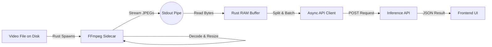

You are absolutely correct to discard the **WebApp/Browser** approach for this specific use case. While modern browsers have `WebCodecs` and `WASMs`, they are fundamentally unsuited for high-throughput wildlife video processing for three reasons:

1. **File Compatibility**: Wildlife cameras often use older containers (AVI, MJPEG in MKV) that browsers cannot read natively without complex WASM demuxers.
2. **Memory Sandboxing**: Browsers limit memory usage. Loading a 4GB+ trail cam video into browser memory to slice it is a recipe for crashing the tab.
3. **Performance**: JavaScript/WASM is significantly slower than native code for video decoding.

### The Recommended Stack: Tauri + FFmpeg Sidecar

**Tauri** is the perfect fit here. It allows you to build a native desktop app (Windows, macOS, Linux) using web technologies for the UI (React/Vue/Svelte), but it uses **Rust** for the backend.

**Why this fits your needs:**

* **Zero Install**: You can bundle a static `ffmpeg` binary *inside* your application installer. The user downloads one `.msi` or `.dmg` file, and it just works. No separate "Please install FFmpeg" step.
* **Maximum Speed**: You use the **Sidecar Pattern**. Rust spawns the bundled FFmpeg process, which decodes and slices the video at native C-speed.
* **Single Codebase**: Tauri handles the cross-platform bundling for you.

### The "Secret Sauce": Stdout Piping

Do **not** let FFmpeg write images to the disk (e.g., `temp/frame_001.jpg`). Disk I/O is slow and wears out SSDs.
Instead, configure FFmpeg to write the images to **Standard Output (stdout)**. Your Rust backend reads this stream in real-time, splits the byte stream into JPEG chunks, and uploads them to the API directly from RAM.

---

Here is the roadmap file, tailored to guide a coding agent through this specific architecture.

```markdown
{
Filename: tauri_client_roadmap.md
Full Content:
# 🦀 Native Wildlife Client: Tauri + FFmpeg Sidecar Roadmap

> **Goal**: Build a high-performance, cross-platform desktop application (Windows, macOS, Linux) that "slices" video frames locally using a bundled FFmpeg binary and streams them to the inference API.
> **Philosophy**: Zero-Dependency (bundled binaries) & Zero-Disk-IO (RAM piping) for maximum throughput.

---

> [!IMPORTANT]
> ## 📍 Current Focus
> **Phase**: T3 — UI/UX & State Management (COMPLETE — Ready for Checkpoint)
> **Active Steps**: Checkpoint T3 — User verification
> **Last Completed**: T3.2 — Progress bar polish, cancel button, rate limit UI
> **Blocked On**: None

> **Context for Agent**: All T3 features implemented: drag-drop, native file dialog, settings persistence, progress bar with elapsed time, cancel button (kills FFmpeg), rate limit countdown UI, results viewer with export. Pending user verification of full loop.
>
> **Deferred to Phase T4**:
> - Model dropdown from `/api/v1/models` (requires A5)
> - Keychain storage for API key (using localStorage for now)
> - Thumbnail timeline view
> - Jump-to-detection video playback

---

## 🏗️ Architecture Overview

### The "Zero-Disk" Pipeline



### Key Principles

1. **Sidecar Pattern**: FFmpeg executable is bundled *inside* the app installer. User installs nothing extra.
2. **Pipe, Don't Write**: Frames flow from `Video -> FFmpeg -> RAM -> API`. Never write `.jpg` files to disk.
3. **Pre-Filtering**: Resize and decimate (frame skipping) happens *inside* FFmpeg before data reaches the app memory.
4. **Platform Agnostic**: Binary names must match Tauri's target triples (e.g., `ffmpeg-x86_64-pc-windows-msvc.exe`).

---

## 🛠️ Phase T1: Foundation & FFmpeg Sidecar

**Goal**: Initialize Tauri and successfully spawn a bundled FFmpeg binary that pipes data to the Rust console.

### T1.1 Project Setup & Binary Acquisition

> [!WARNING]
> **Naming Convention is Strict**: Tauri requires bundled binaries to be suffixed with the target triple.
> Example: `ffmpeg` on Windows **must** be named `ffmpeg-x86_64-pc-windows-msvc.exe`.

* [x] **T1.1.1** Initialize Tauri v2 project (`npm create tauri-app`)
* [x] **T1.1.2** Create `src-tauri/binaries/` directory
* [x] **T1.1.3** Download **FFmpeg Static Builds** (GPL/LGPL) for:
  * Windows x64 (`ffmpeg-x86_64-pc-windows-msvc.exe`)
  * Linux x64 (`ffmpeg-x86_64-unknown-linux-gnu`)
  * macOS Intel (`ffmpeg-x86_64-apple-darwin`)
  * macOS Silicon (`ffmpeg-aarch64-apple-darwin`)


* [x] **T1.1.4** Update `tauri.conf.json` to map `externalBin`:
```json
"bundle": {
  "externalBin": ["binaries/ffmpeg"]
}
```

* [x] **T1.1.5** Configure shell plugin and capabilities (`shell:allow-execute`, `shell:allow-spawn`).

### T1.2 The "Pipe" Implementation

**Goal**: Implement the Rust logic to spawn the command and read `stdout`.

**Update `src-tauri/src/lib.rs**`:

* [x] **T1.2.1** Import `tauri_plugin_shell` and `std::process::Stdio`
* [x] **T1.2.2** Implement `process_video(file_path: String)` command
* [x] **T1.2.3** Construct the FFmpeg args (See **Technical Notes** below)
* [x] **T1.2.4** Create the event loop to read bytes from the sidecar `stdout`
* [x] **T1.2.5** Test: Run app, select video, verify FFmpeg logs appear in terminal

> [!IMPORTANT]
> **Checkpoint T1**: ✅ App builds, bundles FFmpeg, runs the binary, and we can see output in the debug console.

---

## ⚡ Phase T2: Stream Parsing & API Client

**Goal**: Parse the raw byte stream from FFmpeg into distinct images and send them to the API.

### T2.1 MJPEG Stream Parsing

> [!TIP]
> FFmpeg will output a stream of concatenated JPEGs. We must split them based on "Magic Numbers".
> Start: `0xFF 0xD8` | End: `0xFF 0xD9`

* [x] **T2.1.1** Implement a buffer (`Vec<u8>`) in Rust to hold incoming chunks
* [x] **T2.1.2** Write logic to scan buffer for JPEG start/end markers
* [x] **T2.1.3** Extract `Vec<u8>` for a single complete image
* [x] **T2.1.4** Handle edge case: Ensure split chunks (end of frame A + start of frame B) are reassembled correctly
* [x] **T2.1.5** Emit `frame-extracted` event to Frontend (optional, for debugging)

### T2.2 SAFARI API Client

**Update `src-tauri/src/api.rs`**:

> [!NOTE]
> The SAFARI API uses `safari_` prefixed API keys. Store key securely in system keychain.
> API Base URL: `https://[modal-username]--safari-api-inference-serve.modal.run`
> The API supports both **YOLO detection** and **SAM3+Classifier hybrid** models based on `model_type`.
> **Batch endpoint available**: `POST /api/v1/infer/{slug}/batch` for high-throughput frame sequences (max 100 images).

* [x] **T2.2.1** Add `reqwest` (with `multipart`), `tokio`, and `keyring` dependencies
* [x] **T2.2.2** Create `struct SafariClient`:
  ```rust
  pub struct SafariClient {
      api_key: String,  // safari_xxxx...
      base_url: String,
      model_slug: String,
  }
  ```
* [x] **T2.2.3** Implement `SafariClient::new(api_key: &str, model_slug: &str)`
* [x] **T2.2.4** Implement `infer_image(image_bytes: Vec<u8>) -> Result<InferenceResult>`
  - `POST /api/v1/infer/{model_slug}` with `multipart/form-data`
  - Headers: `Authorization: Bearer safari_xxxx...`
* [x] **T2.2.5** Implement `infer_video_async(video_path: &str) -> Result<JobId>`
  - `POST /api/v1/infer/{model_slug}/video`
  - Returns: `{ "job_id": "uuid...", "status": "queued" }`
* [x] **T2.2.6** Implement batch upload for frame bursts:
  ```rust
  pub struct FrameBatcher {
      batch_size: usize,  // Default: 50 (optimized for speed)
      pending: Vec<Vec<u8>>,
  }
  
  impl FrameBatcher {
      // POST /api/v1/infer/{slug}/batch with multipart files
      // Response: { results: [{ index, predictions, image_width, image_height }] }
      pub async fn flush(&mut self) -> Result<Vec<InferenceResult>>;
  }
  ```

### T2.3 Video Job Polling & Progress

**Goal**: Poll SAFARI API for video job progress and display real-time updates.

* [ ] **T2.3.1** Implement `SafariClient::poll_job(job_id: &str) -> Result<JobStatus>`:
  - `GET /api/v1/jobs/{job_id}`
  - Response:
    ```json
    {
      "job_id": "uuid...",
      "status": "processing",
      "progress": 45,
      "progress_current": 450,
      "progress_total": 1000,
      "frames_processed": 450,
      "total_frames": 1000,
      "result": null
    }
    ```
  - When `status` is `"completed"`, the `result` field contains the final predictions (no separate `predictions_url`).
* [ ] **T2.3.2** Create polling loop with exponential backoff:
  - Initial: 500ms
  - Max: 5s
  - Emit `job-progress` event to Frontend on each poll
* [ ] **T2.3.3** Handle terminal states:
  - `"completed"`: Parse `result` field for predictions
  - `"failed"`: Display error message to user
* [ ] **T2.3.4** Emit `job-complete` event with full results

> [!IMPORTANT]
> **Checkpoint T2**: ✅ Video file is read, split into clean JPEG buffers in RAM, and sent to API. Responses are logged.

---

## 🖥️ Phase T3: UI/UX & State Management

**Goal**: Build the frontend to control the process and visualize results.

### T3.1 Video Selection & Settings

* [x] **T3.1.1** UI: Drag & Drop zone for video files
* [x] **T3.1.2** UI: Settings Inputs:
  - **API Key**: Secure password input
  - **Model Slug**: Manual text input *(dropdown from `/api/v1/models` deferred to T4)*
  - **Frame Interval**: `N` frames to skip
* [x] **T3.1.3** Native file dialog via `tauri-plugin-dialog`
* [x] **T3.1.4** Pass settings from UI to the FFmpeg argument builder
* [x] **T3.1.5** Persist settings (localStorage now, Rust keychain deferred to T4)

### T3.2 Progress & Real-time Feedback

* [x] **T3.2.1** Progress bar with frame count and elapsed time
* [x] **T3.2.2** UI: "Cancel" button (kills FFmpeg process)
* [x] **T3.2.3** Handle 429 (Rate Limited): Show "Waiting..." with retry countdown

### T3.3 Results Viewer

* [x] **T3.3.1** Detection list: Species, Confidence, Frame Index
* [x] **T3.3.2** Export JSON/CSV buttons
* [x] **T3.3.3** Detection summary by class
* [ ] **T3.3.4** *(Deferred T4)* Thumbnail timeline showing detection density
* [ ] **T3.3.5** *(Deferred T4)* "Jump to Detection" video playback

> [!IMPORTANT]
> **Checkpoint T3**: ✅ Full user loop: Select File → Configure → Run → See Progress → View Results.

---

## 🔧 Technical Notes

### The "Golden" FFmpeg Command

To be constructed in Rust `Command::new_sidecar("ffmpeg")`:

```bash
ffmpeg 
  -i "input_video.mp4" 
  -vf "select='not(mod(n,10))',scale=640:640" 
  -vsync 0 
  -q:v 2 
  -c:v mjpeg 
  -f image2pipe 
  -

```

**Parameters Explained:**

1. **`-vf "select=..."`**: The magic filter. Drops 9 out of 10 frames internally.
2. **`scale=640:640`**: Resizes immediately. Crucial for speed. Don't resize in Rust/Python.
3. **`-vsync 0`**: Prevents FFmpeg from duplicating frames to maintain frame rate. We just want the raw unique images.
4. **`-f image2pipe -`**: Forces output to Stdout.

### 🚫 Things to AVOID (Guide for Agent)

* ❌ **No `cv2` / OpenCV**: We are not using Python bindings. We are using raw binaries.
* ❌ **No Temp Files**: Do not write `frame_01.jpg` to disk. It destroys performance.
* ❌ **No Web-based Slicing**: Do not attempt to load the video file into the JavaScript frontend. Pass the file path string to Rust.
* ❌ **No Shell Invocation**: Use `Command::new_sidecar`, do not run via `sh` or `cmd` (security risk + path issues).

### SAFARI API Error Handling

| Status Code | Meaning | Client Action |
|-------------|---------|---------------|
| 200 | Success | Parse predictions |
| 202 | Job Accepted | Begin polling |
| 401 | Invalid API Key | Prompt user to re-enter key |
| 429 | Rate Limited | Wait `Retry-After` seconds |
| 500 | Server Error | Retry with backoff, max 3 attempts |

### Data Flow for Detections

Since we are stripping timestamps by dropping frames, we must calculate the timestamp in Rust:
`Timestamp = (Frame_Index * Interval) / FPS`
*(Requires probing the video FPS first or assuming standard FPS)*

---

## 🔗 Integration with SAFARI API

See [API_roadmap.md](./API_roadmap.md) for the full server-side API specification.

**Quick Reference:**

| Endpoint | Method | Purpose |
|----------|--------|---------|
| `/api/v1/infer/{slug}` | POST | Image inference (detection or hybrid) |
| `/api/v1/infer/{slug}/batch` | POST | Batch image inference (max 100 images) |
| `/api/v1/infer/{slug}/video` | POST | Submit video job |
| `/api/v1/jobs/{job_id}` | GET | Poll job status |

> [!NOTE]
> `/api/v1/models` endpoint to list available models is planned for Phase A5.

---

## 🚀 Getting Started

1. **Download FFmpeg binaries** for your development OS immediately.
2. **Run `npm run tauri dev`** to ensure the environment is valid.
3. **Obtain a SAFARI API key** from the SAFARI web app (Project → API).
4. **Start Phase T1.2**: Focus purely on getting bytes from FFmpeg into a Rust variable.
}

```