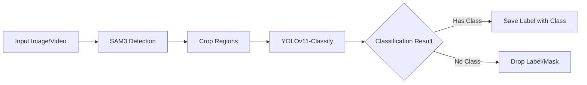

# 🧬 Hybrid Animal Detection: SAM3 + Classifier Roadmap

> **Goal**: Implement a hybrid detection-classification pipeline where SAM3 detects generic objects (e.g., "mammal", "bird") and a YOLOv11-Classify model identifies specific species from cropped regions.
> **Philosophy**: Scaffold for easy model replacement — either detection or classification model.

---

> [!IMPORTANT]
> ## 📍 Current Focus
> **Phase**: C3 — Hybrid Inference Pipeline ✅
> **Active Steps**: C3 Complete! Ready for Phase C4 (Integration & Polish)
> **Last Completed**: C3.3 — Segmentation Mask Rendering (2026-01-11)
> **Blocked On**: None

> **Context for Agent**: Hybrid inference pipeline complete with mask rendering. Modal job returns polygon masks for SVG overlay. Preview modal has eye icon toggle for mask visibility. Next: Integration testing and polish.

---

## 🏗️ Architecture Overview

### Hybrid Pipeline Flow



### Key Principles

1. **SAM3 for Detection**: High-quality masks/boxes for generic categories
2. **Classifier for Species**: YOLOv11-Classify identifies specific classes from crops
3. **Modular Design**: Either model can be swapped independently
4. **Reuse Existing Code**: Labels saved in same format → reuse rendering, editing, export

---

## 📊 Phase C1: Database & Architecture Foundation ✅

**Goal**: Extend the database schema and backend to support classification models and the hybrid pipeline.

### C1.1 Schema Updates ✅

> [!WARNING]
> **User must run these SQL scripts in Supabase Dashboard → SQL Editor**.

**Step 1**: Add `model_type` to training_runs and models:

```sql
-- Add model_type to training_runs table
ALTER TABLE training_runs 
ADD COLUMN IF NOT EXISTS model_type TEXT DEFAULT 'detection' 
CHECK (model_type IN ('detection', 'classification'));

-- Add model_type to models table  
ALTER TABLE models
ADD COLUMN IF NOT EXISTS model_type TEXT DEFAULT 'detection'
CHECK (model_type IN ('detection', 'classification'));
```

- [x] **C1.1.1** Run Step 1 SQL in Supabase Dashboard
- [x] **C1.1.2** Verify: Query `training_runs` table → `model_type` column exists with default 'detection'
- [x] **C1.1.3** Verify: Query `models` table → `model_type` column exists with default 'detection'

**Step 2**: Add classification-specific columns (optional, for future metrics):

```sql
-- Add top-k accuracy fields for classification models
ALTER TABLE training_runs
ADD COLUMN IF NOT EXISTS top1_accuracy FLOAT,
ADD COLUMN IF NOT EXISTS top5_accuracy FLOAT;

ALTER TABLE models
ADD COLUMN IF NOT EXISTS top1_accuracy FLOAT,
ADD COLUMN IF NOT EXISTS top5_accuracy FLOAT;
```

- [x] **C1.1.4** Run Step 2 SQL in Supabase Dashboard
- [x] **C1.1.5** Verify: accuracy columns exist

> [!IMPORTANT]
> **Checkpoint C1.1**: ✅ All schema changes applied (2026-01-11).

---

### C1.2 Backend CRUD Updates ✅

**Goal**: Update `supabase_client.py` to handle model_type in training runs and models.

**Add to `backend/supabase_client.py`**:

- [x] **C1.2.1** Update `create_training_run()` to accept optional `model_type='detection'` param
- [x] **C1.2.2** Update `get_training_run()` to include `model_type` in returned dict (auto-included via `select("*")`)
- [x] **C1.2.3** Update `get_dataset_training_runs()` to include `model_type` (auto-included via `select("*")`)
- [x] **C1.2.4** Update `create_model()` to accept `model_type` param (also added top1/top5_accuracy)
- [x] **C1.2.5** Add `get_user_models_by_type(user_id, model_type)` function
- [x] **C1.2.6** Syntax verified - ready for integration testing

> [!IMPORTANT]
> **Checkpoint C1.2**: ✅ All CRUD operations support model_type (2026-01-11).
---

## 🎓 Phase C2: Classification Training Pipeline

**Goal**: Create a Modal job for training YOLOv11-Classify models using cropped images from existing dataset annotations.

### C2.1 Classification Training Modal Job

**Create `backend/modal_jobs/train_classify_job.py`**:

> [!TIP]
> This is a modified copy of `train_job.py` with key differences:
> 1. Crops images using annotation coordinates before training
> 2. Uses `YOLO(..., task='classify')` instead of detection
> 3. Organizes dataset in classification format (class folders)

```python
# Classification training folder structure:
# /tmp/dataset/
# ├── train/
# │   ├── class1/
# │   │   ├── img001_crop0.jpg
# │   │   └── img002_crop1.jpg
# │   └── class2/
# │       └── img003_crop0.jpg
# └── val/
#     ├── class1/
#     │   └── img004_crop0.jpg
#     └── class2/
#         └── img005_crop0.jpg
```

**Implementation steps**:

- [x] **C2.1.1** Create `backend/modal_jobs/train_classify_job.py` scaffold (copy from `train_job.py`)
- [x] **C2.1.2** Update Modal image to include classification dependencies (added `pillow`)
- [x] **C2.1.3** Implement `crop_image_from_annotation()` helper function:
  - Takes image bytes, annotation dict (x, y, width, height normalized)
  - Returns cropped image bytes
  - Add small padding (5%) to avoid tight crops
- [x] **C2.1.4** Crop processing integrated into main function:
  - Downloads images from presigned URLs
  - For each image, crops all annotations
  - Saves crops to `class_name/image_id_crop_idx.jpg` folder structure
  - Returns train/val split paths
- [x] **C2.1.5** Implement `train_classifier()` main function:
  - Creates classification dataset from cropped annotations
  - Runs `YOLO('yolo11n-cls.pt').train(data=dataset_path, ...)`
  - Uploads best.pt to R2
  - Updates Supabase with metrics (top1_accuracy, top5_accuracy)
- [x] **C2.1.6** Add log streaming (reused `LogCapture` pattern)
- [x] **C2.1.7** Deploy: `modal deploy backend/modal_jobs/train_classify_job.py` ✅ (2026-01-11)
- [x] **C2.1.8** Test with minimal dataset ✅ (2026-01-11) — Training completed successfully!

> [!IMPORTANT]
> **Checkpoint C2.1**: ✅ Complete! Classification training job works end-to-end.

---

### C2.2 Training Dashboard — Classification Tab

**Goal**: Add a "Classification" tab to the training configuration panel alongside the existing "Detection" tab.

**Update `modules/training/dashboard.py`**:

- [x] **C2.2.1** Add mode selector (segmented control) with "Detection" and "Classification" options
- [x] **C2.2.2** Keep existing config UI for "Detection" mode
- [x] **C2.2.3** Create "Classification" config with:
  - Epochs slider (10-300, default 100)
  - Model size dropdown (n/s/m/l for classification)
  - Batch size dropdown (16/32/64/128 — classification can use larger batches)
  - Image size dropdown (224/256/384/512 — classification uses smaller images)
- [x] **C2.2.4** Datasets shared between modes (same selection)
- [x] **C2.2.5** "Start Training" button calls correct Modal job based on mode

**Update `modules/training/state.py`**:

- [x] **C2.2.6** Add `training_mode: str = 'detection'` state variable
- [x] **C2.2.7** Add classification-specific config: `classify_image_size`, `classify_batch_size`
- [x] **C2.2.8** Implement `start_classification_training()` method:
  - Creates training run with `model_type='classification'`
  - Spawns Modal classification job via `modal.Function.from_name()`
  - Passes annotation data (bounding boxes) for cropping
- [x] **C2.2.9** Training runs load includes both types (no filter needed yet)

> [!IMPORTANT]
> **Checkpoint C2.2**: ✅ Complete! Dashboard has Detection/Classification mode selector. Ready to test.

---

### C2.3 Training Run Detail — Model Type Column

**Goal**: Show model type in the training history table and run detail page.

**Update `modules/training/state.py` and `dashboard.py`**:

- [x] **C2.3.1** Add "Type" column to training runs table showing 🎯 Det or 🏷️ Cls badge
- [x] **C2.3.2** Add filter dropdown to show: All Types / 🎯 Detection / 🏷️ Classification runs
- [x] **C2.3.3** Add `model_type` field to TrainingRunModel and load from database
- [x] **C2.3.4** Added `filter_model_type` state variable and setter
- [x] **C2.3.5** Update table metric columns to show mode-specific metrics (mAP vs Top-1/Top-5)

**Update `modules/training/run_detail.py`**:

- [x] **C2.3.6** Add model type badge to run header (Detection blue, Classification purple)
- [x] **C2.3.7** Add `classification_metrics_row()` showing Top-1, Top-5, Loss, Val Loss, Best Epoch
- [x] **C2.3.8** Add `accuracy_chart()` showing Top-1 and Top-5 accuracy over epochs
- [x] **C2.3.9** Add `classification_loss_chart()` showing train/val loss
- [x] **C2.3.10** Add `classification_charts_section()` grouping classification charts
- [x] **C2.3.11** Update `run_detail_content()` to conditionally show detection vs classification insights
- [x] **C2.3.12** Update `results_card()` in dashboard to show mode-specific metrics

> [!IMPORTANT]
> **Checkpoint C2.3**: ✅ Complete! Run detail page shows mode-specific metrics and charts.

---

## 🔬 Phase C3: Hybrid Inference Pipeline

**Goal**: Create the SAM3 + Classifier inference pipeline for the Model Playground.

### C3.1 Classification Inference Modal Job

**Create `backend/modal_jobs/classify_infer_job.py`**:

```python
@app.function(...)
def hybrid_inference(
    image_url: str,
    sam3_model: str,         # SAM3 model name
    sam3_prompts: list[str], # Generic prompts like ["mammal", "bird"]  
    classifier_model_path: str,  # R2 path to classifier weights
    classifier_classes: list[str],  # Class names for classifier output
    prompt_class_map: dict,  # {sam3_prompt: list of valid classifier classes}
    confidence_threshold: float = 0.25,
):
    """
    1. Run SAM3 with generic prompts → Get masks/boxes
    2. Crop each detection
    3. Run classifier on each crop
    4. If classifier returns valid class → Keep detection with new class
    5. If no valid class → Drop detection
    6. Return YOLO-format labels for kept detections
    """
```

**Implementation steps**:

- [x] **C3.1.1** Create `backend/modal_jobs/hybrid_infer_job.py` scaffold
- [x] **C3.1.2** Implement SAM3 detection with text prompts:
  - Load SAM3 model from mounted volume
  - Run inference with multiple text prompts
  - Collect list of (box, prompt) tuples
- [x] **C3.1.3** Implement `crop_from_box()` helper:
  - Takes image bytes and box coordinates
  - Returns cropped JPEG bytes with padding
- [x] **C3.1.4** Implement `download_classifier_model()` helper:
  - Download YOLOv11-Classify model from R2
  - Load with YOLO() and run inference on crops
- [x] **C3.1.5** Implement class filtering logic:
  - Check if classifier class is in valid classes for the SAM3 prompt
  - Filter by classifier confidence threshold
  - Only keep valid matches
- [x] **C3.1.6** Implement main `hybrid_inference()` function:
  - Full SAM3 → Crop → Classify → Filter pipeline
  - Return predictions with YOLO-format labels
- [x] **C3.1.7** Add `hybrid_inference_video()` for frame-by-frame processing
- [x] **C3.1.8** Deploy: `modal deploy backend/modal_jobs/hybrid_infer_job.py` ✅

> [!IMPORTANT]
> **Checkpoint C3.1**: ✅ Complete! Hybrid inference job deployed to Modal.

---

### C3.2 Model Playground — Classifier UI

**Goal**: Auto-detect model type and show appropriate interface.

**Update `modules/inference/playground.py`**:

- [x] **C3.2.1** Show "Hybrid Mode" badge when classifier model selected
- [x] **C3.2.2** Add model type detection logic in `select_model_by_name()`:
  - Query training_run by ID → Check `model_type` field
  - Set `is_hybrid_mode` and `classifier_classes` state variables
- [x] **C3.2.3** Create conditional hybrid config UI:
  - Collapsible "Hybrid Mode" section with purple border
  - Shows class count and configuration options

**For Detection models** (existing behavior):
- Direct inference on full image
- Show bounding boxes with class labels

**For Classification models** (new):
- [x] **C3.2.4** Add SAM3 prompt input section:
  - Text input for generic prompts (comma-separated)
  - Default: "mammal, bird"
- [x] **C3.2.5** Add classifier confidence slider (0.1 - 1.0)
- [x] **C3.2.6** Route "Run" button to `_run_hybrid_image_inference()` when in hybrid mode

**Update `modules/inference/state.py`**:

- [x] **C3.2.7** Add `is_hybrid_mode`, `selected_classifier_type`, `classifier_classes`, `classifier_r2_path`
- [x] **C3.2.8** Add `sam3_prompts_input: str` with computed `sam3_prompts` list
- [x] **C3.2.9** Add computed `prompt_class_map` (auto-assigns all classes to all prompts)
- [x] **C3.2.10** Implement `_run_hybrid_image_inference()` method:
  - Calls `hybrid-inference` Modal job
  - Saves labels to R2 and creates inference result record
  - Stores result for playback
- [x] **C3.2.11** Update `run_inference()` to route to hybrid when `is_hybrid_mode`

> [!IMPORTANT]
> **Checkpoint C3.2**: ✅ Complete! Select classifier model → Hybrid Mode UI appears → Configure prompts → Run hybrid inference.

---

### C3.3 Segmentation Mask Rendering ✅

**Goal**: Render SAM3 segmentation masks alongside bounding boxes.

- [x] **C3.3.1** Masks always included (no config toggle — simplifies UX)
- [x] **C3.3.2** Update Modal job to return masks as polygon coordinates (normalized 0-1)
- [x] **C3.3.3** Add SVG-based mask rendering overlay (semi-transparent green fill)
- [x] **C3.3.4** Masks colored green (matching box color scheme)
- [x] **C3.3.5** Add toggle to show/hide masks in result viewer (eye icon in header)

> [!IMPORTANT]
> **Checkpoint C3.3**: ✅ Complete! Masks render as SVG polygons over detected objects. Toggle in preview header. (2026-01-11)

---

## 📋 Phase C4: Integration & Polish

**Goal**: Ensure seamless integration between detection and classification workflows.

### C4.1 Label Storage Compatibility

**Goal**: Ensure classification results integrate with existing label viewing/editing.

- [ ] **C4.1.1** Verify labels saved in standard YOLO format: `class_id x_center y_center width height`
- [ ] **C4.1.2** Verify labels load correctly in video editor canvas
- [ ] **C4.1.3** Verify labels appear in keyframe thumbnails
- [ ] **C4.1.4** Test: Run hybrid inference on video → Open in video editor → Annotations visible

> [!IMPORTANT]
> **Checkpoint C4.1**: Classification inference results fully compatible with existing labeling UI.

---

### C4.2 Empty Detection Handling

**Goal**: Ensure detections without valid classifications are dropped.

- [ ] **C4.2.1** Implement filtering logic in Modal job:
  - If classifier confidence < threshold: drop
  - If classifier class not in prompt_class_map: drop
- [ ] **C4.2.2** Add dropped detection count to inference result metadata
- [ ] **C4.2.3** Show stats in result viewer: "X detections kept, Y dropped (no matching class)"
- [ ] **C4.2.4** Test with mismatched prompt/class mapping → Verify proper filtering

> [!IMPORTANT]
> **Checkpoint C4.2**: Only valid classifications are saved. Dropped detections logged but not stored.

---

### C4.3 Model Type Preferences

**Goal**: Persist user's model type preferences.

- [ ] **C4.3.1** Store last selected model type in user preferences
- [ ] **C4.3.2** Store SAM3 prompt templates for reuse
- [ ] **C4.3.3** Store common prompt-class mappings per project
- [ ] **C4.3.4** Auto-populate prompts when selecting a previously used classifier

> [!IMPORTANT]
> **Checkpoint C4.3**: User preferences persist across sessions.

---

## ✅ Phase Completion Checklist

### Phase C1: Database & Architecture ✅
- [ ] Schema updated with model_type columns
- [ ] Backend CRUD supports model_type filtering

### Phase C2: Classification Training ✅
- [ ] Classification Modal job creates cropped dataset and trains
- [ ] Training dashboard has Detection/Classification tabs
- [ ] Training history shows model type column

### Phase C3: Hybrid Inference ✅
- [ ] Hybrid inference job: SAM3 → Crop → Classify → Filter
- [ ] Playground detects model type, shows appropriate UI
- [ ] Classification UI has prompt input and class mapping

### Phase C4: Integration ✅
- [ ] Labels compatible with existing editors
- [ ] Empty detections properly filtered
- [ ] Preferences persist

---

## 🔧 Technical Notes

### YOLOv11-Classify Model Sizes

| Model | Size | ImageNet Top-1 | Params |
|-------|------|----------------|--------|
| yolo11n-cls | Nano | 70.0% | 1.6M |
| yolo11s-cls | Small | 75.4% | 5.5M |
| yolo11m-cls | Medium | 77.3% | 10.4M |
| yolo11l-cls | Large | 78.3% | 12.9M |

### Cropping Strategy

- Use annotation bounding box + 5% padding
- Maintain aspect ratio (pad with black if needed)
- Resize to classifier input size (224/256/384)

### Class Mapping Example

```python
# SAM3 detects generic categories
sam3_prompts = ["mammal", "bird"]

# Classifier knows specific species
classifier_classes = ["lynx", "fox", "eagle", "sparrow", "deer"]

# Mapping: which classifier classes are valid for each SAM3 prompt
prompt_class_map = {
    "mammal": ["lynx", "fox", "deer"],
    "bird": ["eagle", "sparrow"]
}

# Pipeline:
# 1. SAM3 detects "mammal" at box [0.1, 0.2, 0.3, 0.4]
# 2. Crop that region
# 3. Classifier returns "lynx" with 0.85 confidence
# 4. "lynx" is in prompt_class_map["mammal"] → KEEP
# 5. Save label: "0 0.25 0.4 0.3 0.4" (class_id=0 for lynx)
```

---

## 🚀 Getting Started

1. **Complete Phase C1** first — database schema updates
2. **Test detection training** still works after schema changes
3. **Proceed to Phase C2** — classification training job
4. **Test classification training** with small dataset
5. **Proceed to Phase C3** — hybrid inference
6. **Integration testing** in Phase C4

> [!TIP]
> Each phase has explicit checkpoints. Don't proceed until current checkpoint passes.
