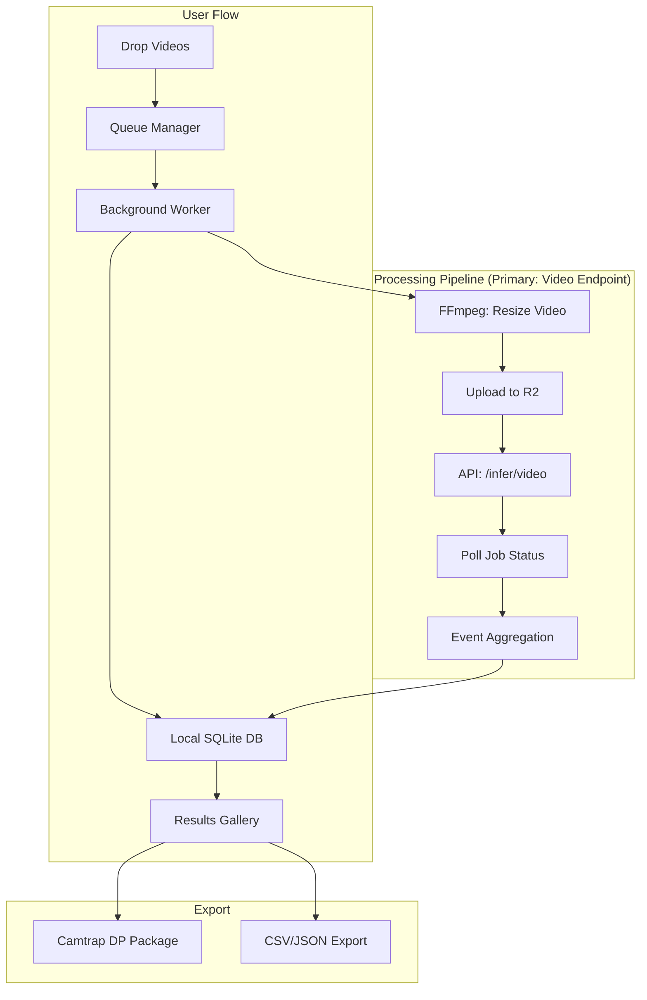
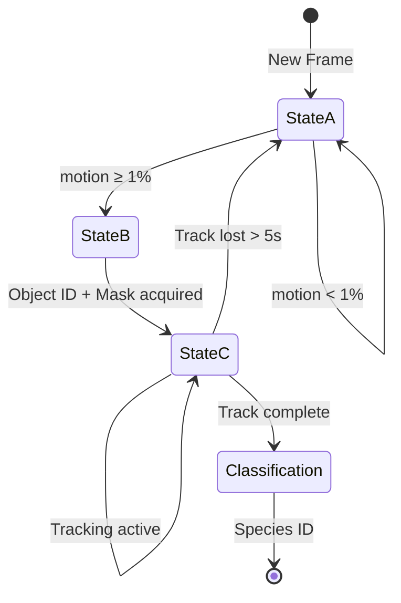

# 🦁 SAFARI Native Client: Multi-Video Processing Roadmap (v2)

> **Vision**: A "drop files and forget" desktop app for wildlife video inference. Users queue videos, walk away, and return to rich, analyzable results.
> **Philosophy**: *Hide complexity, make data shine* — like Twinmotion for rendering. Simple by default, powerful when needed.

---

> [!IMPORTANT]
> ## 📍 Current Status
> **Completed**: Phases T1–T3 (single video processing, UI polish, settings persistence)
> **Starting**: Phase T4 — Multi-Video Queue & Background Processing
> **Foundation**: FFmpeg sidecar ✅ | Batch API client ✅ | Drag-drop UI ✅

---

## 🏗️ Architecture Evolution

### From "One Video" to "Fire and Forget"



### Key Architectural Decisions

| Component | Decision | Rationale |
|-----------|----------|-----------|
| **Queue** | SQLite + Background Thread | Survives app restarts, no cloud dependency |
| **Inference** | Video endpoint (server-side tracking) | Best detection quality via SAM3 temporal tracking |
| **Resolution** | FFmpeg resize before upload (default 1024px) | 90% bandwidth reduction, configurable in Advanced |
| **Parallelism** | 2 concurrent video jobs (configurable) | Doubles throughput without excessive GPU cost |
| **Detections** | 3-tier storage (Media → Raw → Events) | Prevents database bloat from frame-level data |
| **Export** | Camtrap DP standard | Scientific reproducibility, R/Wildlife Insights compatible |
| **Fallback** | Batch image mode (Advanced Settings) | Legacy option for quick previews |

---

## 🧠 Core Inference Architecture: The "Wake-Up" State Machine

> [!IMPORTANT]
> **Objective**: Minimize GPU usage while processing high-resolution video.
> Do **not** run detection on every frame — use a state machine to "wake up" inference only when needed.

### The Three States



| State | Name | GPU Cost | Purpose |
|-------|------|----------|---------|
| **A** | Gaussian Motion Gate | Low (CPU) | Filter out wind/grass noise |
| **B** | Wake-Up (SAM Initiation) | High | Detect new animals, start tracking |
| **C** | Visual Tracking | Medium | Follow tracked objects at lower resolution |

---

### State A: Gaussian Motion Gate (CPU/Low-Cost)

> [!TIP]
> 90% of wildlife footage is static (wind, trees, empty background).
> This gate prevents wasting GPU cycles on nothing.

**Logic:**
1. Apply **Gaussian Blur** (kernel 21×21) to wash out high-frequency noise (wind/grass)
2. Calculate pixel difference between consecutive frames
3. **Threshold**: If motion < 1%, skip frame entirely
4. **Trigger**: If motion ≥ threshold, transition to **State B**

```python
def gaussian_motion_gate(
    current_frame: torch.Tensor,
    prev_frame: torch.Tensor,
    kernel_size: int = 21,
    threshold: float = 0.01
) -> bool:
    """
    Returns True if motion detected (should wake up inference).
    Gaussian blur removes high-frequency noise like swaying grass.
    """
    if prev_frame is None:
        return True  # Always process first frame
    
    # Apply Gaussian blur to both frames
    blurred_current = F.gaussian_blur(current_frame, kernel_size=(kernel_size, kernel_size))
    blurred_prev = F.gaussian_blur(prev_frame, kernel_size=(kernel_size, kernel_size))
    
    # Calculate normalized pixel difference
    diff = torch.mean(torch.abs(blurred_current.float() - blurred_prev.float())) / 255.0
    
    return diff >= threshold
```

---

### State B: The "Wake-Up" (SAM Initiation)

**Trigger**: First frame of new motion detected.

**Action:**
- **If SAM3 (Text-Capable)**: Run Text-to-Track with prompt `"animal"`
- **If SAM2 (No Text)**: Calculate bounding box of motion cluster via Blob Extraction, use as Box Prompt

**Output**: Object ID + Initial Mask → Transition to **State C**

```python
def wake_up_detection(
    frame: torch.Tensor,
    sam_model: SAM3,
    motion_mask: torch.Tensor | None = None
) -> tuple[int, torch.Tensor]:
    """
    Initiate SAM tracking on first motion frame.
    Returns (object_id, initial_mask).
    """
    if sam_model.supports_text_prompts:
        # SAM3: Zero-shot text prompt
        result = sam_model.detect(frame, text_prompt="animal")
    else:
        # SAM2: Use motion blob as bounding box prompt
        bbox = extract_motion_bbox(motion_mask)
        result = sam_model.detect(frame, box_prompt=bbox)
    
    return result.object_id, result.mask
```

---

### State C: Visual Tracking (The "Resolution Sandwich")

> [!IMPORTANT]
> **Key Optimization**: Track at low resolution, classify at full resolution.

**The "Resolution Sandwich" Pattern:**
1. **Top Bread**: Original 4K source (for final classification crops)
2. **Filling**: 512×512 tracking stream (for SAM visual tracker)
3. **Bottom Bread**: Original 4K source (for output coordinates)

**Tracking Logic:**
- Downscale stream to 512×512 (or 640p) via **NVDEC** for tracking
- Feed previous mask/state into SAM's visual tracker (**bypass text encoder** — faster)
- Track for N frames continuously

**Memory Management:**
- **Flush SAM memory bank if track is lost for >5 seconds**
- Prevents OOM (Out of Memory) errors from stale object states
- On flush → transition back to **State A**

```python
class ResolutionSandwich:
    """
    Track at low-res, classify at high-res.
    Coordinates are normalized [0, 1] for seamless mapping.
    """
    TRACKING_RESOLUTION = 512
    TRACK_LOSS_TIMEOUT_SEC = 5.0
    
    def track_frame(
        self,
        low_res_frame: torch.Tensor,   # 512x512
        high_res_frame: torch.Tensor,  # Original 4K
        prev_mask: torch.Tensor,
        last_detection_time: float
    ) -> TrackResult:
        # Check for track loss timeout
        if time.time() - last_detection_time > self.TRACK_LOSS_TIMEOUT_SEC:
            self.sam_model.flush_memory_bank()
            return TrackResult(status="lost", should_reset=True)
        
        # Track at low resolution (fast)
        result = self.sam_model.track_visual(
            frame=low_res_frame,
            prev_mask=prev_mask,
            use_text_encoder=False  # Bypass for speed
        )
        
        if result.confidence > 0.5:
            # Map normalized coords to high-res for classification
            result.high_res_bbox = self.scale_bbox(
                result.bbox_normalized, 
                high_res_frame.shape
            )
            return result
        
        return TrackResult(status="tracking", mask=result.mask)
```

---

## 🎯 Classification Strategy: "Masked Best-Shot Voting"

> [!IMPORTANT]
> **Objective**: Maximize species classification accuracy by removing background noise and using only the best frames.

### Step 1: Masked Cropping

Use the SAM binary mask to isolate the animal from background:

```python
def masked_crop(frame: torch.Tensor, mask: torch.Tensor) -> torch.Tensor:
    """
    Bitwise-AND frame with mask.
    Background pixels become RGB(0, 0, 0).
    """
    # Expand mask to 3 channels
    mask_3ch = mask.unsqueeze(0).expand(3, -1, -1)
    
    # Apply mask — background becomes black
    masked = frame * mask_3ch
    
    return masked
```

**Benefit**: Classifier sees **only the animal**, removing "forest = deer" bias from training data artifacts.

---

### Step 2: Best-Shot Selection (Quality Score)

Do **not** classify every frame. Instead, calculate a quality score:

```
Quality Score = Box_Area × Confidence × (1 - Distance_From_Center)
```

| Factor | Rationale |
|--------|-----------|
| **Box_Area** | Larger = animal closer to camera, more pixels |
| **Confidence** | Higher SAM confidence = cleaner mask |
| **Center Distance** | Animals near frame center are less occluded |

**Select Top 3 Frames** from entire track for classification.

```python
def select_best_shots(track: Track, top_k: int = 3) -> list[int]:
    """
    Select the top-k highest quality frames from a track.
    """
    scores = []
    for i, det in enumerate(track.detections):
        # Normalized box area (0 to 1)
        area = det.bbox.width * det.bbox.height
        
        # Distance from center (0 = corner, 1 = center)
        cx, cy = det.bbox.center
        center_dist = 1 - math.sqrt((cx - 0.5)**2 + (cy - 0.5)**2) / 0.707
        
        # Quality score
        score = area * det.confidence * center_dist
        scores.append((i, score))
    
    # Return indices of top-k frames
    scores.sort(key=lambda x: x[1], reverse=True)
    return [idx for idx, _ in scores[:top_k]]
```

---

### Step 3: Resolution Upscale

Map normalized coordinates from 512p tracking stream back to **original 4K source**:

```python
def extract_high_res_crop(
    original_4k: torch.Tensor,
    normalized_bbox: BBox,  # From 512p tracking
    target_size: int = 224   # Classifier input size
) -> torch.Tensor:
    """
    Extract crop from source-quality video at tracked coordinates.
    """
    h, w = original_4k.shape[-2:]
    
    # Scale normalized coords to pixel coords
    x1 = int(normalized_bbox.x * w)
    y1 = int(normalized_bbox.y * h)
    x2 = int((normalized_bbox.x + normalized_bbox.w) * w)
    y2 = int((normalized_bbox.y + normalized_bbox.h) * h)
    
    # Extract and resize
    crop = original_4k[:, y1:y2, x1:x2]
    return F.interpolate(crop.unsqueeze(0), size=(target_size, target_size))
```

---

### Step 4: Voting Logic

Run classifier on 3 masked high-res crops, then aggregate:

```python
def classify_with_voting(
    crops: list[torch.Tensor],
    classifier: nn.Module,
    method: str = "average"  # or "majority"
) -> tuple[str, float]:
    """
    Classify multiple crops and vote on species.
    """
    predictions = []
    for crop in crops:
        logits = classifier(crop)
        probs = F.softmax(logits, dim=-1)
        predictions.append(probs)
    
    if method == "average":
        # Average probabilities across all crops
        avg_probs = torch.stack(predictions).mean(dim=0)
        species_idx = avg_probs.argmax().item()
        confidence = avg_probs[species_idx].item()
    else:
        # Majority vote
        votes = [p.argmax().item() for p in predictions]
        species_idx = max(set(votes), key=votes.count)
        confidence = votes.count(species_idx) / len(votes)
    
    return classifier.classes[species_idx], confidence
```

---

## 📋 Metadata Fields

### Tier 1: Essential (Required)

| Field | Source | Storage |
|-------|--------|---------|
| `deployment_id` | User assigns (or auto from folder name) | `deployments` table |
| `timestamp_start` | Video metadata (`CreateDate`, NOT filesystem) | `media` table |
| `filename` | Original filename | `media` table |
| `frame_rate` | FFprobe | `media` table |
| `duration` | FFprobe | `media` table |
| `file_hash` | SHA-256 (first 1MB for speed) | `media` table |
| `species_class` | API response | `observations` table |
| `confidence` | API response | `observations` table |
| `time_offset` | Calculated: `frame_index × skip / fps` | `observations` table |

### Tier 2: High Value (Auto-extracted when available)

| Field | Source | Notes |
|-------|--------|-------|
| `bbox` | API response | `[x, y, w, h]` normalized |
| `temperature` | Subtitle track / embedded metadata | Common in trail cams |
| `camera_model` | EXIF/QuickTime tags | Helps explain trigger delays |

### Tier 3: Nice to Have (Future)

| Field | Source | Notes |
|-------|--------|-------|
| `moon_phase` | Calculate from timestamp + location | Requires deployment GPS |
| `flash_fired` | EXIF | Explains washed-out frames |

---

## 🗄️ Database Architecture (SQLite)

### Three-Tier Detection Storage

> [!TIP]
> The key insight: Video inference generates **thousands** of frame-level detections.
> Store raw data as JSON blobs, but **query against aggregated Events**.

```sql
-- TIER 1: Deployments (User-defined groupings)
CREATE TABLE deployments (
    id TEXT PRIMARY KEY,          -- e.g., "SiteA_2024_01"
    name TEXT NOT NULL,
    location_name TEXT,
    latitude REAL,
    longitude REAL,
    created_at TEXT DEFAULT CURRENT_TIMESTAMP
);

-- TIER 2: Media Files (One row per video)
CREATE TABLE media (
    id TEXT PRIMARY KEY,
    deployment_id TEXT REFERENCES deployments(id),
    filename TEXT NOT NULL,
    file_path TEXT NOT NULL,
    file_hash TEXT UNIQUE,        -- Duplicate prevention
    timestamp_start TEXT,         -- ISO 8601 UTC
    duration_seconds REAL,
    frame_rate REAL,
    width INTEGER,
    height INTEGER,
    camera_model TEXT,
    status TEXT DEFAULT 'pending', -- pending | processing | completed | failed
    error_message TEXT,
    raw_detections TEXT,          -- JSON blob for archive (TIER 2 storage)
    created_at TEXT DEFAULT CURRENT_TIMESTAMP,
    processed_at TEXT
);

-- TIER 3: Observations (Aggregated Events - what users query)
CREATE TABLE observations (
    id TEXT PRIMARY KEY,
    media_id TEXT REFERENCES media(id),
    species TEXT NOT NULL,
    species_scientific TEXT,      -- Mapped from GBIF/ITIS
    count INTEGER DEFAULT 1,      -- Future: individual counting
    time_start_seconds REAL,
    time_end_seconds REAL,
    max_confidence REAL,
    avg_confidence REAL,
    best_frame_index INTEGER,     -- For thumbnail extraction
    bbox_json TEXT,               -- Best detection bbox
    is_verified BOOLEAN DEFAULT FALSE, -- User-reviewed
    is_false_positive BOOLEAN DEFAULT FALSE,
    created_at TEXT DEFAULT CURRENT_TIMESTAMP
);

CREATE INDEX idx_observations_species ON observations(species);
CREATE INDEX idx_observations_confidence ON observations(max_confidence);
CREATE INDEX idx_media_status ON media(status);
CREATE INDEX idx_media_hash ON media(file_hash);
```

### Event Aggregation Logic (Rust)

```rust
/// Aggregate consecutive detections into discrete "Events"
/// Rule: Same species within 2 seconds = same event
fn aggregate_detections(
    detections: Vec<FrameDetection>,
    fps: f64,
    skip: u32
) -> Vec<Observation> {
    let mut observations = Vec::new();
    let mut current: Option<ObservationBuilder> = None;
    
    for det in detections {
        let timestamp = (det.frame_index * skip) as f64 / fps;
        
        match &mut current {
            Some(obs) if obs.species == det.species 
                && timestamp - obs.time_end < 2.0 => {
                // Extend current observation
                obs.extend(det, timestamp);
            }
            _ => {
                // Finalize previous and start new
                if let Some(obs) = current.take() {
                    observations.push(obs.build());
                }
                current = Some(ObservationBuilder::new(det, timestamp));
            }
        }
    }
    observations
}
```

---

## 🛠️ Phase T4: Multi-Video Queue & Background Processing

**Goal**: Accept multiple videos, process in background, survive app restarts.

### T4.0 Secure Credential Storage (Priority Fix)

> [!CAUTION]
> **Security Issue**: API keys are currently stored in localStorage (plaintext).
> This must be fixed before any production use.

* [ ] **T4.0.1** Add `keyring` crate to `Cargo.toml`
* [ ] **T4.0.2** Implement secure storage abstraction:
  ```rust
  pub struct SecureStorage {
      service_name: &'static str, // "safari-desktop"
  }
  
  impl SecureStorage {
      pub fn store_api_key(&self, key: &str) -> Result<()>;
      pub fn get_api_key(&self) -> Result<Option<String>>;
      pub fn delete_api_key(&self) -> Result<()>;
  }
  ```
* [ ] **T4.0.3** Platform-specific backends:
  | Platform | Backend |
  |----------|---------|
  | macOS | Keychain Services |
  | Windows | Credential Manager |
  | Linux | Secret Service (libsecret/KWallet) |
* [ ] **T4.0.4** Migrate existing localStorage keys on first run
* [ ] **T4.0.5** Update settings UI: Remove API key from visible storage
* [ ] **T4.0.6** Clear localStorage of any legacy key data

> [!IMPORTANT]
> **Checkpoint T4.0**: API key stored securely in OS keychain, not in any plaintext file or localStorage.

### T4.1 Queue Management

* [ ] **T4.1.1** SQLite setup with `rusqlite` + migrations
* [ ] **T4.1.2** `QueueManager` struct:
  ```rust
  pub struct QueueManager {
      db: Connection,
      processing_tx: mpsc::Sender<QueueCommand>,
  }
  
  impl QueueManager {
      pub fn add_videos(&self, paths: Vec<PathBuf>) -> Result<Vec<MediaId>>;
      pub fn get_pending(&self) -> Result<Vec<QueuedVideo>>;
      pub fn get_status(&self, id: &MediaId) -> Result<ProcessingStatus>;
      pub fn cancel(&self, id: &MediaId) -> Result<()>;
  }
  ```
* [ ] **T4.1.3** Duplicate detection: Check `file_hash` before queueing
* [ ] **T4.1.4** UI: Queue panel showing pending/processing/completed counts

### T4.2 Background Worker (Video Endpoint Flow)

> [!NOTE]
> **Primary flow uses the video endpoint** with server-side SAM3 tracking.
> Batch image mode is available in Advanced Settings for quick previews.

* [ ] **T4.2.1** Spawn dedicated processing thread on app start
* [ ] **T4.2.2** Implement `VideoJobManager` for concurrent processing:
  ```rust
  pub struct VideoJobConfig {
      /// Concurrent video jobs (Modal GPU instances)
      pub max_concurrent: usize,    // Default: 2 (Advanced Settings)
      
      /// Frame skip (sent as API param)
      pub frame_skip: u32,          // Default: 10
      
      /// Poll interval for job status
      pub poll_interval_ms: u64,    // Default: 2000
  }
  ```
* [ ] **T4.2.3** Video processing flow:
  1. Resize video locally (FFmpeg) if resolution > configured max
  2. Upload resized video to R2 presigned URL
  3. Submit to `/api/v1/infer/{slug}/video`
  4. Poll `/api/v1/jobs/{job_id}` until complete
  5. Parse results, aggregate events, store in SQLite
* [ ] **T4.2.4** Concurrent job management:
  - Track active jobs: `HashMap<JobId, VideoJob>`
  - When job completes, pull next from queue
  - Display: "Processing 2/10 videos (Video3, Video4)"
* [ ] **T4.2.5** Resume interrupted processing on app restart
* [ ] **T4.2.6** Event emission: `job-progress`, `video-complete`, `queue-empty`

<details>
<summary><strong>🔄 Batch Image Mode (Advanced Settings - Hidden)</strong></summary>

For users who want faster previews with less accuracy:

* [ ] **T4.2.7** Toggle: "Use batch image mode" (off by default)
* [ ] **T4.2.8** Client-side frame extraction (existing FFmpeg pipe)
* [ ] **T4.2.9** Submit to `/api/v1/infer/{slug}/batch` (50 frames/batch)
* [ ] **T4.2.10** Note: No temporal tracking, lower detection quality

</details>

### T4.3 Metadata Extraction (FFprobe)

* [ ] **T4.3.1** Bundle `ffprobe` alongside `ffmpeg`
* [ ] **T4.3.2** Extract: duration, fps, resolution, creation date, camera model
* [ ] **T4.3.3** Parse creation date from multiple formats (QuickTime, EXIF, filename patterns)
* [ ] **T4.3.4** Store metadata in `media` table before processing

### T4.4 Resolution Optimization

> [!NOTE]
> Trail cams often record 4K. Resizing before upload reduces bandwidth by ~90%.

* [ ] **T4.4.1** Add "Upload Resolution" to Advanced Settings:
  | Option | FFmpeg Scale | Use Case |
  |--------|--------------|----------|
  | **Fast (640px)** | `scale=640:-2` | Quick preview, low bandwidth |
  | **Balanced (1024px)** ✓ | `scale=1024:-2` | Default, good accuracy |
  | **High Quality (1920px)** | `scale=1920:-2` | Maximum detail |
  | **Original** | *(no scale)* | Full resolution, slow upload |
* [ ] **T4.4.2** Persist resolution choice in SQLite settings
* [ ] **T4.4.3** Display: Show estimated upload size based on selected resolution
* [ ] **T4.4.4** Dynamic FFmpeg command construction based on setting

### T4.5 Client Engineering Resilience ("Invisible Walls")

> [!CAUTION]
> **Field Conditions**: Users deploy in remote locations with unstable power, limited internet, and unusual file formats.
> These patterns prevent crashes and support tickets.

#### T4.5.1 SQLite Concurrency (WAL Mode)

> [!IMPORTANT]
> **Critical Fix**: Enable Write-Ahead Logging immediately to prevent `database is locked` errors during concurrent ingest/UI usage.

* [ ] **T4.5.1.1** Enable WAL mode on database initialization:
  ```rust
  fn init_database(path: &Path) -> Result<Connection> {
      let conn = Connection::open(path)?;
      
      // CRITICAL: Enable WAL for concurrent read/write
      conn.execute_batch("
          PRAGMA journal_mode = WAL;
          PRAGMA synchronous = NORMAL;
          PRAGMA busy_timeout = 5000;
      ")?;
      
      Ok(conn)
  }
  ```
* [ ] **T4.5.1.2** Verify WAL mode active: Check `.wal` file exists alongside `.db`
* [ ] **T4.5.1.3** Connection pool for background threads (avoid sharing Connection across threads)

#### T4.5.2 Field Internet Resilience (Resumable Uploads)

> [!NOTE]
> **Constraint**: Users often have unstable 3G/Wi-Fi in field conditions.
> Uploading a 500MB video should not fail from a 30-second dropout.

* [ ] **T4.5.2.1** Chunk video files (5MB per chunk)
* [ ] **T4.5.2.2** Upload chunks in parallel (3 concurrent by default)
* [ ] **T4.5.2.3** Retry failed chunks individually with exponential backoff:
  ```rust
  struct ChunkUploader {
      chunk_size: usize,       // 5MB
      max_concurrent: usize,   // 3
      max_retries: u32,        // 5
      base_delay_ms: u64,      // 1000
  }
  
  impl ChunkUploader {
      async fn upload_with_retry(
          &self,
          chunk: &[u8],
          chunk_idx: usize,
          upload_url: &str
      ) -> Result<()> {
          let mut attempts = 0;
          loop {
              match self.upload_chunk(chunk, chunk_idx, upload_url).await {
                  Ok(_) => return Ok(()),
                  Err(e) if attempts < self.max_retries => {
                      attempts += 1;
                      let delay = self.base_delay_ms * 2_u64.pow(attempts);
                      tokio::time::sleep(Duration::from_millis(delay)).await;
                  }
                  Err(e) => return Err(e),
              }
          }
      }
  }
  ```
* [ ] **T4.5.2.4** Track upload progress in SQLite: `upload_status = "chunk 12/47"`
* [ ] **T4.5.2.5** Resume incomplete uploads on app restart
* [ ] **T4.5.2.6** Backend: Use S3/R2 Multipart Upload API for server-side assembly

#### T4.5.3 Universal Playback (Proxy Generation)

> [!WARNING]
> **Problem**: Tauri/Browsers cannot play raw AVI/MJPEG from trail cams.
> Users expect to preview their videos in the app.

* [ ] **T4.5.3.1** During ingest, detect non-web-playable formats:
  | Container | Codec | Playable? | Action |
  |-----------|-------|-----------|--------|
  | `.mp4` | H.264 | ✅ Yes | Use directly |
  | `.avi` | MJPEG | ❌ No | Generate proxy |
  | `.avi` | DivX | ❌ No | Generate proxy |
  | `.mov` | H.265 | ⚠️ Sometimes | Test, fallback to proxy |
* [ ] **T4.5.3.2** Generate lightweight local proxy (H.264, 720p, AAC audio):
  ```bash
  ffmpeg -i "raw_trailcam.avi" \
    -c:v libx264 -preset fast -crf 28 \
    -vf "scale=-2:720" \
    -c:a aac -b:a 128k \
    "proxy_12345.mp4"
  ```
* [ ] **T4.5.3.3** Store proxy path in `media` table: `proxy_path TEXT`
* [ ] **T4.5.3.4** UI Logic: Play proxy in gallery; analyze **raw file** in backend
* [ ] **T4.5.3.5** Cleanup: Delete proxy when media entry is deleted

> [!IMPORTANT]
> **Checkpoint T4**: Queue multiple videos → process in background → view status → app restart resumes.

---

## 🖥️ Phase T5: Results Gallery & Analysis

**Goal**: Turn raw data into actionable insights with minimal user effort.

### T5.1 Gallery View

* [ ] **T5.1.1** Grid of videos with detection thumbnails (not frame 0!)
* [ ] **T5.1.2** "Best Frame" thumbnail: Extract frame at `best_frame_index` from API
* [ ] **T5.1.3** Detection badges: Species count overlay on each card
* [ ] **T5.1.4** Status indicators: ✓ Completed | ⏳ Processing | ❌ Failed

### T5.2 Detection List

* [ ] **T5.2.1** Sortable/filterable table:
  - Species | Confidence | Time | Video | Actions
* [ ] **T5.2.2** Quick filters: By species, confidence threshold, verification status
* [ ] **T5.2.3** Bulk actions: "Mark all as verified", "Flag as false positive"

### T5.3 Video Playback Integration

<details>
<summary><strong>🎬 Smart Scrubber (Collapsible - Advanced Feature)</strong></summary>

* [ ] **T5.3.1** Timeline heatmap showing detection density
* [ ] **T5.3.2** Color-coded bars: Species by color on timeline
* [ ] **T5.3.3** Click-to-seek: Jump directly to detection time
* [ ] **T5.3.4** Keyboard shortcuts: `J/K` = prev/next detection

</details>

### T5.4 Species Summary

* [ ] **T5.4.1** Aggregated stats: Total detections per species
* [ ] **T5.4.2** Confidence distribution histogram
* [ ] **T5.4.3** Detection timeline (hour of day, day of week patterns)

> [!IMPORTANT]
> **Checkpoint T5**: Browse results gallery → filter by species → watch video with detection overlay.

---

## 📤 Phase T6: Export & Interoperability

**Goal**: Scientific-grade data export in standard formats.

### T6.1 Camtrap DP Export

> [!TIP]
> **Camera Trap Data Package** is the emerging global standard.
> Compatible with R (`camtrapR`), Wildlife Insights, GBIF, and more.

* [ ] **T6.1.1** Generate `deployments.csv`:
  ```csv
  deploymentID,locationName,latitude,longitude,deploymentStart,deploymentEnd
  SiteA_2024_01,Oak Ridge Trail,-34.5,18.2,2024-01-15T00:00:00Z,2024-02-15T00:00:00Z
  ```
* [ ] **T6.1.2** Generate `media.csv`:
  ```csv
  mediaID,deploymentID,captureMethod,timestamp,filePath,fileMediatype
  VID001,SiteA_2024_01,activityDetection,2024-01-16T14:32:00Z,RCNX0042.MP4,video/mp4
  ```
* [ ] **T6.1.3** Generate `observations.csv`:
  ```csv
  observationID,mediaID,eventID,eventStart,eventEnd,observationType,scientificName,count,lifeStage
  OBS001,VID001,EVT001,14.5,18.2,animal,Canis lupus,1,adult
  ```
* [ ] **T6.1.4** Package as ZIP with `datapackage.json` manifest
* [ ] **T6.1.5** Species name mapping: API labels → GBIF scientific names

#### T6.1.6 Timezone Normalization (UTC Ingestion)

> [!WARNING]
> **Scientific Requirement**: Camera timestamps are often in local time without timezone info.
> Solar/lunar analysis requires UTC-normalized timestamps.

* [ ] **T6.1.6.1** Deployment object must include timezone:
  ```rust
  struct Deployment {
      id: String,
      name: String,
      timezone: String,  // e.g., "America/New_York", "Europe/London"
      // ...
  }
  ```
* [ ] **T6.1.6.2** On ingestion, convert local file timestamps to UTC:
  ```rust
  use chrono_tz::Tz;
  
  fn normalize_to_utc(local_time: NaiveDateTime, tz_name: &str) -> DateTime<Utc> {
      let tz: Tz = tz_name.parse().unwrap_or(Tz::UTC);
      let local = tz.from_local_datetime(&local_time).single().unwrap();
      local.with_timezone(&Utc)
  }
  ```
* [ ] **T6.1.6.3** Store both `timestamp_local` and `timestamp_utc` in `media` table
* [ ] **T6.1.6.4** UI: Default timezone picker in Deployment settings (inherit from system)

#### T6.1.7 Camtrap DP Compliance (Full)

> [!IMPORTANT]
> **Goal**: Ensure R libraries (`camtrapR`, `camtraptor`) accept exported data without modification.

* [ ] **T6.1.7.1** Generate `datapackage.json` alongside CSV exports:
  ```json
  {
    "profile": "tabular-data-package",
    "name": "safari-export-2024-01-15",
    "resources": [
      {"path": "deployments.csv", "schema": {...}},
      {"path": "media.csv", "schema": {...}},
      {"path": "observations.csv", "schema": {...}}
    ],
    "taxonomic": {
      "version": "GBIF Backbone 2024-01-01",
      "source": "https://www.gbif.org/species"
    }
  }
  ```
* [ ] **T6.1.7.2** Include column definitions matching Camtrap DP spec
* [ ] **T6.1.7.3** Validate export with: `camtrapR::read_camtrap_dp("export.zip")`
* [ ] **T6.1.7.4** Include taxonomy version used for species identification

### T6.2 Simple Exports

* [ ] **T6.2.1** CSV export: Flat table with all observations
* [ ] **T6.2.2** JSON export: Hierarchical structure for developers
* [ ] **T6.2.3** Clipboard copy: Selected rows as TSV

> [!IMPORTANT]
> **Checkpoint T6**: Export → Open in R → Verify structure matches Camtrap DP spec.

---

## ✨ Phase T7: Quality of Life Features

**Goal**: The "wow factors" that make ecologists love this tool.

### T7.1 Trash / Blank Management

> [!NOTE]
> 90% of trail cam footage is "blanks" (wind, shadows, false triggers).
> Let users bulk-archive without watching every video.

* [ ] **T7.1.1** "Low Confidence" view: Videos with `max_confidence < threshold`
* [ ] **T7.1.2** Bulk action: "Archive All Blanks" (moves to archive, keeps in DB)
* [ ] **T7.1.3** **Never auto-delete**: User controls data, builds trust

### T7.2 Ghost Filter (Stationary Object Detection)

<details>
<summary><strong>👻 Ghost Filter (Collapsible - Advanced Feature)</strong></summary>

Rocks and stumps trigger thousands of false detections.

* [ ] **T7.2.1** Compare bbox centers across video duration
* [ ] **T7.2.2** If center moves < 5% of frame width → flag as "Stationary"
* [ ] **T7.2.3** UI badge: "🪨 Likely Stationary" on detection cards
* [ ] **T7.2.4** Filter: "Hide stationary objects"

</details>

### T7.3 Time Drift Correction

<details>
<summary><strong>🕐 Time Drift Correction (Collapsible - Advanced Feature)</strong></summary>

Camera clocks drift or reset to 1970.

* [ ] **T7.3.1** Batch time offset: Select videos → Apply "+4 hours, 10 minutes"
* [ ] **T7.3.2** Visual correction: Show before/after timestamps
* [ ] **T7.3.3** Persist offset in `media` table

</details>

### T7.4 Deployment Groups

* [ ] **T7.4.1** Auto-group by folder structure: `Site/Camera/` → Deployment
* [ ] **T7.4.2** Manual grouping: Drag videos to deployments
* [ ] **T7.4.3** Deployment metadata: Location name, GPS coordinates, date range

> [!IMPORTANT]
> **Checkpoint T7**: Import folder of mixed-quality videos → auto-archive blanks → correct time drift → export clean dataset.

---

## 🎨 UI/UX Principles

### Progressive Disclosure

```
┌─────────────────────────────────────────────┐
│  DROP VIDEOS HERE                           │  ← Primary action, always visible
│  (or click to browse)                       │
├─────────────────────────────────────────────┤
│  📊 Results: 47 detections in 12 videos     │  ← Summary, always visible
├─────────────────────────────────────────────┤
│  ▼ Advanced Options                         │  ← Collapsed by default
│    ├─ Confidence Threshold: 0.25            │
│    ├─ Frame Skip: 10                        │
│    └─ Upload Resolution: 1024px             │
└─────────────────────────────────────────────┘
```

### Design Tokens

| Token | Value | Usage |
|-------|-------|-------|
| `--accent` | `#3B82F6` | Primary buttons, progress bars |
| `--bg-panel` | `#1E1E1E` | Card backgrounds (dark mode) |
| `--text-muted` | `#9CA3AF` | Secondary labels |
| `--radius` | `8px` | All corners |
| `--transition` | `150ms ease` | All hover states |

---

## 📅 Incremental Delivery Plan

| Checkpoint | Type | Deliverable | Outcome |
|------------|------|-------------|---------|
| **T4** | Client | Queue + Video Endpoint | Drop many videos, process via server-side tracking |
| **TS.1-2** | Server | NVDEC + Motion Gating | 50-70% GPU cost reduction |
| **T5** | Client | Gallery + Filters | Browse results, filter by species |
| **TS.3-4** | Server | Warmup + Sparse Classification | Sub-3s cold start, 90% classifier savings |
| **T6** | Client | Camtrap Export | Export to R / Wildlife Insights |
| **T7** | Client | Quality Tools | Handle messy real-world data |

---

## ⚡ Phase TS: Server-Side GPU Optimization (Modal)

> [!CAUTION]
> **Time is Money**: Modal charges per GPU-second. These optimizations can reduce cost by 50-70%.
> This is the most important section for production viability.

> [!NOTE]
> **See Also**: [🧠 Core Inference Architecture: The "Wake-Up" State Machine](#-core-inference-architecture-the-wake-up-state-machine) for the complete conceptual framework.
> This TS section provides Modal-specific implementation details.

### The Bottleneck Analysis

| Component | Current Cost | Optimized Cost | Savings |
|-----------|--------------|----------------|---------|
| CPU video decode (OpenCV) | ~200ms/frame | 0 (GPU decode) | 100% |
| PCIe transfer (CPU→GPU) | ~50ms/batch | 0 (zero-copy) | 100% |
| SAM3 on static frames | ~150ms/frame | 0 (skipped) | 90%* |
| Classifier per frame | ~30ms/crop | ~30ms/track | 95%* |

*Assumes 90% static frames, 20 frames per tracked object

---

### TS.1 Zero-Copy NVDEC Pipeline

> [!TIP]
> **The Secret**: A10 GPUs have hardware video decoders (NVDEC).
> Stream bytes directly to GPU memory — never touch CPU.

* [ ] **TS.1.1** Replace OpenCV/CPU decode with `torchaudio.io.StreamReader`:
  ```python
  from torchaudio.io import StreamReader
  
  streamer = StreamReader(src=video_path, format="mp4")
  streamer.add_video_stream(
      frames_per_chunk=16,      # Batch for inference
      decoder="h264_cuvid",     # Hardware decoder
      hw_accel="cuda:0"         # Direct to GPU memory
  )
  
  for (batch_gpu,) in streamer.stream():
      # batch_gpu is ALREADY a CUDA tensor
      # Zero CPU usage, zero PCIe copy
      results = model(batch_gpu)
  ```
* [ ] **TS.1.2** Handle codec variations:
  | Codec | NVDEC Decoder |
  |-------|---------------|
  | H.264 | `h264_cuvid` |
  | H.265/HEVC | `hevc_cuvid` |
  | MJPEG | `mjpeg_cuvid` (limited) |
* [ ] **TS.1.3** Fallback: If NVDEC fails, use CPU decode with warning log
* [ ] **TS.1.4** Memory optimization: Process in 16-frame chunks to fit VRAM

> [!IMPORTANT]
> **Checkpoint TS.1**: Video decode benchmark shows 0% CPU usage during inference.

---

### TS.2 Motion Gating (Skip Static Frames)

> [!NOTE]
> 90% of wildlife footage is wind, trees, or empty background.
> If nothing moves **and no active tracks**, skip expensive inference.

* [ ] **TS.2.1** Implement smart motion gating with detection override:
  ```python
  def should_infer(
      frame_idx: int,
      current_frame: torch.Tensor,
      prev_frame: torch.Tensor,
      active_tracks: int,
      threshold: float = 0.02
  ) -> bool:
      """
      Always infer if:
      1. First frame (must establish baseline)
      2. Active tracks exist (static animals like owls on branches)
      3. Motion detected above threshold
      """
      # Rule 1: Always process first frame
      if frame_idx == 0:
          return True
      
      # Rule 2: If SAM3 is tracking something, keep processing
      if active_tracks > 0:
          return True
      
      # Rule 3: Motion detection (only when no tracks)
      if prev_frame is None:
          return True
      diff = torch.mean(torch.abs(current_frame.float() - prev_frame.float()))
      return diff > threshold * 255
  ```
* [ ] **TS.2.2** Add "Motion Threshold" to Advanced Settings:
  | Setting | Value | Effect |
  |---------|-------|--------|
  | **Sensitive (0.01)** | Detect subtle motion | More inference, higher cost |
  | **Balanced (0.02)** ✓ | Default | Good balance |
  | **Aggressive (0.05)** | Skip more frames | Lower cost, may miss slow animals |
* [ ] **TS.2.3** Carry forward previous detections for skipped frames
* [ ] **TS.2.4** Log: "Skipped X/Y frames (Z% static, no active tracks)"
* [ ] **TS.2.5** **Gaussian Pre-Blur** (see [State A: Gaussian Motion Gate](#state-a-gaussian-motion-gate-cpulow-cost)):
  - Apply 21×21 kernel before diff calculation to suppress wind/grass noise
  - Reduces false positives from high-frequency motion

> [!IMPORTANT]
> **Checkpoint TS.2**: Processing 90% static video costs ~10% of original GPU time.

---

### TS.3 Modal Warmup (Eliminate JIT Lag)

> [!WARNING]
> PyTorch JIT-compiles CUDA kernels on first inference.
> Without warmup, first request lags 5-10 seconds.

* [ ] **TS.3.1** In `@modal.enter(snap=True)`, run dummy inference:
  ```python
  @modal.enter(snap=True)
  def warmup(self):
      # Load models to CPU (captured in snapshot)
      self.detector = load_sam3_model()
      self.classifier = load_classifier()
      
      # Dummy inference to compile kernels
      dummy_frame = torch.zeros(1, 3, 640, 640)
      _ = self.detector(dummy_frame)
      _ = self.classifier(dummy_frame[:, :, :224, :224])
      
      print("[warmup] JIT compilation complete")
  
  @modal.enter(snap=False)
  def to_gpu(self):
      # After restore, move to GPU (fast, weights cached)
      self.detector = self.detector.to("cuda")
      self.classifier = self.classifier.to("cuda")
  ```
* [ ] **TS.3.2** Cold start benchmark:
  | State | Time |
  |-------|------|
  | No snapshot | ~8s |
  | CPU snapshot (no warmup) | ~5s |
  | CPU snapshot + warmup | ~2s ✓ |

> [!IMPORTANT]
> **Checkpoint TS.3**: First inference after cold start completes in <3 seconds.

---

### TS.4 Sparse Classification (Classify Once Per Track)

> [!TIP]
> SAM3 tracks objects. Classify the **best crop**, not every frame.

* [ ] **TS.4.1** Track object across frames, collect bbox sizes
* [ ] **TS.4.2** Identify "Best Frame": Largest bbox area (animal closest to camera)
* [ ] **TS.4.3** Extract crop at best frame, run classifier **once**:
  ```python
  def classify_track(track: Track, frames: List[torch.Tensor]) -> str:
      # Find frame with largest bounding box
      best_idx = max(range(len(track.boxes)), key=lambda i: track.boxes[i].area())
      best_frame = frames[best_idx]
      best_box = track.boxes[best_idx]
      
      # Extract and classify
      crop = extract_crop(best_frame, best_box)
      species = self.classifier(crop)
      return species
  ```
* [ ] **TS.4.4** Result: 20 frames of deer = 1 classifier call (not 20)

> [!IMPORTANT]
> **Checkpoint TS.4**: Classifier GPU time reduced by 90%+ for videos with tracking.

---

### TS.5 RAM Disk for Zero-IO (Advanced)

<details>
<summary><strong>🚀 RAM Disk Pipeline (Collapsible - Advanced)</strong></summary>

For maximum throughput, avoid disk entirely.

* [ ] **TS.5.1** Write uploaded video to `/dev/shm` (RAM disk)
* [ ] **TS.5.2** Alternative: Named pipe (`os.mkfifo`) for streaming
* [ ] **TS.5.3** Process directly from memory, never touch SSD
* [ ] **TS.5.4** Cleanup: Delete from RAM disk after processing

```python
import os
import tempfile

# Write to RAM disk instead of /tmp
ram_path = f"/dev/shm/video_{job_id}.mp4"
with open(ram_path, "wb") as f:
    f.write(video_bytes)

try:
    process_video(ram_path)
finally:
    os.remove(ram_path)
```

</details>

---

### Advanced Settings Summary (GPU Optimization)

| Setting | Location | Default | Range |
|---------|----------|---------|-------|
| Motion Threshold | Advanced | 0.02 | 0.01–0.10 |
| Concurrent Videos | Advanced | 2 | 1–5 |
| Frame Skip | Advanced | 10 | 1–30 |
| Upload Resolution | Advanced | 1024px | 640–Original |
| Batch Mode | Advanced | Off | On/Off |

---

## 🚫 Explicit Non-Goals (v2)

- ❌ Cloud sync / multi-device
- ❌ User accounts / login
- ❌ Webhook integration
- ❌ Custom model training from client
- ❌ Real-time streaming inference

---

## 🧪 Testing Strategy

### Per-Phase Verification

| Phase | Test Method | Validation |
|-------|-------------|------------|
| T4 | Process 10 diverse videos | All complete, no duplicates, resume on restart |
| T5 | Search "deer" | Correct results, thumbnails load |
| T6 | Import exported CSV in R | `camtrapR::read_camtrap_dp()` succeeds |
| T7 | Folder with 50% blanks | Auto-archive suggests correct videos |

### Edge Cases to Test

- [ ] Video with no detections (blank)
- [ ] Video with 1000+ detections (busy watering hole)
- [ ] Corrupted video file (graceful error)
- [ ] Duplicate video import (rejected with message)
- [ ] Camera clock reset to 1970 (time correction workflow)

---

## 🔗 Dependencies

| Component | Version | Notes |
|-----------|---------|-------|
| FFmpeg | 6.x static | Bundled, both `ffmpeg` + `ffprobe` |
| SQLite | Via `rusqlite` | Local persistence |
| Tauri | 2.x | Desktop framework |
| SAFARI API | v1 | See [API_roadmap.md](./API_roadmap.md) |

---

## 📚 References

- [Camtrap DP Specification](https://camtrap-dp.tdwg.org/)
- [GBIF Backbone Taxonomy](https://www.gbif.org/species/search)
- [ITIS Taxonomic Database](https://www.itis.gov/)
- [Wildlife Insights Data Standards](https://www.wildlifeinsights.org/)
